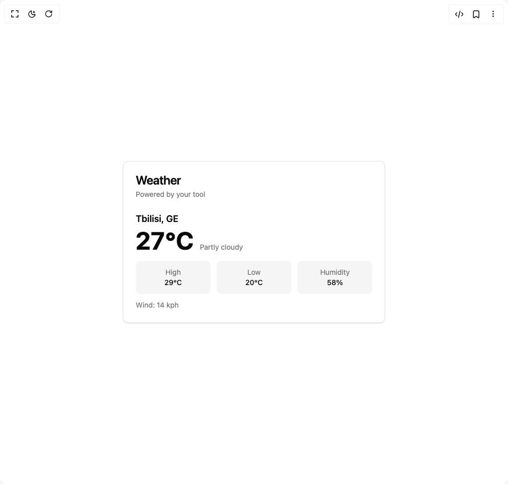

# Build Weather Card in BuilderStudio

> Build this component in our Agentic IDE: [BuilderStudio](https://builderstudio.dev).
>
> Join the BuilderStudio community on [Discord](https://discord.gg/QdWeSGCqfe) and [Reddit](https://reddit.com/r/builderstudio).



## Component

- Author group: `user_xn1cklas`
- Component: `weather-card`
- Variant: `default`
- Rendered HTML snapshot: [`rendered.html`](rendered.html)

## BuilderStudio prompt

You are implementing a React component based on a component reference.

## Component identity

- Author: user_xn1cklas
- Component slug: weather-card
- Demo slug: default
- Title: weather-card
- Description: 

## Goal

Recreate this component in a React + TypeScript + Tailwind CSS project. Preserve the visual layout, spacing, colors, border radius, shadows, interaction behavior, animation behavior, responsive behavior, and dark mode behavior shown in the rendered demo.

## Implementation requirements

- Use React and TypeScript.
- Use Tailwind CSS classes whenever possible.
- Keep the component self-contained unless the source files require helper components.
- If the source uses CSS variables, custom CSS, animations, or keyframes, include them.
- If the source uses external packages, list and use the required packages.
- Preserve accessibility attributes, button semantics, links, keyboard behavior, and ARIA attributes when visible in the source.
- Do not replace the component with a simplified placeholder.
- Return complete production-ready code.

## Dependencies

No reference metadata available.

## Rendered DOM snapshot

This is the rendered demo HTML extracted from the live preview. Use it to verify structure, class names, visible content, and layout.

```html
<div id="root"><div class="w-screen min-h-screen flex justify-center items-center"><div class="w-screen min-h-screen flex justify-center items-center"><div class="rounded-lg border bg-card text-card-foreground shadow-sm w-full max-w-lg"><div class="flex flex-col space-y-1.5 p-6"><h3 class="text-2xl font-semibold leading-none tracking-tight">Weather</h3><p class="text-sm text-muted-foreground">Powered by your tool</p></div><div class="p-6 pt-0 pb-6"><div class="text-lg font-semibold mb-1">Tbilisi, GE</div><div class="flex items-baseline gap-3"><div class="text-5xl font-bold">27°C</div><div class="text-sm text-muted-foreground">Partly cloudy</div></div><div class="mt-4 grid grid-cols-3 gap-3 text-sm"><div class="rounded-md bg-muted p-3 text-center"><div class="text-muted-foreground">High</div><div class="font-medium">29°C</div></div><div class="rounded-md bg-muted p-3 text-center"><div class="text-muted-foreground">Low</div><div class="font-medium">20°C</div></div><div class="rounded-md bg-muted p-3 text-center"><div class="text-muted-foreground">Humidity</div><div class="font-medium">58%</div></div></div><div class="mt-3 text-sm text-muted-foreground">Wind: 14 kph</div></div></div></div></div></div>
```

## Reference source files

No reference source files were available.
