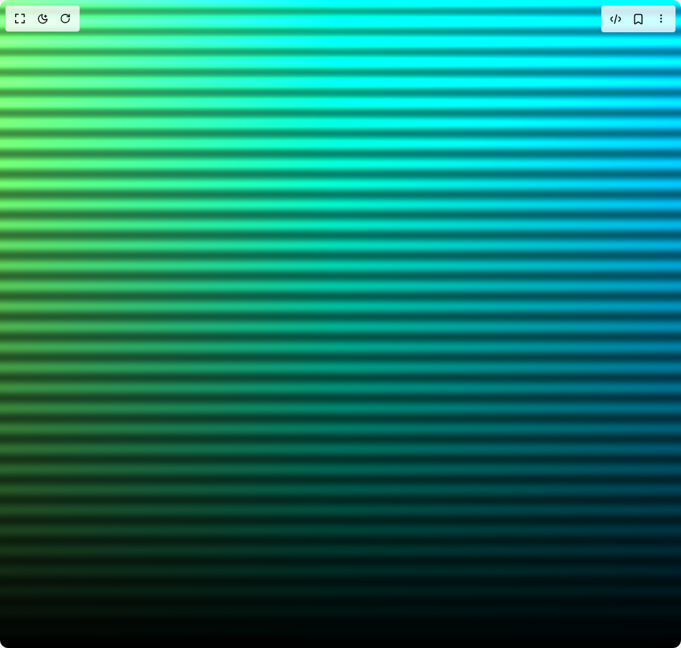
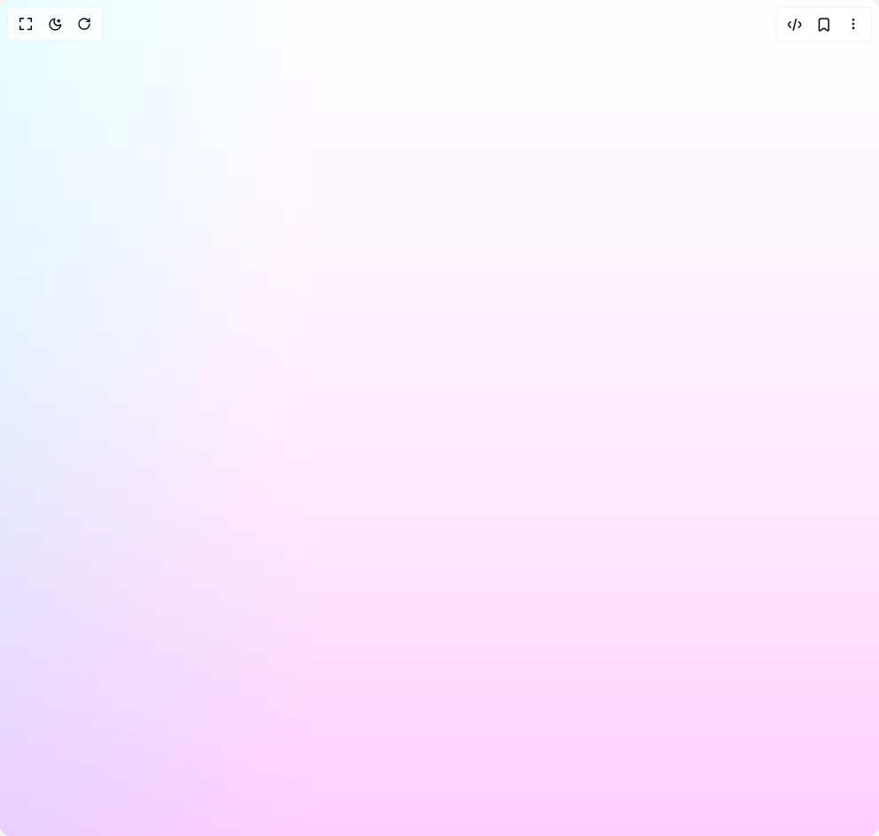
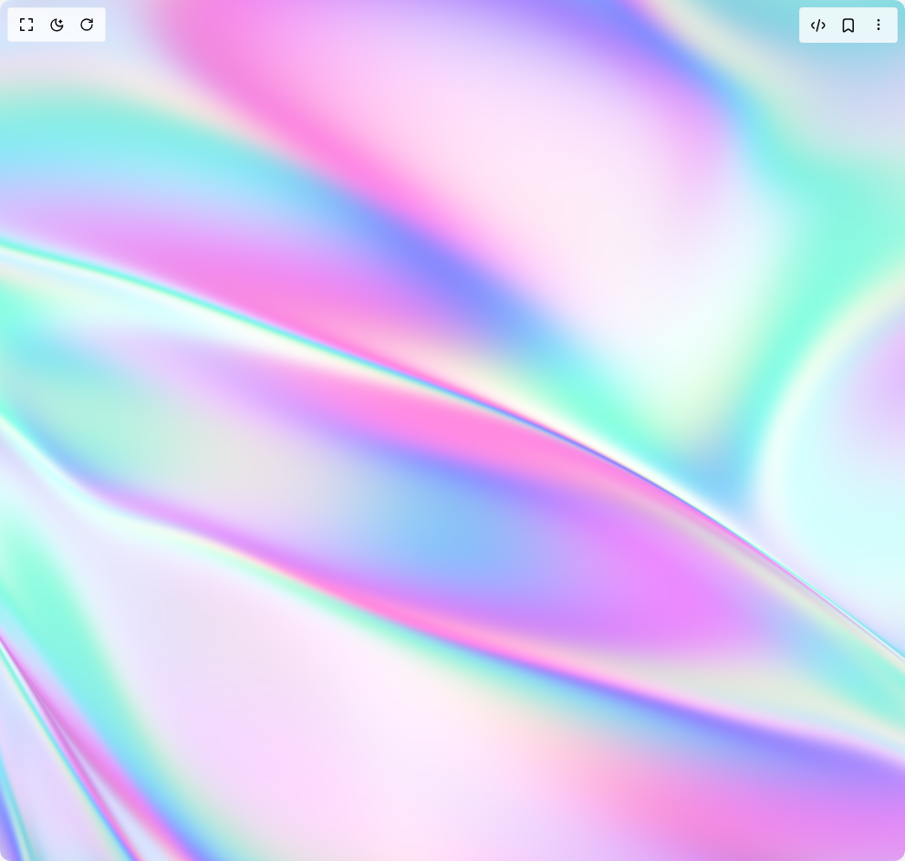
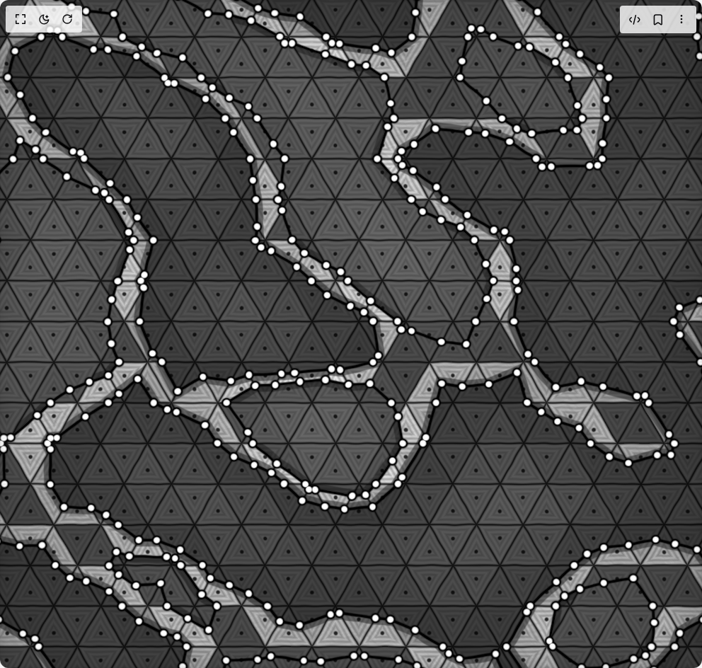
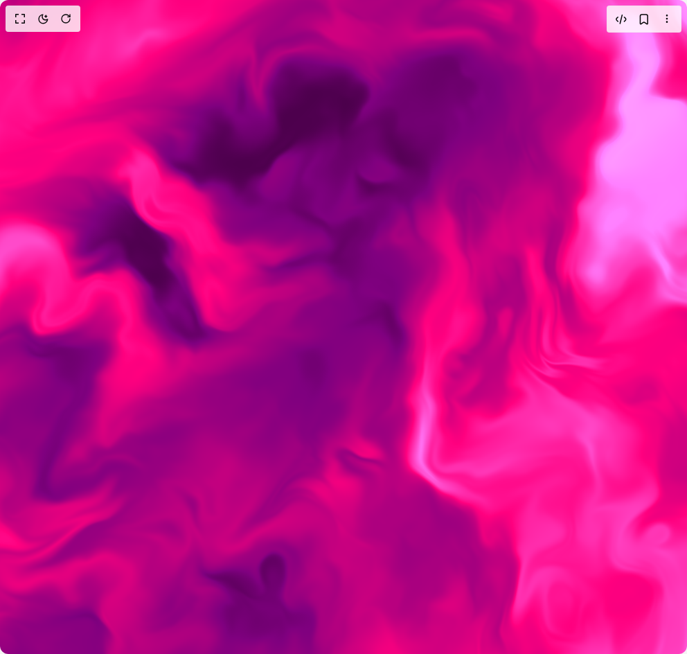
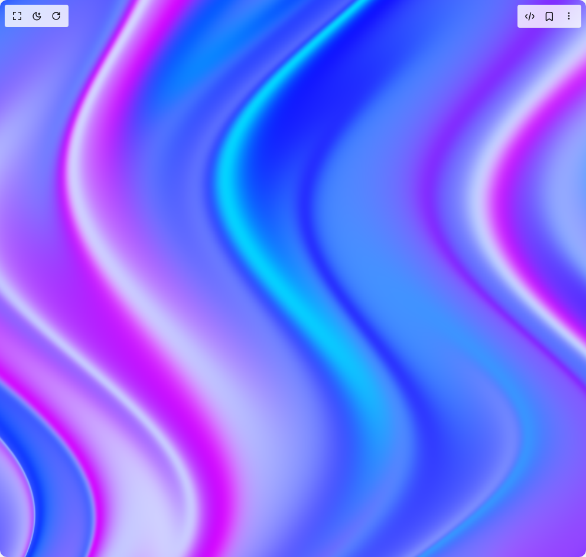
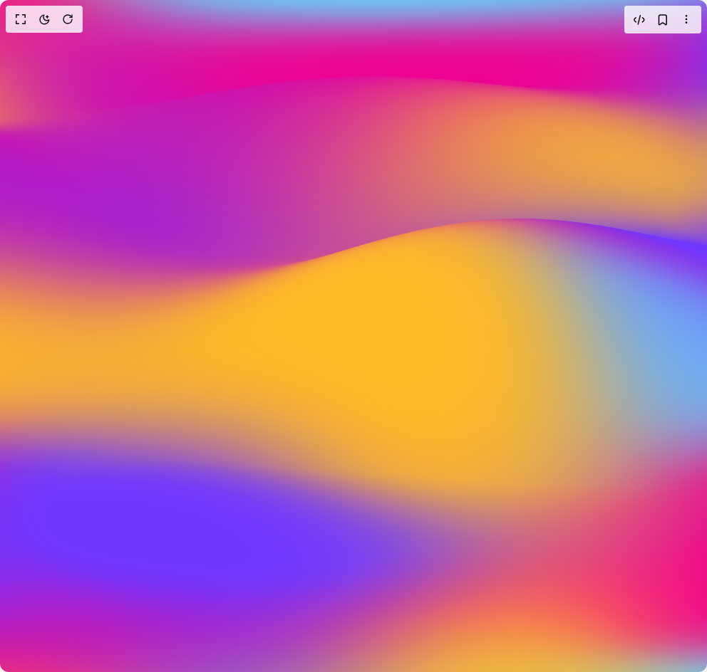

# Uvcanvas Components

7 components are available in this author group.

> Build any component in [BuilderStudio](https://builderstudio.dev), then share improvements with the community on [Discord](https://discord.gg/QdWeSGCqfe) or [Reddit](https://reddit.com/r/builderstudio).

| Preview | Component | Variant |
| --- | --- | --- |
|  | [Xenon Component](xenon-component/default/README.md) | `default` |
|  | [Xenon Component](xenon-component/lumiflex/README.md) | `lumiflex` |
|  | [Xenon Component](xenon-component/novatrix/README.md) | `novatrix` |
|  | [Xenon Component](xenon-component/opulento/README.md) | `opulento` |
|  | [Xenon Component](xenon-component/tranquiluxe/README.md) | `tranquiluxe` |
|  | [Xenon Component](xenon-component/velustro/README.md) | `velustro` |
|  | [Xenon Component](xenon-component/zenitho/README.md) | `zenitho` |
