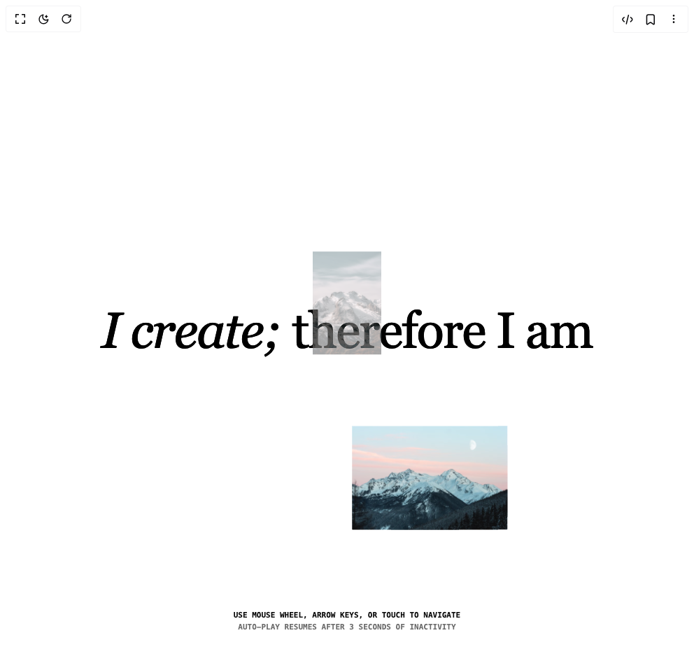

# Build 3d Gallery Photography in BuilderStudio

> Build this component in our Agentic IDE: [BuilderStudio](https://builderstudio.dev).
>
> Join the BuilderStudio community on [Discord](https://discord.gg/QdWeSGCqfe) and [Reddit](https://reddit.com/r/builderstudio).



## Component

- Author group: `vaib215`
- Component: `3d-gallery-photography`
- Variant: `default`
- Rendered HTML snapshot: [`rendered.html`](rendered.html)

## BuilderStudio prompt

You are implementing a React component based on a component reference.

## Component identity

- Author: vaib215
- Component slug: 3d-gallery-photography
- Demo slug: default
- Title: 3d-gallery-photography
- Description: 

## Goal

Recreate this component in a React + TypeScript + Tailwind CSS project. Preserve the visual layout, spacing, colors, border radius, shadows, interaction behavior, animation behavior, responsive behavior, and dark mode behavior shown in the rendered demo.

## Implementation requirements

- Use React and TypeScript.
- Use Tailwind CSS classes whenever possible.
- Keep the component self-contained unless the source files require helper components.
- If the source uses CSS variables, custom CSS, animations, or keyframes, include them.
- If the source uses external packages, list and use the required packages.
- Preserve accessibility attributes, button semantics, links, keyboard behavior, and ARIA attributes when visible in the source.
- Do not replace the component with a simplified placeholder.
- Return complete production-ready code.

## Dependencies

No reference metadata available.

## Rendered DOM snapshot

This is the rendered demo HTML extracted from the live preview. Use it to verify structure, class names, visible content, and layout.

```html
<div id="root"><div class="w-screen min-h-screen flex justify-center items-center"><div class="w-screen min-h-screen flex justify-center items-center"><main class="min-h-screen w-full"><div class="h-screen w-full rounded-lg overflow-hidden"><div style="position: relative; width: 100%; height: 100%; overflow: hidden; pointer-events: auto;"><div style="width: 100%; height: 100%;"><canvas data-engine="three.js r171" width="992" height="944" style="display: block; width: 992px; height: 944px;"></canvas></div></div></div><div class="h-screen inset-0 pointer-events-none fixed flex items-center justify-center text-center px-3 mix-blend-exclusion text-white"><h1 class="font-serif text-4xl md:text-7xl tracking-tight"><span class="italic">I create;</span> therefore I am</h1></div><div class="text-center fixed bottom-10 left-0 right-0 font-mono uppercase text-[11px] font-semibold"><p>Use mouse wheel, arrow keys, or touch to navigate</p><p class=" opacity-60">Auto-play resumes after 3 seconds of inactivity</p></div></main></div></div></div>
```

## Reference source files

No reference source files were available.
