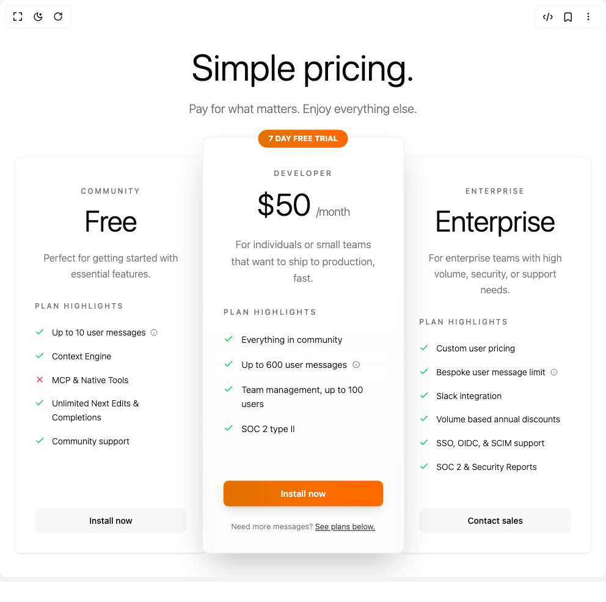

# Build Adaptive Pricing Section in BuilderStudio

> Build this component in our Agentic IDE: [BuilderStudio](https://builderstudio.dev).
>
> Join the BuilderStudio community on [Discord](https://discord.gg/QdWeSGCqfe) and [Reddit](https://reddit.com/r/builderstudio).



## Component

- Author group: `vaib215`
- Component: `adaptive-pricing-section`
- Variant: `default`
- Rendered HTML snapshot: [`rendered.html`](rendered.html)

## BuilderStudio prompt

You are implementing a React component based on a component reference.

## Component identity

- Author: vaib215
- Component slug: adaptive-pricing-section
- Demo slug: default
- Title: adaptive-pricing-section
- Description: 

## Goal

Recreate this component in a React + TypeScript + Tailwind CSS project. Preserve the visual layout, spacing, colors, border radius, shadows, interaction behavior, animation behavior, responsive behavior, and dark mode behavior shown in the rendered demo.

## Implementation requirements

- Use React and TypeScript.
- Use Tailwind CSS classes whenever possible.
- Keep the component self-contained unless the source files require helper components.
- If the source uses CSS variables, custom CSS, animations, or keyframes, include them.
- If the source uses external packages, list and use the required packages.
- Preserve accessibility attributes, button semantics, links, keyboard behavior, and ARIA attributes when visible in the source.
- Do not replace the component with a simplified placeholder.
- Return complete production-ready code.

## Dependencies

No reference metadata available.

## Rendered DOM snapshot

This is the rendered demo HTML extracted from the live preview. Use it to verify structure, class names, visible content, and layout.

```html
<div id="root"><div class="w-screen min-h-screen flex justify-center items-center"><div class="w-screen min-h-screen flex justify-center items-center"><div class="w-full"><div class="w-full min-h-screen bg-background"><div class="max-w-7xl mx-auto px-6 py-20"><div class="text-center mb-16"><h1 class="text-6xl font-light text-foreground mb-6">Simple pricing.</h1><p class="text-xl text-muted-foreground font-light">Pay for what matters. Enjoy everything else.</p></div><div class="grid grid-cols-1 md:grid-cols-3 max-md:gap-8 max-w-6xl mx-auto"><div class="rounded-lg border text-card-foreground shadow-sm relative flex flex-col h-full transition-all duration-300 bg-card/40 border-border/40 hover:bg-card/60 dark:bg-gray-900/40 dark:border-gray-800/40 dark:hover:bg-gray-900/60" style="backdrop-filter: blur(10px);"><div class="flex flex-col space-y-1.5 p-6 text-center pb-8 pt-12"><div class="text-xs font-medium text-muted-foreground uppercase tracking-[0.2em] mb-4">COMMUNITY</div><h3 class="text-2xl font-semibold leading-none tracking-tight mb-6"><div class="text-5xl font-light text-foreground">Free</div></h3><p class="text-muted-foreground text-base font-light leading-relaxed px-4">Perfect for getting started with essential features.</p></div><div class="p-6 pt-0 flex-1 px-8"><div class="mb-8"><h4 class="text-xs font-medium text-muted-foreground uppercase tracking-[0.2em] mb-6">PLAN HIGHLIGHTS</h4><div class="space-y-4"><div class="flex items-start gap-3"><svg xmlns="http://www.w3.org/2000/svg" width="24" height="24" viewBox="0 0 24 24" fill="none" stroke="currentColor" stroke-width="2" stroke-linecap="round" stroke-linejoin="round" class="lucide lucide-check h-4 w-4 text-green-500 dark:text-green-400 flex-shrink-0 mt-0.5" aria-hidden="true"><path d="M20 6 9 17l-5-5"></path></svg><span class="text-foreground text-sm font-light flex items-center gap-2 leading-relaxed">Up to 10 user messages<svg xmlns="http://www.w3.org/2000/svg" width="24" height="24" viewBox="0 0 24 24" fill="none" stroke="currentColor" stroke-width="2" stroke-linecap="round" stroke-linejoin="round" class="lucide lucide-info h-3 w-3 text-muted-foreground" aria-hidden="true"><circle cx="12" cy="12" r="10"></circle><path d="M12 16v-4"></path><path d="M12 8h.01"></path></svg></span></div><div class="flex items-start gap-3"><svg xmlns="http://www.w3.org/2000/svg" width="24" height="24" viewBox="0 0 24 24" fill="none" stroke="currentColor" stroke-width="2" stroke-linecap="round" stroke-linejoin="round" class="lucide lucide-check h-4 w-4 text-green-500 dark:text-green-400 flex-shrink-0 mt-0.5" aria-hidden="true"><path d="M20 6 9 17l-5-5"></path></svg><span class="text-foreground text-sm font-light flex items-center gap-2 leading-relaxed">Context Engine</span></div><div class="flex items-start gap-3"><svg xmlns="http://www.w3.org/2000/svg" width="24" height="24" viewBox="0 0 24 24" fill="none" stroke="currentColor" stroke-width="2" stroke-linecap="round" stroke-linejoin="round" class="lucide lucide-x h-4 w-4 text-red-500 dark:text-red-400 flex-shrink-0 mt-0.5" aria-hidden="true"><path d="M18 6 6 18"></path><path d="m6 6 12 12"></path></svg><span class="text-foreground text-sm font-light flex items-center gap-2 leading-relaxed">MCP &amp; Native Tools</span></div><div class="flex items-start gap-3"><svg xmlns="http://www.w3.org/2000/svg" width="24" height="24" viewBox="0 0 24 24" fill="none" stroke="currentColor" stroke-width="2" stroke-linecap="round" stroke-linejoin="round" class="lucide lucide-check h-4 w-4 text-green-500 dark:text-green-400 flex-shrink-0 mt-0.5" aria-hidden="true"><path d="M20 6 9 17l-5-5"></path></svg><span class="text-foreground text-sm font-light flex items-center gap-2 leading-relaxed">Unlimited Next Edits &amp; Completions</span></div><div class="flex items-start gap-3"><svg xmlns="http://www.w3.org/2000/svg" width="24" height="24" viewBox="0 0 24 24" fill="none" stroke="currentColor" stroke-width="2" stroke-linecap="round" stroke-linejoin="round" class="lucide lucide-check h-4 w-4 text-green-500 dark:text-green-400 flex-shrink-0 mt-0.5" aria-hidden="true"><path d="M20 6 9 17l-5-5"></path></svg><span class="text-foreground text-sm font-light flex items-center gap-2 leading-relaxed">Community support</span></div></div></div></div><div class="flex items-center p-6 pt-0 px-8 pb-8"><div class="w-full"><button class="inline-flex items-center justify-center whitespace-nowrap rounded-md ring-offset-background focus-visible:outline-none focus-visible:ring-2 focus-visible:ring-ring focus-visible:ring-offset-2 disabled:pointer-events-none disabled:opacity-50 h-10 px-4 w-full py-4 text-sm font-medium transition-all duration-300 bg-muted/80 hover:bg-muted text-foreground border-border/50 dark:bg-gray-700/80 dark:hover:bg-gray-600/80 dark:text-white dark:border-gray-600/50">Install now</button></div></div></div><div class="rounded-lg border text-card-foreground relative flex flex-col h-full transition-all duration-300 bg-gradient-to-b from-card/80 to-muted/20 border-border/70 shadow-2xl dark:from-gray-900/80 dark:to-gray-800/60 dark:border-gray-700/70 md:scale-105 md:bottom-4 z-20" style="backdrop-filter: blur(10px);"><div class="absolute -top-3 left-1/2 transform -translate-x-1/2"><div class="bg-gradient-to-r from-amber-600 to-orange-500 text-white dark:text-black text-xs font-bold px-4 py-1.5 rounded-full">7 DAY FREE TRIAL</div></div><div class="flex flex-col space-y-1.5 p-6 text-center pb-8 pt-12"><div class="text-xs font-medium text-muted-foreground uppercase tracking-[0.2em] mb-4">DEVELOPER</div><h3 class="text-2xl font-semibold leading-none tracking-tight mb-6"><div class="flex items-baseline justify-center"><span class="text-5xl font-light text-foreground">$50</span><span class="text-lg font-light text-muted-foreground ml-2">/month</span></div></h3><p class="text-muted-foreground text-base font-light leading-relaxed px-4">For individuals or small teams that want to ship to production, fast.</p></div><div class="p-6 pt-0 flex-1 px-8"><div class="mb-8"><h4 class="text-xs font-medium text-muted-foreground uppercase tracking-[0.2em] mb-6">PLAN HIGHLIGHTS</h4><div class="space-y-4"><div class="flex items-start gap-3"><svg xmlns="http://www.w3.org/2000/svg" width="24" height="24" viewBox="0 0 24 24" fill="none" stroke="currentColor" stroke-width="2" stroke-linecap="round" stroke-linejoin="round" class="lucide lucide-check h-4 w-4 text-green-500 dark:text-green-400 flex-shrink-0 mt-0.5" aria-hidden="true"><path d="M20 6 9 17l-5-5"></path></svg><span class="text-foreground text-sm font-light flex items-center gap-2 leading-relaxed">Everything in community</span></div><div class="flex items-start gap-3"><svg xmlns="http://www.w3.org/2000/svg" width="24" height="24" viewBox="0 0 24 24" fill="none" stroke="currentColor" stroke-width="2" stroke-linecap="round" stroke-linejoin="round" class="lucide lucide-check h-4 w-4 text-green-500 dark:text-green-400 flex-shrink-0 mt-0.5" aria-hidden="true"><path d="M20 6 9 17l-5-5"></path></svg><span class="text-foreground text-sm font-light flex items-center gap-2 leading-relaxed">Up to 600 user messages<svg xmlns="http://www.w3.org/2000/svg" width="24" height="24" viewBox="0 0 24 24" fill="none" stroke="currentColor" stroke-width="2" stroke-linecap="round" stroke-linejoin="round" class="lucide lucide-info h-3 w-3 text-muted-foreground" aria-hidden="true"><circle cx="12" cy="12" r="10"></circle><path d="M12 16v-4"></path><path d="M12 8h.01"></path></svg></span></div><div class="flex items-start gap-3"><svg xmlns="http://www.w3.org/2000/svg" width="24" height="24" viewBox="0 0 24 24" fill="none" stroke="currentColor" stroke-width="2" stroke-linecap="round" stroke-linejoin="round" class="lucide lucide-check h-4 w-4 text-green-500 dark:text-green-400 flex-shrink-0 mt-0.5" aria-hidden="true"><path d="M20 6 9 17l-5-5"></path></svg><span class="text-foreground text-sm font-light flex items-center gap-2 leading-relaxed">Team management, up to 100 users</span></div><div class="flex items-start gap-3"><svg xmlns="http://www.w3.org/2000/svg" width="24" height="24" viewBox="0 0 24 24" fill="none" stroke="currentColor" stroke-width="2" stroke-linecap="round" stroke-linejoin="round" class="lucide lucide-check h-4 w-4 text-green-500 dark:text-green-400 flex-shrink-0 mt-0.5" aria-hidden="true"><path d="M20 6 9 17l-5-5"></path></svg><span class="text-foreground text-sm font-light flex items-center gap-2 leading-relaxed">SOC 2 type II</span></div></div></div></div><div class="flex items-center p-6 pt-0 px-8 pb-8"><div class="w-full"><button class="inline-flex items-center justify-center whitespace-nowrap rounded-md ring-offset-background focus-visible:outline-none focus-visible:ring-2 focus-visible:ring-ring focus-visible:ring-offset-2 disabled:pointer-events-none disabled:opacity-50 hover:bg-primary/90 h-10 px-4 w-full py-4 text-sm font-medium bg-gradient-to-r from-amber-600 to-orange-500 hover:from-amber-500 hover:to-orange-400 text-white dark:text-black border-0 shadow-lg hover:shadow-xl transition-all duration-300">Install now</button><div class="text-center mt-6"><p class="text-xs text-muted-foreground font-light">Need more messages? <button class="text-primary hover:text-primary/80 underline transition-colors">See plans below.</button></p></div></div></div></div><div class="rounded-lg border text-card-foreground shadow-sm relative flex flex-col h-full transition-all duration-300 bg-card/40 border-border/40 hover:bg-card/60 dark:bg-gray-900/40 dark:border-gray-800/40 dark:hover:bg-gray-900/60" style="backdrop-filter: blur(10px);"><div class="flex flex-col space-y-1.5 p-6 text-center pb-8 pt-12"><div class="text-xs font-medium text-muted-foreground uppercase tracking-[0.2em] mb-4">ENTERPRISE</div><h3 class="text-2xl font-semibold leading-none tracking-tight mb-6"><div class="text-5xl font-light text-foreground">Enterprise</div></h3><p class="text-muted-foreground text-base font-light leading-relaxed px-4">For enterprise teams with high volume, security, or support needs.</p></div><div class="p-6 pt-0 flex-1 px-8"><div class="mb-8"><h4 class="text-xs font-medium text-muted-foreground uppercase tracking-[0.2em] mb-6">PLAN HIGHLIGHTS</h4><div class="space-y-4"><div class="flex items-start gap-3"><svg xmlns="http://www.w3.org/2000/svg" width="24" height="24" viewBox="0 0 24 24" fill="none" stroke="currentColor" stroke-width="2" stroke-linecap="round" stroke-linejoin="round" class="lucide lucide-check h-4 w-4 text-green-500 dark:text-green-400 flex-shrink-0 mt-0.5" aria-hidden="true"><path d="M20 6 9 17l-5-5"></path></svg><span class="text-foreground text-sm font-light flex items-center gap-2 leading-relaxed">Custom user pricing</span></div><div class="flex items-start gap-3"><svg xmlns="http://www.w3.org/2000/svg" width="24" height="24" viewBox="0 0 24 24" fill="none" stroke="currentColor" stroke-width="2" stroke-linecap="round" stroke-linejoin="round" class="lucide lucide-check h-4 w-4 text-green-500 dark:text-green-400 flex-shrink-0 mt-0.5" aria-hidden="true"><path d="M20 6 9 17l-5-5"></path></svg><span class="text-foreground text-sm font-light flex items-center gap-2 leading-relaxed">Bespoke user message limit<svg xmlns="http://www.w3.org/2000/svg" width="24" height="24" viewBox="0 0 24 24" fill="none" stroke="currentColor" stroke-width="2" stroke-linecap="round" stroke-linejoin="round" class="lucide lucide-info h-3 w-3 text-muted-foreground" aria-hidden="true"><circle cx="12" cy="12" r="10"></circle><path d="M12 16v-4"></path><path d="M12 8h.01"></path></svg></span></div><div class="flex items-start gap-3"><svg xmlns="http://www.w3.org/2000/svg" width="24" height="24" viewBox="0 0 24 24" fill="none" stroke="currentColor" stroke-width="2" stroke-linecap="round" stroke-linejoin="round" class="lucide lucide-check h-4 w-4 text-green-500 dark:text-green-400 flex-shrink-0 mt-0.5" aria-hidden="true"><path d="M20 6 9 17l-5-5"></path></svg><span class="text-foreground text-sm font-light flex items-center gap-2 leading-relaxed">Slack integration</span></div><div class="flex items-start gap-3"><svg xmlns="http://www.w3.org/2000/svg" width="24" height="24" viewBox="0 0 24 24" fill="none" stroke="currentColor" stroke-width="2" stroke-linecap="round" stroke-linejoin="round" class="lucide lucide-check h-4 w-4 text-green-500 dark:text-green-400 flex-shrink-0 mt-0.5" aria-hidden="true"><path d="M20 6 9 17l-5-5"></path></svg><span class="text-foreground text-sm font-light flex items-center gap-2 leading-relaxed">Volume based annual discounts</span></div><div class="flex items-start gap-3"><svg xmlns="http://www.w3.org/2000/svg" width="24" height="24" viewBox="0 0 24 24" fill="none" stroke="currentColor" stroke-width="2" stroke-linecap="round" stroke-linejoin="round" class="lucide lucide-check h-4 w-4 text-green-500 dark:text-green-400 flex-shrink-0 mt-0.5" aria-hidden="true"><path d="M20 6 9 17l-5-5"></path></svg><span class="text-foreground text-sm font-light flex items-center gap-2 leading-relaxed">SSO, OIDC, &amp; SCIM support</span></div><div class="flex items-start gap-3"><svg xmlns="http://www.w3.org/2000/svg" width="24" height="24" viewBox="0 0 24 24" fill="none" stroke="currentColor" stroke-width="2" stroke-linecap="round" stroke-linejoin="round" class="lucide lucide-check h-4 w-4 text-green-500 dark:text-green-400 flex-shrink-0 mt-0.5" aria-hidden="true"><path d="M20 6 9 17l-5-5"></path></svg><span class="text-foreground text-sm font-light flex items-center gap-2 leading-relaxed">SOC 2 &amp; Security Reports</span></div></div></div></div><div class="flex items-center p-6 pt-0 px-8 pb-8"><div class="w-full"><button class="inline-flex items-center justify-center whitespace-nowrap rounded-md ring-offset-background focus-visible:outline-none focus-visible:ring-2 focus-visible:ring-ring focus-visible:ring-offset-2 disabled:pointer-events-none disabled:opacity-50 h-10 px-4 w-full py-4 text-sm font-medium transition-all duration-300 bg-muted/80 hover:bg-muted text-foreground border-border/50 dark:bg-gray-700/80 dark:hover:bg-gray-600/80 dark:text-white dark:border-gray-600/50">Contact sales</button></div></div></div></div></div></div></div></div></div></div>
```

## Reference source files

No reference source files were available.
