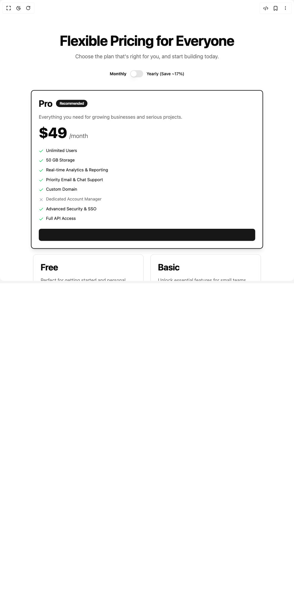

# Build Bento Pricing Component in BuilderStudio

> Build this component in our Agentic IDE: [BuilderStudio](https://builderstudio.dev).
>
> Join the BuilderStudio community on [Discord](https://discord.gg/QdWeSGCqfe) and [Reddit](https://reddit.com/r/builderstudio).



## Component

- Author group: `vaib215`
- Component: `bento-pricing-component`
- Variant: `default`
- Rendered HTML snapshot: [`rendered.html`](rendered.html)

## BuilderStudio prompt

You are implementing a React component based on a component reference.

## Component identity

- Author: vaib215
- Component slug: bento-pricing-component
- Demo slug: default
- Title: bento-pricing-component
- Description: 

## Goal

Recreate this component in a React + TypeScript + Tailwind CSS project. Preserve the visual layout, spacing, colors, border radius, shadows, interaction behavior, animation behavior, responsive behavior, and dark mode behavior shown in the rendered demo.

## Implementation requirements

- Use React and TypeScript.
- Use Tailwind CSS classes whenever possible.
- Keep the component self-contained unless the source files require helper components.
- If the source uses CSS variables, custom CSS, animations, or keyframes, include them.
- If the source uses external packages, list and use the required packages.
- Preserve accessibility attributes, button semantics, links, keyboard behavior, and ARIA attributes when visible in the source.
- Do not replace the component with a simplified placeholder.
- Return complete production-ready code.

## Dependencies

No reference metadata available.

## Rendered DOM snapshot

This is the rendered demo HTML extracted from the live preview. Use it to verify structure, class names, visible content, and layout.

```html
<div id="root"><div class="w-screen min-h-screen flex justify-center items-center"><div class="w-screen min-h-screen flex justify-center items-center"><div class="min-h-screen bg-background flex flex-col items-center justify-center p-4"><section class="container py-12 md:py-24"><div class="mb-12 text-center"><h2 class="text-4xl font-bold tracking-tight sm:text-5xl">Flexible Pricing for Everyone</h2><p class="mt-4 text-lg text-muted-foreground">Choose the plan that's right for you, and start building today.</p><div class="mt-8 flex items-center justify-center space-x-3"><label class="text-sm leading-none peer-disabled:cursor-not-allowed peer-disabled:opacity-70 font-bold text-primary" for="billing-toggle-monthly">Monthly</label><button type="button" role="switch" aria-checked="false" data-state="unchecked" value="on" class="peer inline-flex h-6 w-11 shrink-0 cursor-pointer items-center rounded-full border-2 border-transparent transition-colors focus-visible:outline-none focus-visible:ring-2 focus-visible:ring-ring focus-visible:ring-offset-2 focus-visible:ring-offset-background disabled:cursor-not-allowed disabled:opacity-50 data-[state=checked]:bg-primary data-[state=unchecked]:bg-input" id="billing-toggle-monthly"><span data-state="unchecked" class="pointer-events-none block h-5 w-5 rounded-full bg-background shadow-lg ring-0 transition-transform data-[state=checked]:translate-x-5 data-[state=unchecked]:translate-x-0"></span></button><label class="text-sm font-medium leading-none peer-disabled:cursor-not-allowed peer-disabled:opacity-70" for="billing-toggle-monthly">Yearly (Save ~17%)</label></div></div><div class="grid grid-cols-1 md:grid-cols-2 lg:grid-cols-3 xl:grid-cols-4 gap-6 auto-rows-fr"><div class="rounded-lg bg-card text-card-foreground flex flex-col justify-between p-6 transition-all duration-300 ease-in-out border-2 border-primary shadow-lg dark:shadow-primary/20 scale-[1.02] md:col-span-2 lg:col-span-2 xl:col-span-2"><div class="flex flex-col space-y-1.5 p-0 mb-4"><h3 class="tracking-tight text-3xl font-bold flex items-center">Pro<span class="ml-3 inline-flex items-center rounded-full bg-primary px-3 py-1 text-xs font-semibold text-primary-foreground">Recommended</span></h3><p class="mt-2 text-base text-muted-foreground">Everything you need for growing businesses and serious projects.</p></div><div class="flex-grow p-0 mb-6"><div class="flex items-baseline space-x-2"><p class="text-5xl font-extrabold tracking-tight">$49</p><span class="text-xl font-normal text-muted-foreground">/month</span></div><ul class="mt-6 space-y-3 text-sm"><li class="flex items-start gap-2"><svg xmlns="http://www.w3.org/2000/svg" width="24" height="24" viewBox="0 0 24 24" fill="none" stroke="currentColor" stroke-width="2" stroke-linecap="round" stroke-linejoin="round" class="lucide lucide-check h-4 w-4 flex-shrink-0 text-green-500 mt-1" aria-hidden="true"><path d="M20 6 9 17l-5-5"></path></svg><span class="text-foreground">Unlimited Users</span></li><li class="flex items-start gap-2"><svg xmlns="http://www.w3.org/2000/svg" width="24" height="24" viewBox="0 0 24 24" fill="none" stroke="currentColor" stroke-width="2" stroke-linecap="round" stroke-linejoin="round" class="lucide lucide-check h-4 w-4 flex-shrink-0 text-green-500 mt-1" aria-hidden="true"><path d="M20 6 9 17l-5-5"></path></svg><span class="text-foreground">50 GB Storage</span></li><li class="flex items-start gap-2"><svg xmlns="http://www.w3.org/2000/svg" width="24" height="24" viewBox="0 0 24 24" fill="none" stroke="currentColor" stroke-width="2" stroke-linecap="round" stroke-linejoin="round" class="lucide lucide-check h-4 w-4 flex-shrink-0 text-green-500 mt-1" aria-hidden="true"><path d="M20 6 9 17l-5-5"></path></svg><span class="text-foreground">Real-time Analytics &amp; Reporting</span></li><li class="flex items-start gap-2"><svg xmlns="http://www.w3.org/2000/svg" width="24" height="24" viewBox="0 0 24 24" fill="none" stroke="currentColor" stroke-width="2" stroke-linecap="round" stroke-linejoin="round" class="lucide lucide-check h-4 w-4 flex-shrink-0 text-green-500 mt-1" aria-hidden="true"><path d="M20 6 9 17l-5-5"></path></svg><span class="text-foreground">Priority Email &amp; Chat Support</span></li><li class="flex items-start gap-2"><svg xmlns="http://www.w3.org/2000/svg" width="24" height="24" viewBox="0 0 24 24" fill="none" stroke="currentColor" stroke-width="2" stroke-linecap="round" stroke-linejoin="round" class="lucide lucide-check h-4 w-4 flex-shrink-0 text-green-500 mt-1" aria-hidden="true"><path d="M20 6 9 17l-5-5"></path></svg><span class="text-foreground">Custom Domain</span></li><li class="flex items-start gap-2"><svg xmlns="http://www.w3.org/2000/svg" width="24" height="24" viewBox="0 0 24 24" fill="none" stroke="currentColor" stroke-width="2" stroke-linecap="round" stroke-linejoin="round" class="lucide lucide-x h-4 w-4 flex-shrink-0 text-gray-400 mt-1" aria-hidden="true"><path d="M18 6 6 18"></path><path d="m6 6 12 12"></path></svg><span class="text-muted-foreground">Dedicated Account Manager</span></li><li class="flex items-start gap-2"><svg xmlns="http://www.w3.org/2000/svg" width="24" height="24" viewBox="0 0 24 24" fill="none" stroke="currentColor" stroke-width="2" stroke-linecap="round" stroke-linejoin="round" class="lucide lucide-check h-4 w-4 flex-shrink-0 text-green-500 mt-1" aria-hidden="true"><path d="M20 6 9 17l-5-5"></path></svg><span class="text-foreground">Advanced Security &amp; SSO</span></li><li class="flex items-start gap-2"><svg xmlns="http://www.w3.org/2000/svg" width="24" height="24" viewBox="0 0 24 24" fill="none" stroke="currentColor" stroke-width="2" stroke-linecap="round" stroke-linejoin="round" class="lucide lucide-check h-4 w-4 flex-shrink-0 text-green-500 mt-1" aria-hidden="true"><path d="M20 6 9 17l-5-5"></path></svg><span class="text-foreground">Full API Access</span></li></ul></div><div class="flex items-center p-0 mt-auto"><button class="inline-flex items-center justify-center whitespace-nowrap rounded-md text-sm font-medium ring-offset-background transition-colors focus-visible:outline-none focus-visible:ring-2 focus-visible:ring-ring focus-visible:ring-offset-2 disabled:pointer-events-none disabled:opacity-50 h-10 px-4 py-2 w-full bg-primary hover:bg-primary/90 text-primary-foreground"></button></div></div><div class="rounded-lg border bg-card text-card-foreground shadow-sm flex flex-col justify-between p-6 transition-all duration-300 ease-in-out lg:col-span-1"><div class="flex flex-col space-y-1.5 p-0 mb-4"><h3 class="tracking-tight text-3xl font-bold flex items-center">Free</h3><p class="mt-2 text-base text-muted-foreground">Perfect for getting started and personal projects.</p></div><div class="flex-grow p-0 mb-6"><div class="flex items-baseline space-x-2"><p class="text-5xl font-extrabold tracking-tight">$0</p><span class="text-xl font-normal text-muted-foreground">/month</span></div><ul class="mt-6 space-y-3 text-sm"><li class="flex items-start gap-2"><svg xmlns="http://www.w3.org/2000/svg" width="24" height="24" viewBox="0 0 24 24" fill="none" stroke="currentColor" stroke-width="2" stroke-linecap="round" stroke-linejoin="round" class="lucide lucide-check h-4 w-4 flex-shrink-0 text-green-500 mt-1" aria-hidden="true"><path d="M20 6 9 17l-5-5"></path></svg><span class="text-foreground">1 User</span></li><li class="flex items-start gap-2"><svg xmlns="http://www.w3.org/2000/svg" width="24" height="24" viewBox="0 0 24 24" fill="none" stroke="currentColor" stroke-width="2" stroke-linecap="round" stroke-linejoin="round" class="lucide lucide-check h-4 w-4 flex-shrink-0 text-green-500 mt-1" aria-hidden="true"><path d="M20 6 9 17l-5-5"></path></svg><span class="text-foreground">500 MB Storage</span></li><li class="flex items-start gap-2"><svg xmlns="http://www.w3.org/2000/svg" width="24" height="24" viewBox="0 0 24 24" fill="none" stroke="currentColor" stroke-width="2" stroke-linecap="round" stroke-linejoin="round" class="lucide lucide-check h-4 w-4 flex-shrink-0 text-green-500 mt-1" aria-hidden="true"><path d="M20 6 9 17l-5-5"></path></svg><span class="text-foreground">Basic Analytics</span></li><li class="flex items-start gap-2"><svg xmlns="http://www.w3.org/2000/svg" width="24" height="24" viewBox="0 0 24 24" fill="none" stroke="currentColor" stroke-width="2" stroke-linecap="round" stroke-linejoin="round" class="lucide lucide-check h-4 w-4 flex-shrink-0 text-green-500 mt-1" aria-hidden="true"><path d="M20 6 9 17l-5-5"></path></svg><span class="text-foreground">Community Support</span></li><li class="flex items-start gap-2"><svg xmlns="http://www.w3.org/2000/svg" width="24" height="24" viewBox="0 0 24 24" fill="none" stroke="currentColor" stroke-width="2" stroke-linecap="round" stroke-linejoin="round" class="lucide lucide-x h-4 w-4 flex-shrink-0 text-gray-400 mt-1" aria-hidden="true"><path d="M18 6 6 18"></path><path d="m6 6 12 12"></path></svg><span class="text-muted-foreground">Custom Domain</span></li><li class="flex items-start gap-2"><svg xmlns="http://www.w3.org/2000/svg" width="24" height="24" viewBox="0 0 24 24" fill="none" stroke="currentColor" stroke-width="2" stroke-linecap="round" stroke-linejoin="round" class="lucide lucide-x h-4 w-4 flex-shrink-0 text-gray-400 mt-1" aria-hidden="true"><path d="M18 6 6 18"></path><path d="m6 6 12 12"></path></svg><span class="text-muted-foreground">Advanced Security</span></li></ul></div><div class="flex items-center p-0 mt-auto"><button class="inline-flex items-center justify-center whitespace-nowrap rounded-md text-sm font-medium ring-offset-background transition-colors focus-visible:outline-none focus-visible:ring-2 focus-visible:ring-ring focus-visible:ring-offset-2 disabled:pointer-events-none disabled:opacity-50 bg-primary text-primary-foreground hover:bg-primary/90 h-10 px-4 py-2 w-full">Get Started Free</button></div></div><div class="rounded-lg border bg-card text-card-foreground shadow-sm flex flex-col justify-between p-6 transition-all duration-300 ease-in-out lg:col-span-1"><div class="flex flex-col space-y-1.5 p-0 mb-4"><h3 class="tracking-tight text-3xl font-bold flex items-center">Basic</h3><p class="mt-2 text-base text-muted-foreground">Unlock essential features for small teams and growing needs.</p></div><div class="flex-grow p-0 mb-6"><div class="flex items-baseline space-x-2"><p class="text-5xl font-extrabold tracking-tight">$19</p><span class="text-xl font-normal text-muted-foreground">/month</span></div><ul class="mt-6 space-y-3 text-sm"><li class="flex items-start gap-2"><svg xmlns="http://www.w3.org/2000/svg" width="24" height="24" viewBox="0 0 24 24" fill="none" stroke="currentColor" stroke-width="2" stroke-linecap="round" stroke-linejoin="round" class="lucide lucide-check h-4 w-4 flex-shrink-0 text-green-500 mt-1" aria-hidden="true"><path d="M20 6 9 17l-5-5"></path></svg><span class="text-foreground">5 Users</span></li><li class="flex items-start gap-2"><svg xmlns="http://www.w3.org/2000/svg" width="24" height="24" viewBox="0 0 24 24" fill="none" stroke="currentColor" stroke-width="2" stroke-linecap="round" stroke-linejoin="round" class="lucide lucide-check h-4 w-4 flex-shrink-0 text-green-500 mt-1" aria-hidden="true"><path d="M20 6 9 17l-5-5"></path></svg><span class="text-foreground">5 GB Storage</span></li><li class="flex items-start gap-2"><svg xmlns="http://www.w3.org/2000/svg" width="24" height="24" viewBox="0 0 24 24" fill="none" stroke="currentColor" stroke-width="2" stroke-linecap="round" stroke-linejoin="round" class="lucide lucide-check h-4 w-4 flex-shrink-0 text-green-500 mt-1" aria-hidden="true"><path d="M20 6 9 17l-5-5"></path></svg><span class="text-foreground">Advanced Analytics</span></li><li class="flex items-start gap-2"><svg xmlns="http://www.w3.org/2000/svg" width="24" height="24" viewBox="0 0 24 24" fill="none" stroke="currentColor" stroke-width="2" stroke-linecap="round" stroke-linejoin="round" class="lucide lucide-check h-4 w-4 flex-shrink-0 text-green-500 mt-1" aria-hidden="true"><path d="M20 6 9 17l-5-5"></path></svg><span class="text-foreground">Email Support</span></li><li class="flex items-start gap-2"><svg xmlns="http://www.w3.org/2000/svg" width="24" height="24" viewBox="0 0 24 24" fill="none" stroke="currentColor" stroke-width="2" stroke-linecap="round" stroke-linejoin="round" class="lucide lucide-x h-4 w-4 flex-shrink-0 text-gray-400 mt-1" aria-hidden="true"><path d="M18 6 6 18"></path><path d="m6 6 12 12"></path></svg><span class="text-muted-foreground">Custom Domain</span></li><li class="flex items-start gap-2"><svg xmlns="http://www.w3.org/2000/svg" width="24" height="24" viewBox="0 0 24 24" fill="none" stroke="currentColor" stroke-width="2" stroke-linecap="round" stroke-linejoin="round" class="lucide lucide-x h-4 w-4 flex-shrink-0 text-gray-400 mt-1" aria-hidden="true"><path d="M18 6 6 18"></path><path d="m6 6 12 12"></path></svg><span class="text-muted-foreground">Priority Support</span></li><li class="flex items-start gap-2"><svg xmlns="http://www.w3.org/2000/svg" width="24" height="24" viewBox="0 0 24 24" fill="none" stroke="currentColor" stroke-width="2" stroke-linecap="round" stroke-linejoin="round" class="lucide lucide-x h-4 w-4 flex-shrink-0 text-gray-400 mt-1" aria-hidden="true"><path d="M18 6 6 18"></path><path d="m6 6 12 12"></path></svg><span class="text-muted-foreground">API Access</span></li></ul></div><div class="flex items-center p-0 mt-auto"><button class="inline-flex items-center justify-center whitespace-nowrap rounded-md text-sm font-medium ring-offset-background transition-colors focus-visible:outline-none focus-visible:ring-2 focus-visible:ring-ring focus-visible:ring-offset-2 disabled:pointer-events-none disabled:opacity-50 bg-primary text-primary-foreground hover:bg-primary/90 h-10 px-4 py-2 w-full">Start 14-day Free Trial</button></div></div><div class="rounded-lg border bg-card text-card-foreground shadow-sm flex flex-col justify-between p-6 transition-all duration-300 ease-in-out md:col-span-2 lg:col-span-2 xl:col-span-4"><div class="flex flex-col space-y-1.5 p-0 mb-4"><h3 class="tracking-tight text-3xl font-bold flex items-center">Enterprise</h3><p class="mt-2 text-base text-muted-foreground">Custom solutions and dedicated support for large organizations.</p></div><div class="flex-grow p-0 mb-6"><div class="flex items-baseline space-x-2"><p class="text-5xl font-extrabold tracking-tight">$99</p><span class="text-xl font-normal text-muted-foreground">/month</span></div><ul class="mt-6 space-y-3 text-sm"><li class="flex items-start gap-2"><svg xmlns="http://www.w3.org/2000/svg" width="24" height="24" viewBox="0 0 24 24" fill="none" stroke="currentColor" stroke-width="2" stroke-linecap="round" stroke-linejoin="round" class="lucide lucide-check h-4 w-4 flex-shrink-0 text-green-500 mt-1" aria-hidden="true"><path d="M20 6 9 17l-5-5"></path></svg><span class="text-foreground">Unlimited Users &amp; Storage</span></li><li class="flex items-start gap-2"><svg xmlns="http://www.w3.org/2000/svg" width="24" height="24" viewBox="0 0 24 24" fill="none" stroke="currentColor" stroke-width="2" stroke-linecap="round" stroke-linejoin="round" class="lucide lucide-check h-4 w-4 flex-shrink-0 text-green-500 mt-1" aria-hidden="true"><path d="M20 6 9 17l-5-5"></path></svg><span class="text-foreground">Advanced Security &amp; Compliance</span></li><li class="flex items-start gap-2"><svg xmlns="http://www.w3.org/2000/svg" width="24" height="24" viewBox="0 0 24 24" fill="none" stroke="currentColor" stroke-width="2" stroke-linecap="round" stroke-linejoin="round" class="lucide lucide-check h-4 w-4 flex-shrink-0 text-green-500 mt-1" aria-hidden="true"><path d="M20 6 9 17l-5-5"></path></svg><span class="text-foreground">24/7 Phone &amp; On-site Support</span></li><li class="flex items-start gap-2"><svg xmlns="http://www.w3.org/2000/svg" width="24" height="24" viewBox="0 0 24 24" fill="none" stroke="currentColor" stroke-width="2" stroke-linecap="round" stroke-linejoin="round" class="lucide lucide-check h-4 w-4 flex-shrink-0 text-green-500 mt-1" aria-hidden="true"><path d="M20 6 9 17l-5-5"></path></svg><span class="text-foreground">Dedicated Account Manager</span></li><li class="flex items-start gap-2"><svg xmlns="http://www.w3.org/2000/svg" width="24" height="24" viewBox="0 0 24 24" fill="none" stroke="currentColor" stroke-width="2" stroke-linecap="round" stroke-linejoin="round" class="lucide lucide-check h-4 w-4 flex-shrink-0 text-green-500 mt-1" aria-hidden="true"><path d="M20 6 9 17l-5-5"></path></svg><span class="text-foreground">Custom Integrations &amp; SLAs</span></li><li class="flex items-start gap-2"><svg xmlns="http://www.w3.org/2000/svg" width="24" height="24" viewBox="0 0 24 24" fill="none" stroke="currentColor" stroke-width="2" stroke-linecap="round" stroke-linejoin="round" class="lucide lucide-check h-4 w-4 flex-shrink-0 text-green-500 mt-1" aria-hidden="true"><path d="M20 6 9 17l-5-5"></path></svg><span class="text-foreground">SAML SSO &amp; Audit Logs</span></li><li class="flex items-start gap-2"><svg xmlns="http://www.w3.org/2000/svg" width="24" height="24" viewBox="0 0 24 24" fill="none" stroke="currentColor" stroke-width="2" stroke-linecap="round" stroke-linejoin="round" class="lucide lucide-check h-4 w-4 flex-shrink-0 text-green-500 mt-1" aria-hidden="true"><path d="M20 6 9 17l-5-5"></path></svg><span class="text-foreground">White-glove Onboarding</span></li></ul></div><div class="flex items-center p-0 mt-auto"><button class="inline-flex items-center justify-center whitespace-nowrap rounded-md text-sm font-medium ring-offset-background transition-colors focus-visible:outline-none focus-visible:ring-2 focus-visible:ring-ring focus-visible:ring-offset-2 disabled:pointer-events-none disabled:opacity-50 bg-primary text-primary-foreground hover:bg-primary/90 h-10 px-4 py-2 w-full">Contact Sales</button></div></div></div></section></div></div></div></div>
```

## Reference source files

No reference source files were available.
