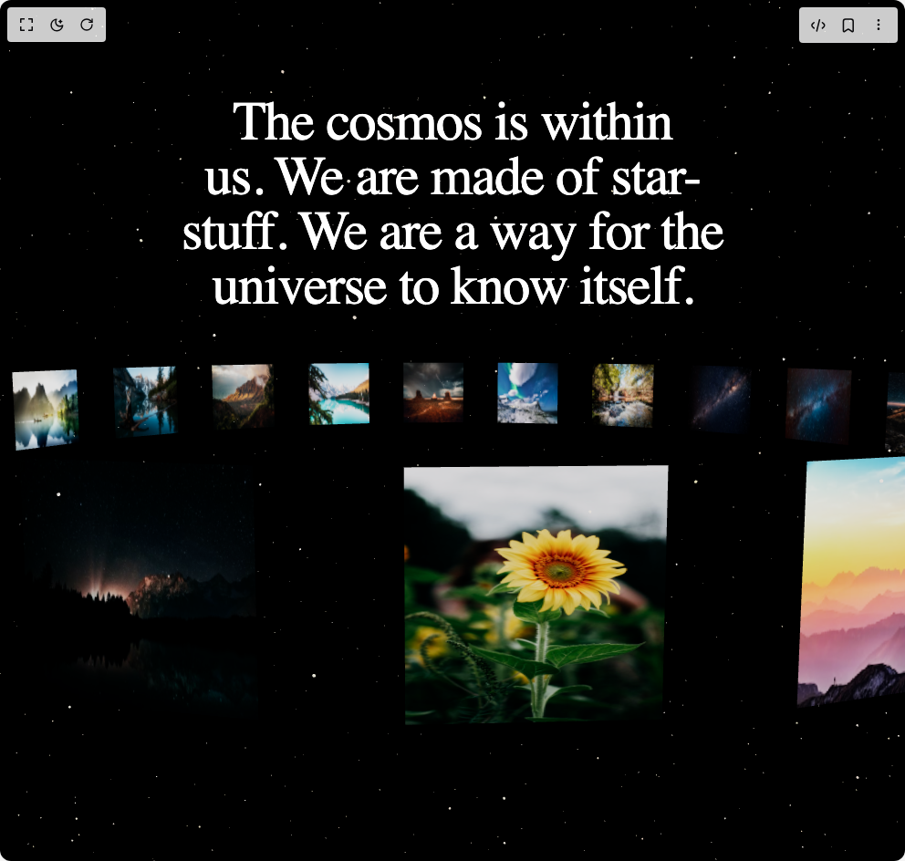

# Build Cosmos 3d Orbit Gallery in BuilderStudio

> Build this component in our Agentic IDE: [BuilderStudio](https://builderstudio.dev).
>
> Join the BuilderStudio community on [Discord](https://discord.gg/QdWeSGCqfe) and [Reddit](https://reddit.com/r/builderstudio).



## Component

- Author group: `vaib215`
- Component: `cosmos-3d-orbit-gallery`
- Variant: `default`
- Rendered HTML snapshot: [`rendered.html`](rendered.html)

## BuilderStudio prompt

You are implementing a React component based on a component reference.

## Component identity

- Author: vaib215
- Component slug: cosmos-3d-orbit-gallery
- Demo slug: default
- Title: cosmos-3d-orbit-gallery
- Description: 

## Goal

Recreate this component in a React + TypeScript + Tailwind CSS project. Preserve the visual layout, spacing, colors, border radius, shadows, interaction behavior, animation behavior, responsive behavior, and dark mode behavior shown in the rendered demo.

## Implementation requirements

- Use React and TypeScript.
- Use Tailwind CSS classes whenever possible.
- Keep the component self-contained unless the source files require helper components.
- If the source uses CSS variables, custom CSS, animations, or keyframes, include them.
- If the source uses external packages, list and use the required packages.
- Preserve accessibility attributes, button semantics, links, keyboard behavior, and ARIA attributes when visible in the source.
- Do not replace the component with a simplified placeholder.
- Return complete production-ready code.

## Dependencies

No reference metadata available.

## Rendered DOM snapshot

This is the rendered demo HTML extracted from the live preview. Use it to verify structure, class names, visible content, and layout.

```html
<div id="root"><div class="w-screen min-h-screen flex justify-center items-center"><div class="w-screen min-h-screen flex justify-center items-center"><div class="w-full h-screen bg-black relative"><div class="fixed top-20 left-0 right-0 z-10 p-6"><h1 class="max-w-[750px] mx-auto text-white text-center font-instrument-serif px-6 md:text-6xl text-4xl text-balance tracking-tight font-normal">The cosmos is within us. We are made of star-stuff. We are a way for the universe to know itself.</h1></div><div style="position: relative; width: 100%; height: 100%; overflow: hidden; pointer-events: auto; touch-action: none;"><div style="width: 100%; height: 100%;"><canvas data-engine="three.js r180" width="992" height="944" style="display: block; width: 992px; height: 944px;"></canvas></div></div></div></div></div></div>
```

## Reference source files

No reference source files were available.
