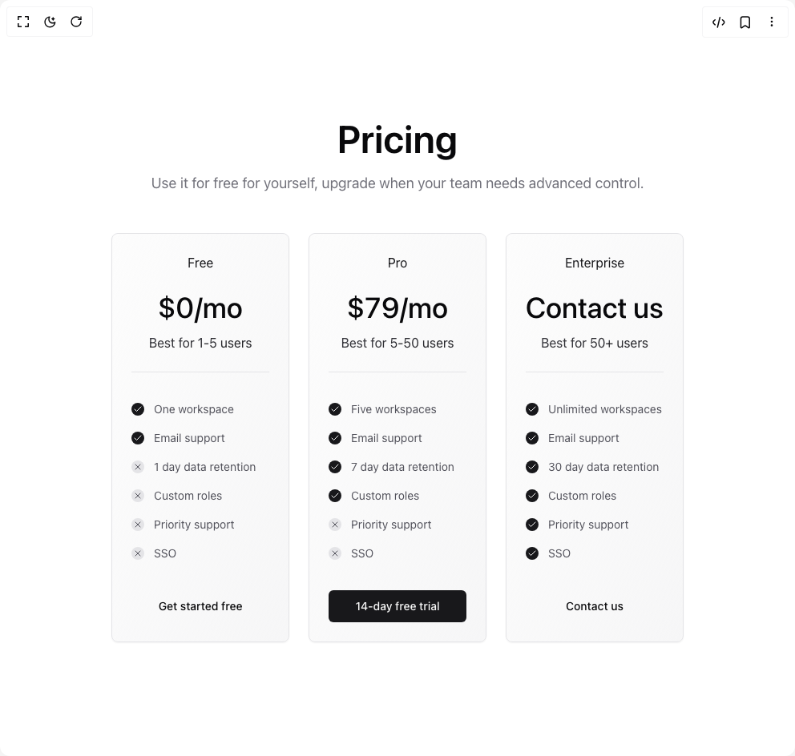

# Build Dark Gradient Pricing in BuilderStudio

> Build this component in our Agentic IDE: [BuilderStudio](https://builderstudio.dev).
>
> Join the BuilderStudio community on [Discord](https://discord.gg/QdWeSGCqfe) and [Reddit](https://reddit.com/r/builderstudio).



## Component

- Author group: `vaib215`
- Component: `dark-gradient-pricing`
- Variant: `default`
- Rendered HTML snapshot: [`rendered.html`](rendered.html)

## BuilderStudio prompt

You are implementing a React component based on a component reference.

## Component identity

- Author: vaib215
- Component slug: dark-gradient-pricing
- Demo slug: default
- Title: dark-gradient-pricing
- Description: 

## Goal

Recreate this component in a React + TypeScript + Tailwind CSS project. Preserve the visual layout, spacing, colors, border radius, shadows, interaction behavior, animation behavior, responsive behavior, and dark mode behavior shown in the rendered demo.

## Implementation requirements

- Use React and TypeScript.
- Use Tailwind CSS classes whenever possible.
- Keep the component self-contained unless the source files require helper components.
- If the source uses CSS variables, custom CSS, animations, or keyframes, include them.
- If the source uses external packages, list and use the required packages.
- Preserve accessibility attributes, button semantics, links, keyboard behavior, and ARIA attributes when visible in the source.
- Do not replace the component with a simplified placeholder.
- Return complete production-ready code.

## Dependencies

No reference metadata available.

## Rendered DOM snapshot

This is the rendered demo HTML extracted from the live preview. Use it to verify structure, class names, visible content, and layout.

```html
<div id="root"><div class="relative flex items-center justify-center h-screen w-full m-auto p-16 bg-background text-foreground"><div class="absolute lab-bg inset-0 size-full"><div class="absolute inset-0 bg-[radial-gradient(#00000021_1px,transparent_1px)] dark:bg-[radial-gradient(#ffffff22_1px,transparent_1px)]"></div></div><div class="flex w-full justify-center relative"><section class="relative overflow-hidden bg-background text-foreground"><div class="relative z-10 mx-auto max-w-5xl px-4 py-20 md:px-8"><div class="mb-12 space-y-3"><h2 class="text-center text-3xl font-semibold leading-tight sm:text-4xl sm:leading-tight md:text-5xl md:leading-tight">Pricing</h2><p class="text-center text-base text-muted-foreground md:text-lg">Use it for free for yourself, upgrade when your team needs advanced control.</p></div><div class="grid grid-cols-1 gap-6 md:grid-cols-3"><div style="filter: blur(0px);"><div class="rounded-lg text-card-foreground shadow-sm relative h-full w-full overflow-hidden border dark:border-zinc-700 dark:bg-gradient-to-br dark:from-zinc-950/50 dark:to-zinc-900/80 border-zinc-200 bg-gradient-to-br from-zinc-50/50 to-zinc-100/80 p-6"><div class="flex flex-col items-center border-b pb-6 dark:border-zinc-700 border-zinc-200"><span class="mb-6 inline-block dark:text-zinc-50 text-zinc-900">Free</span><span class="mb-3 inline-block text-4xl font-medium">$0/mo</span><span class="dark:bg-gradient-to-br dark:from-zinc-200 dark:to-zinc-500 bg-gradient-to-br from-zinc-700 to-zinc-900 bg-clip-text text-center text-transparent">Best for 1-5 users</span></div><div class="space-y-4 py-9"><div class="flex items-center gap-3"><span class="grid size-4 place-content-center rounded-full bg-primary text-sm text-primary-foreground"><svg xmlns="http://www.w3.org/2000/svg" width="24" height="24" viewBox="0 0 24 24" fill="none" stroke="currentColor" stroke-width="2" stroke-linecap="round" stroke-linejoin="round" class="lucide lucide-check size-3" aria-hidden="true"><path d="M20 6 9 17l-5-5"></path></svg></span><span class="text-sm dark:text-zinc-300 text-zinc-600">One workspace</span></div><div class="flex items-center gap-3"><span class="grid size-4 place-content-center rounded-full bg-primary text-sm text-primary-foreground"><svg xmlns="http://www.w3.org/2000/svg" width="24" height="24" viewBox="0 0 24 24" fill="none" stroke="currentColor" stroke-width="2" stroke-linecap="round" stroke-linejoin="round" class="lucide lucide-check size-3" aria-hidden="true"><path d="M20 6 9 17l-5-5"></path></svg></span><span class="text-sm dark:text-zinc-300 text-zinc-600">Email support</span></div><div class="flex items-center gap-3"><span class="grid size-4 place-content-center rounded-full dark:bg-zinc-800 bg-zinc-200 text-sm dark:text-zinc-400 text-zinc-600"><svg xmlns="http://www.w3.org/2000/svg" width="24" height="24" viewBox="0 0 24 24" fill="none" stroke="currentColor" stroke-width="2" stroke-linecap="round" stroke-linejoin="round" class="lucide lucide-x size-3" aria-hidden="true"><path d="M18 6 6 18"></path><path d="m6 6 12 12"></path></svg></span><span class="text-sm dark:text-zinc-300 text-zinc-600">1 day data retention</span></div><div class="flex items-center gap-3"><span class="grid size-4 place-content-center rounded-full dark:bg-zinc-800 bg-zinc-200 text-sm dark:text-zinc-400 text-zinc-600"><svg xmlns="http://www.w3.org/2000/svg" width="24" height="24" viewBox="0 0 24 24" fill="none" stroke="currentColor" stroke-width="2" stroke-linecap="round" stroke-linejoin="round" class="lucide lucide-x size-3" aria-hidden="true"><path d="M18 6 6 18"></path><path d="m6 6 12 12"></path></svg></span><span class="text-sm dark:text-zinc-300 text-zinc-600">Custom roles</span></div><div class="flex items-center gap-3"><span class="grid size-4 place-content-center rounded-full dark:bg-zinc-800 bg-zinc-200 text-sm dark:text-zinc-400 text-zinc-600"><svg xmlns="http://www.w3.org/2000/svg" width="24" height="24" viewBox="0 0 24 24" fill="none" stroke="currentColor" stroke-width="2" stroke-linecap="round" stroke-linejoin="round" class="lucide lucide-x size-3" aria-hidden="true"><path d="M18 6 6 18"></path><path d="m6 6 12 12"></path></svg></span><span class="text-sm dark:text-zinc-300 text-zinc-600">Priority support</span></div><div class="flex items-center gap-3"><span class="grid size-4 place-content-center rounded-full dark:bg-zinc-800 bg-zinc-200 text-sm dark:text-zinc-400 text-zinc-600"><svg xmlns="http://www.w3.org/2000/svg" width="24" height="24" viewBox="0 0 24 24" fill="none" stroke="currentColor" stroke-width="2" stroke-linecap="round" stroke-linejoin="round" class="lucide lucide-x size-3" aria-hidden="true"><path d="M18 6 6 18"></path><path d="m6 6 12 12"></path></svg></span><span class="text-sm dark:text-zinc-300 text-zinc-600">SSO</span></div></div><button class="inline-flex items-center justify-center whitespace-nowrap rounded-md text-sm font-medium ring-offset-background transition-colors focus-visible:outline-none focus-visible:ring-2 focus-visible:ring-ring focus-visible:ring-offset-2 disabled:pointer-events-none disabled:opacity-50 hover:bg-accent hover:text-accent-foreground h-10 px-4 py-2 w-full">Get started free</button></div></div><div style="filter: blur(0px);"><div class="rounded-lg text-card-foreground shadow-sm relative h-full w-full overflow-hidden border dark:border-zinc-700 dark:bg-gradient-to-br dark:from-zinc-950/50 dark:to-zinc-900/80 border-zinc-200 bg-gradient-to-br from-zinc-50/50 to-zinc-100/80 p-6"><div class="flex flex-col items-center border-b pb-6 dark:border-zinc-700 border-zinc-200"><span class="mb-6 inline-block dark:text-zinc-50 text-zinc-900">Pro</span><span class="mb-3 inline-block text-4xl font-medium">$79/mo</span><span class="dark:bg-gradient-to-br dark:from-zinc-200 dark:to-zinc-500 bg-gradient-to-br from-zinc-700 to-zinc-900 bg-clip-text text-center text-transparent">Best for 5-50 users</span></div><div class="space-y-4 py-9"><div class="flex items-center gap-3"><span class="grid size-4 place-content-center rounded-full bg-primary text-sm text-primary-foreground"><svg xmlns="http://www.w3.org/2000/svg" width="24" height="24" viewBox="0 0 24 24" fill="none" stroke="currentColor" stroke-width="2" stroke-linecap="round" stroke-linejoin="round" class="lucide lucide-check size-3" aria-hidden="true"><path d="M20 6 9 17l-5-5"></path></svg></span><span class="text-sm dark:text-zinc-300 text-zinc-600">Five workspaces</span></div><div class="flex items-center gap-3"><span class="grid size-4 place-content-center rounded-full bg-primary text-sm text-primary-foreground"><svg xmlns="http://www.w3.org/2000/svg" width="24" height="24" viewBox="0 0 24 24" fill="none" stroke="currentColor" stroke-width="2" stroke-linecap="round" stroke-linejoin="round" class="lucide lucide-check size-3" aria-hidden="true"><path d="M20 6 9 17l-5-5"></path></svg></span><span class="text-sm dark:text-zinc-300 text-zinc-600">Email support</span></div><div class="flex items-center gap-3"><span class="grid size-4 place-content-center rounded-full bg-primary text-sm text-primary-foreground"><svg xmlns="http://www.w3.org/2000/svg" width="24" height="24" viewBox="0 0 24 24" fill="none" stroke="currentColor" stroke-width="2" stroke-linecap="round" stroke-linejoin="round" class="lucide lucide-check size-3" aria-hidden="true"><path d="M20 6 9 17l-5-5"></path></svg></span><span class="text-sm dark:text-zinc-300 text-zinc-600">7 day data retention</span></div><div class="flex items-center gap-3"><span class="grid size-4 place-content-center rounded-full bg-primary text-sm text-primary-foreground"><svg xmlns="http://www.w3.org/2000/svg" width="24" height="24" viewBox="0 0 24 24" fill="none" stroke="currentColor" stroke-width="2" stroke-linecap="round" stroke-linejoin="round" class="lucide lucide-check size-3" aria-hidden="true"><path d="M20 6 9 17l-5-5"></path></svg></span><span class="text-sm dark:text-zinc-300 text-zinc-600">Custom roles</span></div><div class="flex items-center gap-3"><span class="grid size-4 place-content-center rounded-full dark:bg-zinc-800 bg-zinc-200 text-sm dark:text-zinc-400 text-zinc-600"><svg xmlns="http://www.w3.org/2000/svg" width="24" height="24" viewBox="0 0 24 24" fill="none" stroke="currentColor" stroke-width="2" stroke-linecap="round" stroke-linejoin="round" class="lucide lucide-x size-3" aria-hidden="true"><path d="M18 6 6 18"></path><path d="m6 6 12 12"></path></svg></span><span class="text-sm dark:text-zinc-300 text-zinc-600">Priority support</span></div><div class="flex items-center gap-3"><span class="grid size-4 place-content-center rounded-full dark:bg-zinc-800 bg-zinc-200 text-sm dark:text-zinc-400 text-zinc-600"><svg xmlns="http://www.w3.org/2000/svg" width="24" height="24" viewBox="0 0 24 24" fill="none" stroke="currentColor" stroke-width="2" stroke-linecap="round" stroke-linejoin="round" class="lucide lucide-x size-3" aria-hidden="true"><path d="M18 6 6 18"></path><path d="m6 6 12 12"></path></svg></span><span class="text-sm dark:text-zinc-300 text-zinc-600">SSO</span></div></div><button class="inline-flex items-center justify-center whitespace-nowrap rounded-md text-sm font-medium ring-offset-background transition-colors focus-visible:outline-none focus-visible:ring-2 focus-visible:ring-ring focus-visible:ring-offset-2 disabled:pointer-events-none disabled:opacity-50 bg-primary text-primary-foreground hover:bg-primary/90 h-10 px-4 py-2 w-full">14-day free trial</button></div></div><div style="filter: blur(0px);"><div class="rounded-lg text-card-foreground shadow-sm relative h-full w-full overflow-hidden border dark:border-zinc-700 dark:bg-gradient-to-br dark:from-zinc-950/50 dark:to-zinc-900/80 border-zinc-200 bg-gradient-to-br from-zinc-50/50 to-zinc-100/80 p-6"><div class="flex flex-col items-center border-b pb-6 dark:border-zinc-700 border-zinc-200"><span class="mb-6 inline-block dark:text-zinc-50 text-zinc-900">Enterprise</span><span class="mb-3 inline-block text-4xl font-medium">Contact us</span><span class="dark:bg-gradient-to-br dark:from-zinc-200 dark:to-zinc-500 bg-gradient-to-br from-zinc-700 to-zinc-900 bg-clip-text text-center text-transparent">Best for 50+ users</span></div><div class="space-y-4 py-9"><div class="flex items-center gap-3"><span class="grid size-4 place-content-center rounded-full bg-primary text-sm text-primary-foreground"><svg xmlns="http://www.w3.org/2000/svg" width="24" height="24" viewBox="0 0 24 24" fill="none" stroke="currentColor" stroke-width="2" stroke-linecap="round" stroke-linejoin="round" class="lucide lucide-check size-3" aria-hidden="true"><path d="M20 6 9 17l-5-5"></path></svg></span><span class="text-sm dark:text-zinc-300 text-zinc-600">Unlimited workspaces</span></div><div class="flex items-center gap-3"><span class="grid size-4 place-content-center rounded-full bg-primary text-sm text-primary-foreground"><svg xmlns="http://www.w3.org/2000/svg" width="24" height="24" viewBox="0 0 24 24" fill="none" stroke="currentColor" stroke-width="2" stroke-linecap="round" stroke-linejoin="round" class="lucide lucide-check size-3" aria-hidden="true"><path d="M20 6 9 17l-5-5"></path></svg></span><span class="text-sm dark:text-zinc-300 text-zinc-600">Email support</span></div><div class="flex items-center gap-3"><span class="grid size-4 place-content-center rounded-full bg-primary text-sm text-primary-foreground"><svg xmlns="http://www.w3.org/2000/svg" width="24" height="24" viewBox="0 0 24 24" fill="none" stroke="currentColor" stroke-width="2" stroke-linecap="round" stroke-linejoin="round" class="lucide lucide-check size-3" aria-hidden="true"><path d="M20 6 9 17l-5-5"></path></svg></span><span class="text-sm dark:text-zinc-300 text-zinc-600">30 day data retention</span></div><div class="flex items-center gap-3"><span class="grid size-4 place-content-center rounded-full bg-primary text-sm text-primary-foreground"><svg xmlns="http://www.w3.org/2000/svg" width="24" height="24" viewBox="0 0 24 24" fill="none" stroke="currentColor" stroke-width="2" stroke-linecap="round" stroke-linejoin="round" class="lucide lucide-check size-3" aria-hidden="true"><path d="M20 6 9 17l-5-5"></path></svg></span><span class="text-sm dark:text-zinc-300 text-zinc-600">Custom roles</span></div><div class="flex items-center gap-3"><span class="grid size-4 place-content-center rounded-full bg-primary text-sm text-primary-foreground"><svg xmlns="http://www.w3.org/2000/svg" width="24" height="24" viewBox="0 0 24 24" fill="none" stroke="currentColor" stroke-width="2" stroke-linecap="round" stroke-linejoin="round" class="lucide lucide-check size-3" aria-hidden="true"><path d="M20 6 9 17l-5-5"></path></svg></span><span class="text-sm dark:text-zinc-300 text-zinc-600">Priority support</span></div><div class="flex items-center gap-3"><span class="grid size-4 place-content-center rounded-full bg-primary text-sm text-primary-foreground"><svg xmlns="http://www.w3.org/2000/svg" width="24" height="24" viewBox="0 0 24 24" fill="none" stroke="currentColor" stroke-width="2" stroke-linecap="round" stroke-linejoin="round" class="lucide lucide-check size-3" aria-hidden="true"><path d="M20 6 9 17l-5-5"></path></svg></span><span class="text-sm dark:text-zinc-300 text-zinc-600">SSO</span></div></div><button class="inline-flex items-center justify-center whitespace-nowrap rounded-md text-sm font-medium ring-offset-background transition-colors focus-visible:outline-none focus-visible:ring-2 focus-visible:ring-ring focus-visible:ring-offset-2 disabled:pointer-events-none disabled:opacity-50 hover:bg-accent hover:text-accent-foreground h-10 px-4 py-2 w-full">Contact us</button></div></div></div></div></section></div></div></div>
```

## Reference source files

No reference source files were available.
