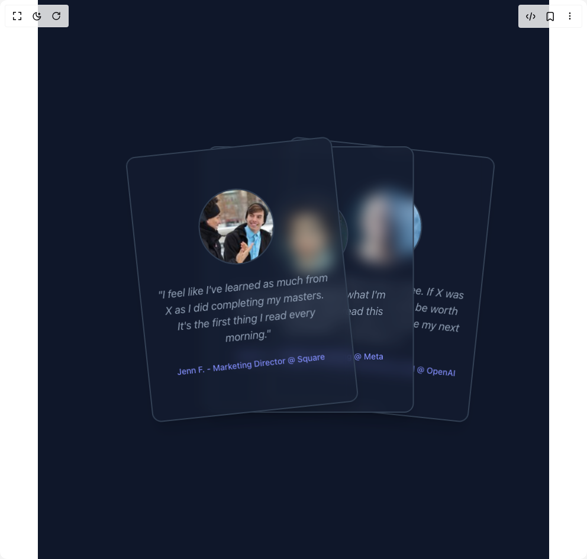

# Build Testimonial Cards in BuilderStudio

> Build this component in our Agentic IDE: [BuilderStudio](https://builderstudio.dev).
>
> Join the BuilderStudio community on [Discord](https://discord.gg/QdWeSGCqfe) and [Reddit](https://reddit.com/r/builderstudio).



## Component

- Author group: `vaib215`
- Component: `testimonial-cards`
- Variant: `default`
- Rendered HTML snapshot: [`rendered.html`](rendered.html)

## BuilderStudio prompt

You are implementing a React component based on a component reference.

## Component identity

- Author: vaib215
- Component slug: testimonial-cards
- Demo slug: default
- Title: testimonial-cards
- Description: 

## Goal

Recreate this component in a React + TypeScript + Tailwind CSS project. Preserve the visual layout, spacing, colors, border radius, shadows, interaction behavior, animation behavior, responsive behavior, and dark mode behavior shown in the rendered demo.

## Implementation requirements

- Use React and TypeScript.
- Use Tailwind CSS classes whenever possible.
- Keep the component self-contained unless the source files require helper components.
- If the source uses CSS variables, custom CSS, animations, or keyframes, include them.
- If the source uses external packages, list and use the required packages.
- Preserve accessibility attributes, button semantics, links, keyboard behavior, and ARIA attributes when visible in the source.
- Do not replace the component with a simplified placeholder.
- Return complete production-ready code.

## Dependencies

No reference metadata available.

## Rendered DOM snapshot

This is the rendered demo HTML extracted from the live preview. Use it to verify structure, class names, visible content, and layout.

```html
<div id="root"><div class="relative flex items-center justify-center h-screen w-full m-auto p-16 bg-background text-foreground"><div class="absolute lab-bg inset-0 size-full"><div class="absolute inset-0 bg-[radial-gradient(#00000021_1px,transparent_1px)] dark:bg-[radial-gradient(#ffffff22_1px,transparent_1px)]"></div></div><div class="flex w-full justify-center relative"><div class="grid place-content-center overflow-hidden bg-slate-900 px-8 py-24 text-slate-50 min-h-screen h-full w-full"><div class="relative -ml-[100px] h-[450px] w-[350px] md:-ml-[175px]"><div class="absolute left-0 top-0 grid h-[450px] w-[350px] select-none place-content-center space-y-6 rounded-2xl border-2 border-slate-700 bg-slate-800/20 p-6 shadow-xl backdrop-blur-md cursor-grab active:cursor-grabbing" draggable="false" style="z-index: 2; user-select: none; touch-action: none; transform: rotate(-6deg);"><span class="text-center text-lg italic text-slate-400">"I feel like I've learned as much from X as I did completing my masters. It's the first thing I read every morning."</span><span class="text-center text-sm font-medium text-indigo-400">Jenn F. - Marketing Director @ Square</span></div><div class="absolute left-0 top-0 grid h-[450px] w-[350px] select-none place-content-center space-y-6 rounded-2xl border-2 border-slate-700 bg-slate-800/20 p-6 shadow-xl backdrop-blur-md " style="z-index: 1; transform: translateX(33%);"><span class="text-center text-lg italic text-slate-400">"My boss thinks I know what I'm doing. Honestly, I just read this newsletter."</span><span class="text-center text-sm font-medium text-indigo-400">Adrian Y. - Product Marketing @ Meta</span></div><div class="absolute left-0 top-0 grid h-[450px] w-[350px] select-none place-content-center space-y-6 rounded-2xl border-2 border-slate-700 bg-slate-800/20 p-6 shadow-xl backdrop-blur-md " style="z-index: 0; transform: translateX(66%) rotate(6deg);"><span class="text-center text-lg italic text-slate-400">"Can not believe this is free. If X was $5,000 a month, it would be worth every penny. I plan to name my next child after X."</span><span class="text-center text-sm font-medium text-indigo-400">Devin R. - Growth Marketing Lead @ OpenAI</span></div></div></div></div></div></div>
```

## Reference source files

No reference source files were available.
