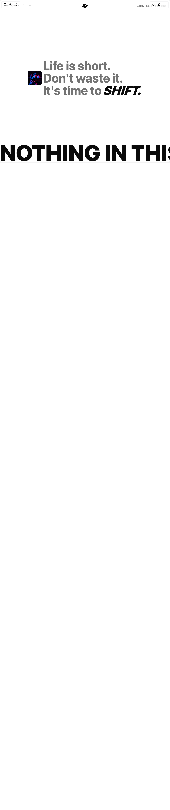

# Build Velocity Text in BuilderStudio

> Build this component in our Agentic IDE: [BuilderStudio](https://builderstudio.dev).
>
> Join the BuilderStudio community on [Discord](https://discord.gg/QdWeSGCqfe) and [Reddit](https://reddit.com/r/builderstudio).



## Component

- Author group: `vaib215`
- Component: `velocity-text`
- Variant: `default`
- Rendered HTML snapshot: [`rendered.html`](rendered.html)

## BuilderStudio prompt

You are implementing a React component based on a component reference.

## Component identity

- Author: vaib215
- Component slug: velocity-text
- Demo slug: default
- Title: velocity-text
- Description: 

## Goal

Recreate this component in a React + TypeScript + Tailwind CSS project. Preserve the visual layout, spacing, colors, border radius, shadows, interaction behavior, animation behavior, responsive behavior, and dark mode behavior shown in the rendered demo.

## Implementation requirements

- Use React and TypeScript.
- Use Tailwind CSS classes whenever possible.
- Keep the component self-contained unless the source files require helper components.
- If the source uses CSS variables, custom CSS, animations, or keyframes, include them.
- If the source uses external packages, list and use the required packages.
- Preserve accessibility attributes, button semantics, links, keyboard behavior, and ARIA attributes when visible in the source.
- Do not replace the component with a simplified placeholder.
- Return complete production-ready code.

## Dependencies

No reference metadata available.

## Rendered DOM snapshot

This is the rendered demo HTML extracted from the live preview. Use it to verify structure, class names, visible content, and layout.

```html
<div id="root"><div class="fixed top-4 left-4 z-10"><select class="appearance-none h-8 max-w-[200px] text-sm leading-tight rounded-lg pl-3 pr-7 py-0 border bg-background focus:outline-none focus:ring-0"><option value="named_DemoOne_DemoOne">DemoOne</option></select><div class="absolute top-1/2 transform -translate-y-1/2 right-2 pointer-events-none"><svg class="w-4 h-4 fill-current" viewBox="0 0 20 20"><path d="M5.516 7.548c.436-.446 1.043-.48 1.576 0L10 10.405l2.908-2.857c.533-.48 1.14-.446 1.576 0 .436.445.408 1.197 0 1.615l-3.734 3.705c-.533.534-1.39.534-1.923 0l-3.734-3.705c-.408-.418-.436-1.17 0-1.615z"></path></svg></div></div><div class="w-screen min-h-screen flex justify-center items-center"><section class="h-[500vh] bg-background text-foreground transition-colors duration-300"><div class="sticky top-0 left-0 right-0 w-screen flex h-screen flex-col justify-between overflow-hidden"><div class="relative mb-1 flex w-full justify-between p-6"><p class="hidden text-xs md:block text-muted-foreground">40° 42' 46" N, 74° 0' 21" W<br></p><svg width="36" height="auto" viewBox="0 0 50 39" fill="none" xmlns="http://www.w3.org/2000/svg" class="absolute right-4 top-1/2 h-fit -translate-y-1/2 translate-x-0 md:right-1/2 md:translate-x-1/2 fill-foreground transition-colors duration-300"><path d="M16.4992 2H37.5808L22.0816 24.9729H1L16.4992 2Z"></path><path d="M17.4224 27.102L11.4192 36H33.5008L49 13.0271H32.7024L23.2064 27.102H17.4224Z"></path></svg><nav class="flex gap-3 text-sm"><a href="#" class="transition-colors duration-200 text-muted-foreground hover:text-foreground">Supply</a><a href="#" class="transition-colors duration-200 text-muted-foreground hover:text-foreground">Merch</a><a href="#" class="transition-colors duration-200 text-muted-foreground hover:text-foreground">Locations</a></nav></div><div class="flex items-center justify-center px-4"><div class="mr-2 h-20 w-20 bg-muted rounded-sm overflow-hidden transition-colors duration-300"></div><h1 class="text-3xl font-bold sm:text-5xl md:text-7xl"><span class="text-muted-foreground">Life is short. <br>Don't waste it. <br>It's time to </span><span class="inline-block -skew-x-[18deg] font-black text-foreground">SHIFT.</span></h1></div><p class="origin-bottom-left whitespace-nowrap text-7xl font-black uppercase leading-[0.85] md:text-9xl md:leading-[0.85] text-foreground" style="transform: none;">Nothing in this world can take the place of persistence. Talent will not; nothing is more common than unsuccessful men with talent. Genius will not; unrewarded genius is almost a proverb. Education will not; the world is full of educated derelicts. Persistence and determination alone are omnipotent. The slogan 'Press On!' has solved and always will solve the problems of the human race.</p><div class="absolute left-4 top-1/2 hidden -translate-y-1/2 text-xs lg:block text-muted-foreground"><span style="writing-mode: vertical-lr;">SCROLL</span><svg xmlns="http://www.w3.org/2000/svg" width="24" height="24" viewBox="0 0 24 24" fill="none" stroke="currentColor" stroke-width="2" stroke-linecap="round" stroke-linejoin="round" class="mx-auto"><path d="M12 5v14"></path><path d="m19 12-7 7-7-7"></path></svg></div><div class="absolute right-4 top-1/2 hidden -translate-y-1/2 text-xs lg:block text-muted-foreground"><span style="writing-mode: vertical-lr;">SCROLL</span><svg xmlns="http://www.w3.org/2000/svg" width="24" height="24" viewBox="0 0 24 24" fill="none" stroke="currentColor" stroke-width="2" stroke-linecap="round" stroke-linejoin="round" class="mx-auto"><path d="M12 5v14"></path><path d="m19 12-7 7-7-7"></path></svg></div></div></section></div></div>
```

## Reference source files

No reference source files were available.
