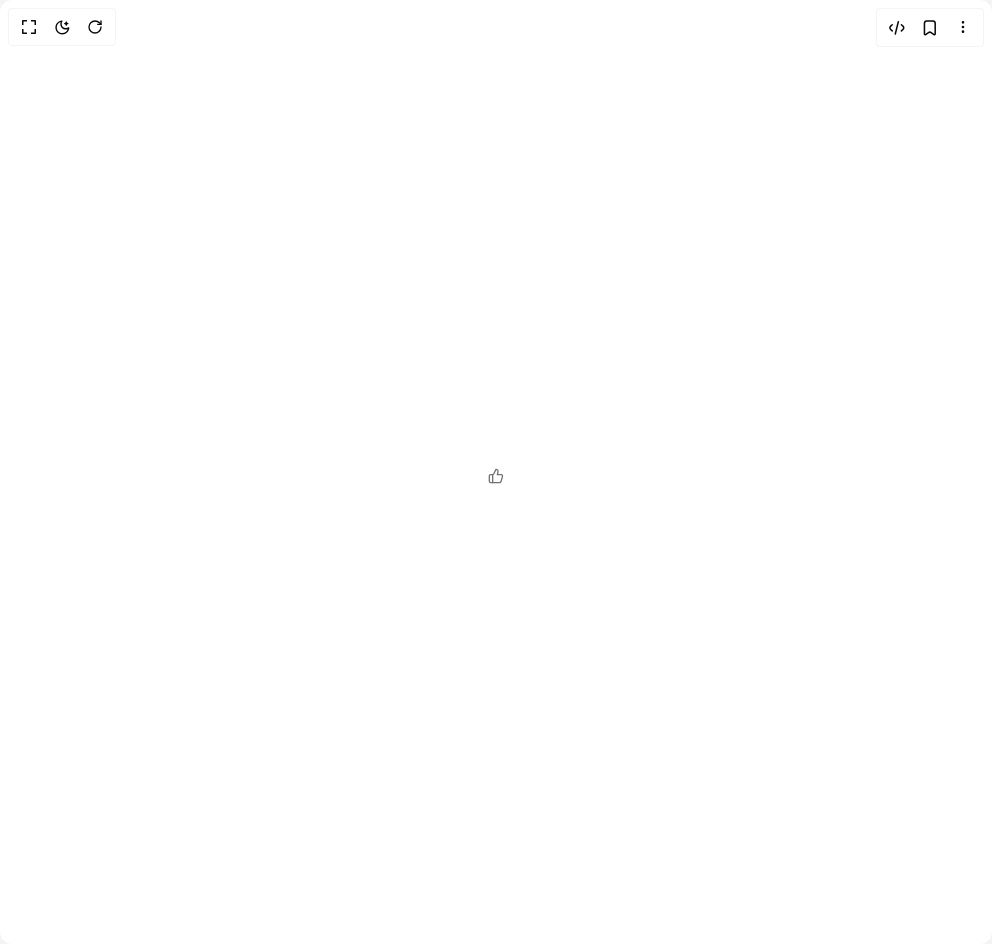
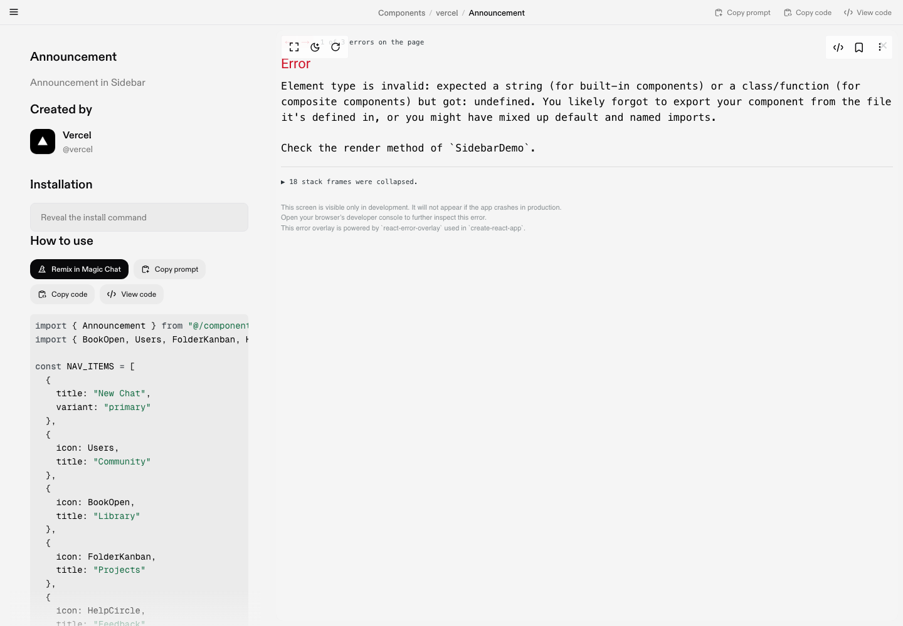
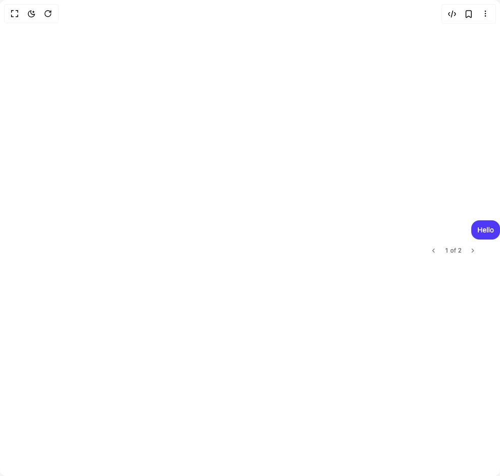
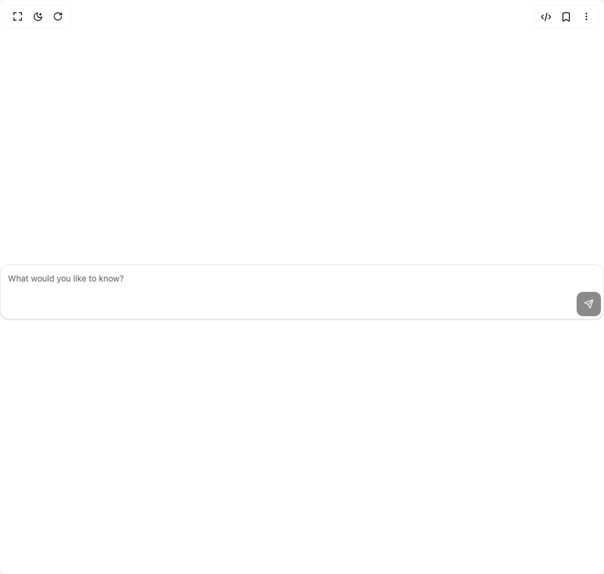
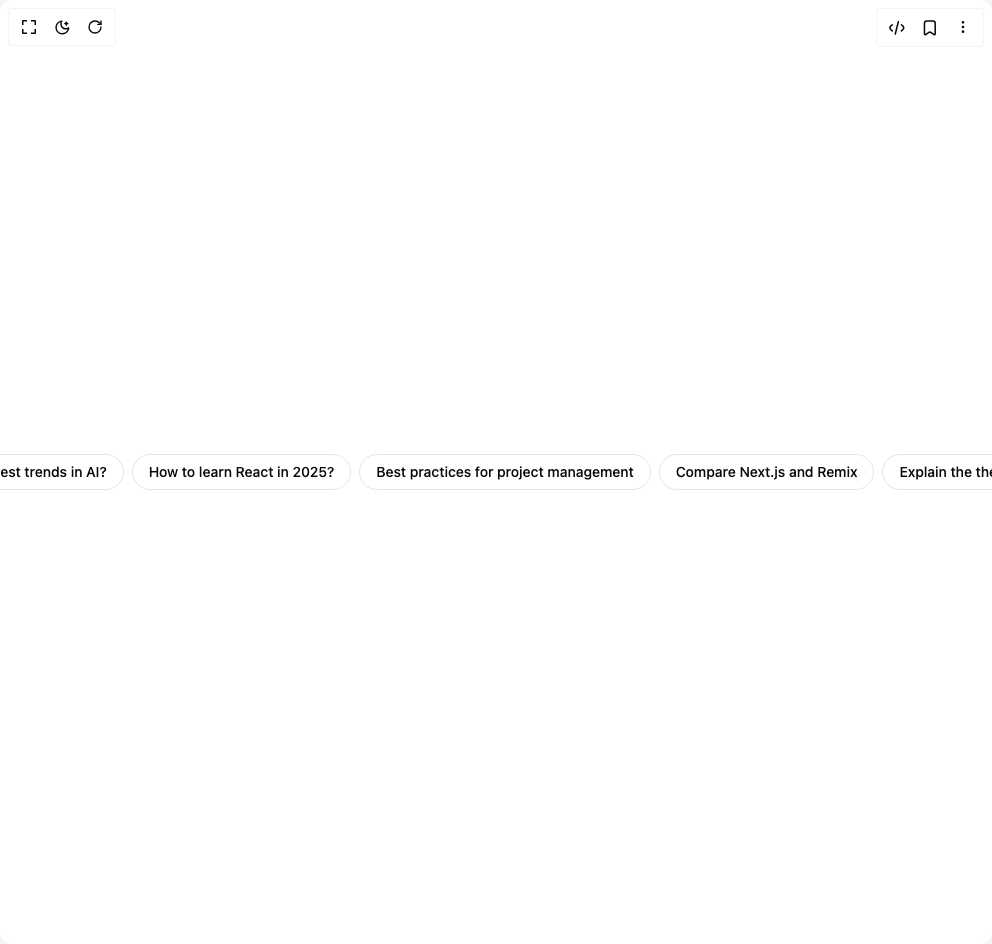

# Vercel Components

10 components are available in this author group.

> Build any component in [BuilderStudio](https://builderstudio.dev), then share improvements with the community on [Discord](https://discord.gg/QdWeSGCqfe) or [Reddit](https://reddit.com/r/builderstudio).

| Preview | Component | Variant |
| --- | --- | --- |
|  | [Actions](actions/default/README.md) | `default` |
|  | [Announcement](announcement/default/README.md) | `default` |
|  | [Branch](branch/default/README.md) | `default` |
|  | [Code Block](code-block/default/README.md) | `default` |
|  | [Conversation](conversation/default/README.md) | `default` |
|  | [Inline Citation](inline-citation/default/README.md) | `default` |
|  | [Loader](loader/default/README.md) | `default` |
|  | [Message](message/default/README.md) | `default` |
|  | [Promt Input](promt-input/default/README.md) | `default` |
|  | [Suggestion](suggestion/default/README.md) | `default` |
