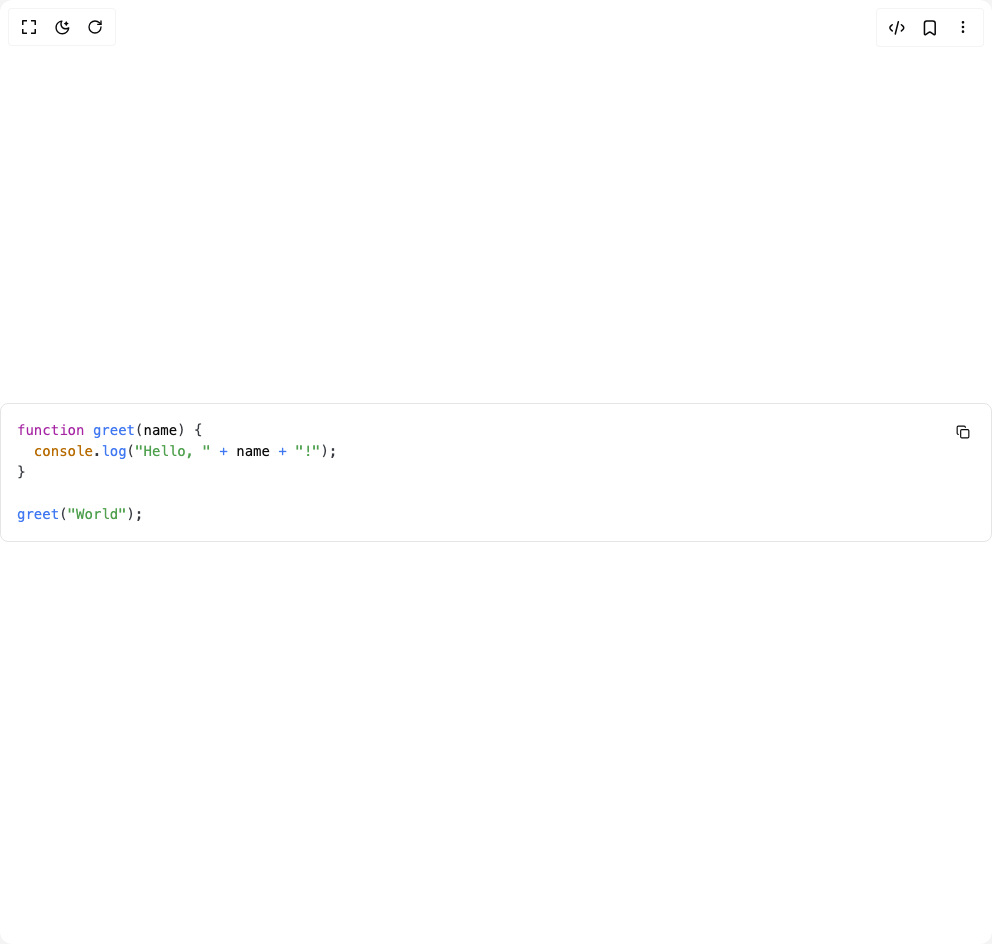

# Build Code Block in BuilderStudio

> Build this component in our Agentic IDE: [BuilderStudio](https://builderstudio.dev).
>
> Join the BuilderStudio community on [Discord](https://discord.gg/QdWeSGCqfe) and [Reddit](https://reddit.com/r/builderstudio).



## Component

- Author group: `vercel`
- Component: `code-block`
- Variant: `default`
- Rendered HTML snapshot: [`rendered.html`](rendered.html)

## BuilderStudio prompt

You are implementing a React component based on a component reference.

## Component identity

- Author: vercel
- Component slug: code-block
- Demo slug: default
- Title: code-block
- Description: 

## Goal

Recreate this component in a React + TypeScript + Tailwind CSS project. Preserve the visual layout, spacing, colors, border radius, shadows, interaction behavior, animation behavior, responsive behavior, and dark mode behavior shown in the rendered demo.

## Implementation requirements

- Use React and TypeScript.
- Use Tailwind CSS classes whenever possible.
- Keep the component self-contained unless the source files require helper components.
- If the source uses CSS variables, custom CSS, animations, or keyframes, include them.
- If the source uses external packages, list and use the required packages.
- Preserve accessibility attributes, button semantics, links, keyboard behavior, and ARIA attributes when visible in the source.
- Do not replace the component with a simplified placeholder.
- Return complete production-ready code.

## Dependencies

No reference metadata available.

## Rendered DOM snapshot

This is the rendered demo HTML extracted from the live preview. Use it to verify structure, class names, visible content, and layout.

```html
<div id="root"><div class="w-screen min-h-screen flex justify-center items-center"><div class="w-screen min-h-screen flex justify-center items-center"><div class="relative w-full overflow-hidden rounded-md border bg-background text-foreground"><div class="relative"><pre class="dark:hidden overflow-hidden" style="background: hsl(var(--background)); color: hsl(var(--foreground)); font-family: &quot;Fira Code&quot;, &quot;Fira Mono&quot;, Menlo, Consolas, &quot;DejaVu Sans Mono&quot;, monospace; direction: ltr; text-align: left; white-space: pre; word-spacing: normal; word-break: normal; line-height: 1.5; tab-size: 2; hyphens: none; padding: 1rem; margin: 0px; overflow: auto; border-radius: 0.3em; font-size: 0.875rem;"><code class="font-mono text-sm" style="white-space: pre;"><span class="token" style="color: rgb(166, 38, 164);">function</span><span> </span><span class="token" style="color: rgb(64, 120, 242);">greet</span><span class="token" style="color: rgb(56, 58, 66);">(</span><span class="token parameter">name</span><span class="token" style="color: rgb(56, 58, 66);">)</span><span> </span><span class="token" style="color: rgb(56, 58, 66);">{</span><span>
</span><span>  </span><span class="token console" style="color: rgb(183, 107, 1);">console</span><span class="token" style="color: rgb(56, 58, 66);">.</span><span class="token method property-access" style="color: rgb(64, 120, 242);">log</span><span class="token" style="color: rgb(56, 58, 66);">(</span><span class="token" style="color: rgb(80, 161, 79);">"Hello, "</span><span> </span><span class="token" style="color: rgb(64, 120, 242);">+</span><span> name </span><span class="token" style="color: rgb(64, 120, 242);">+</span><span> </span><span class="token" style="color: rgb(80, 161, 79);">"!"</span><span class="token" style="color: rgb(56, 58, 66);">)</span><span class="token" style="color: rgb(56, 58, 66);">;</span><span>
</span><span></span><span class="token" style="color: rgb(56, 58, 66);">}</span><span>
</span>
<span></span><span class="token" style="color: rgb(64, 120, 242);">greet</span><span class="token" style="color: rgb(56, 58, 66);">(</span><span class="token" style="color: rgb(80, 161, 79);">"World"</span><span class="token" style="color: rgb(56, 58, 66);">)</span><span class="token" style="color: rgb(56, 58, 66);">;</span></code></pre><pre class="hidden dark:block overflow-hidden" style="background: hsl(var(--background)); color: hsl(var(--foreground)); text-shadow: rgba(0, 0, 0, 0.3) 0px 1px; font-family: &quot;Fira Code&quot;, &quot;Fira Mono&quot;, Menlo, Consolas, &quot;DejaVu Sans Mono&quot;, monospace; direction: ltr; text-align: left; white-space: pre; word-spacing: normal; word-break: normal; line-height: 1.5; tab-size: 2; hyphens: none; padding: 1rem; margin: 0px; overflow: auto; border-radius: 0.3em; font-size: 0.875rem;"><code class="font-mono text-sm" style="white-space: pre;"><span class="token" style="color: rgb(198, 120, 221);">function</span><span> </span><span class="token" style="color: rgb(97, 175, 239);">greet</span><span class="token" style="color: rgb(171, 178, 191);">(</span><span class="token parameter">name</span><span class="token" style="color: rgb(171, 178, 191);">)</span><span> </span><span class="token" style="color: rgb(171, 178, 191);">{</span><span>
</span><span>  </span><span class="token console" style="color: rgb(209, 154, 102);">console</span><span class="token" style="color: rgb(171, 178, 191);">.</span><span class="token method property-access" style="color: rgb(97, 175, 239);">log</span><span class="token" style="color: rgb(171, 178, 191);">(</span><span class="token" style="color: rgb(152, 195, 121);">"Hello, "</span><span> </span><span class="token" style="color: rgb(97, 175, 239);">+</span><span> name </span><span class="token" style="color: rgb(97, 175, 239);">+</span><span> </span><span class="token" style="color: rgb(152, 195, 121);">"!"</span><span class="token" style="color: rgb(171, 178, 191);">)</span><span class="token" style="color: rgb(171, 178, 191);">;</span><span>
</span><span></span><span class="token" style="color: rgb(171, 178, 191);">}</span><span>
</span>
<span></span><span class="token" style="color: rgb(97, 175, 239);">greet</span><span class="token" style="color: rgb(171, 178, 191);">(</span><span class="token" style="color: rgb(152, 195, 121);">"World"</span><span class="token" style="color: rgb(171, 178, 191);">)</span><span class="token" style="color: rgb(171, 178, 191);">;</span></code></pre><div class="absolute right-2 top-2 flex items-center gap-2"><button class="inline-flex items-center justify-center whitespace-nowrap rounded-md text-sm font-medium ring-offset-background transition-colors focus-visible:outline-none focus-visible:ring-2 focus-visible:ring-ring focus-visible:ring-offset-2 disabled:pointer-events-none disabled:opacity-50 hover:bg-accent hover:text-accent-foreground h-10 w-10 shrink-0"><svg xmlns="http://www.w3.org/2000/svg" width="14" height="14" viewBox="0 0 24 24" fill="none" stroke="currentColor" stroke-width="2" stroke-linecap="round" stroke-linejoin="round" class="lucide lucide-copy" aria-hidden="true"><rect width="14" height="14" x="8" y="8" rx="2" ry="2"></rect><path d="M4 16c-1.1 0-2-.9-2-2V4c0-1.1.9-2 2-2h10c1.1 0 2 .9 2 2"></path></svg></button></div></div></div></div></div></div>
```

## Reference source files

No reference source files were available.
