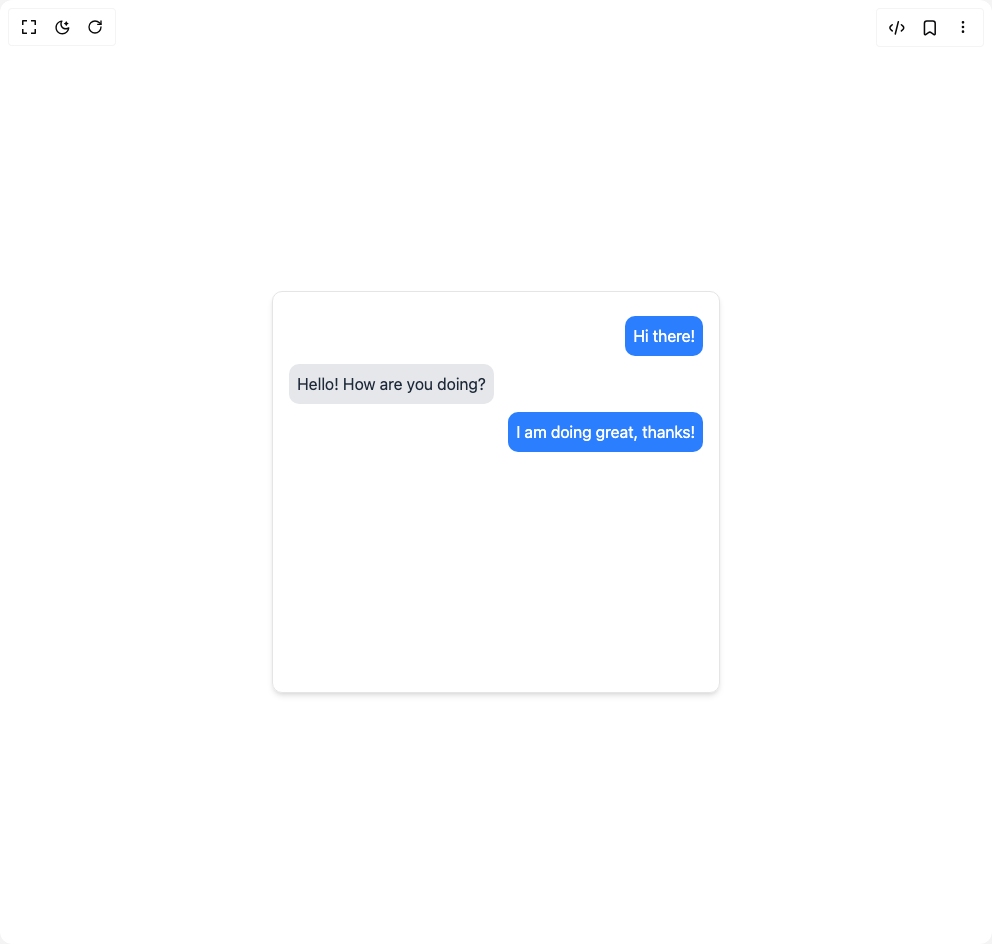

# Build Conversation in BuilderStudio

> Build this component in our Agentic IDE: [BuilderStudio](https://builderstudio.dev).
>
> Join the BuilderStudio community on [Discord](https://discord.gg/QdWeSGCqfe) and [Reddit](https://reddit.com/r/builderstudio).



## Component

- Author group: `vercel`
- Component: `conversation`
- Variant: `default`
- Rendered HTML snapshot: [`rendered.html`](rendered.html)

## BuilderStudio prompt

You are implementing a React component based on a component reference.

## Component identity

- Author: vercel
- Component slug: conversation
- Demo slug: default
- Title: conversation
- Description: 

## Goal

Recreate this component in a React + TypeScript + Tailwind CSS project. Preserve the visual layout, spacing, colors, border radius, shadows, interaction behavior, animation behavior, responsive behavior, and dark mode behavior shown in the rendered demo.

## Implementation requirements

- Use React and TypeScript.
- Use Tailwind CSS classes whenever possible.
- Keep the component self-contained unless the source files require helper components.
- If the source uses CSS variables, custom CSS, animations, or keyframes, include them.
- If the source uses external packages, list and use the required packages.
- Preserve accessibility attributes, button semantics, links, keyboard behavior, and ARIA attributes when visible in the source.
- Do not replace the component with a simplified placeholder.
- Return complete production-ready code.

## Dependencies

No reference metadata available.

## Rendered DOM snapshot

This is the rendered demo HTML extracted from the live preview. Use it to verify structure, class names, visible content, and layout.

```html
<div id="root"><div class="w-screen min-h-screen flex justify-center items-center"><div class="w-screen min-h-screen flex justify-center items-center"><div class="w-full max-w-md mx-auto mt-10 border rounded-lg overflow-hidden shadow-md"><div class="flex-1 overflow-y-auto relative w-full" role="log" style="height: 400px;"><div style="height: 100%; width: 100%; overflow: auto;"><div class="p-4"><div class="my-2 flex justify-end"><div class="max-w-xs rounded-lg p-2 bg-blue-500 text-white"><div>Hi there!</div></div></div><div class="my-2 flex justify-start"><div class="max-w-xs rounded-lg p-2 bg-gray-200 text-gray-800"><div>Hello! How are you doing?</div></div></div><div class="my-2 flex justify-end"><div class="max-w-xs rounded-lg p-2 bg-blue-500 text-white"><div>I am doing great, thanks!</div></div></div></div></div></div></div></div></div></div>
```

## Reference source files

No reference source files were available.
