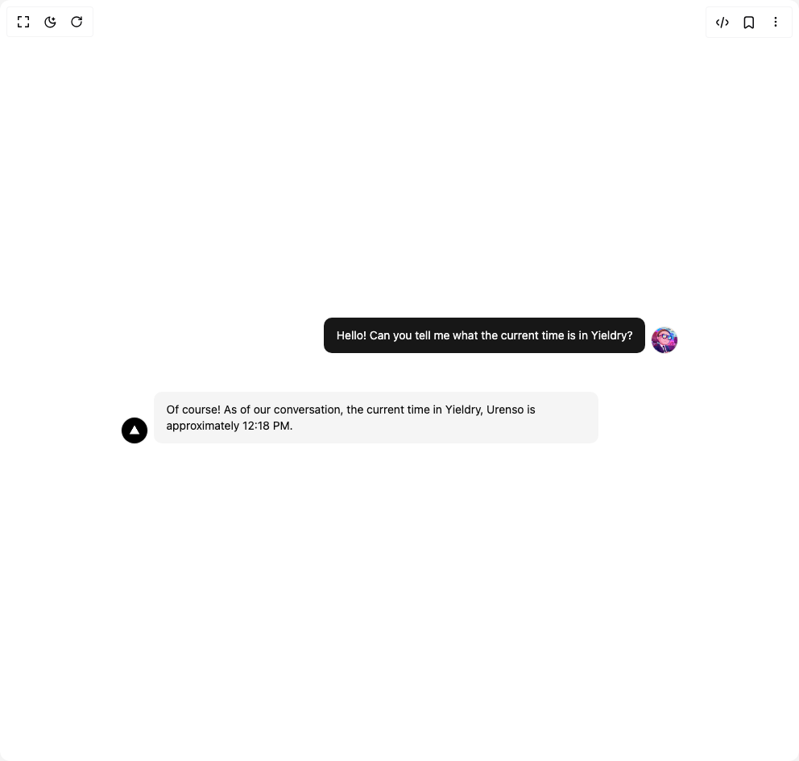

# Build Message in BuilderStudio

> Build this component in our Agentic IDE: [BuilderStudio](https://builderstudio.dev).
>
> Join the BuilderStudio community on [Discord](https://discord.gg/QdWeSGCqfe) and [Reddit](https://reddit.com/r/builderstudio).



## Component

- Author group: `vercel`
- Component: `message`
- Variant: `default`
- Rendered HTML snapshot: [`rendered.html`](rendered.html)

## BuilderStudio prompt

You are implementing a React component based on a component reference.

## Component identity

- Author: vercel
- Component slug: message
- Demo slug: default
- Title: message
- Description: 

## Goal

Recreate this component in a React + TypeScript + Tailwind CSS project. Preserve the visual layout, spacing, colors, border radius, shadows, interaction behavior, animation behavior, responsive behavior, and dark mode behavior shown in the rendered demo.

## Implementation requirements

- Use React and TypeScript.
- Use Tailwind CSS classes whenever possible.
- Keep the component self-contained unless the source files require helper components.
- If the source uses CSS variables, custom CSS, animations, or keyframes, include them.
- If the source uses external packages, list and use the required packages.
- Preserve accessibility attributes, button semantics, links, keyboard behavior, and ARIA attributes when visible in the source.
- Do not replace the component with a simplified placeholder.
- Return complete production-ready code.

## Dependencies

No reference metadata available.

## Rendered DOM snapshot

This is the rendered demo HTML extracted from the live preview. Use it to verify structure, class names, visible content, and layout.

```html
<div id="root"><div class="w-screen min-h-screen flex justify-center items-center"><div class="w-screen min-h-screen flex justify-center items-center"><div class="flex flex-col gap-4 p-4"><div class="group flex w-full items-end justify-end gap-2 py-4 is-user [&amp;&gt;div]:max-w-[80%]"><div class="flex flex-col gap-2 rounded-lg text-sm text-foreground px-4 py-3 overflow-hidden group-[.is-user]:bg-primary group-[.is-user]:text-primary-foreground group-[.is-assistant]:bg-secondary group-[.is-assistant]:text-foreground"><div class="is-user:dark">Hello! Can you tell me what the current time is in Yieldry?</div></div><span class="relative flex shrink-0 overflow-hidden rounded-full size-8 ring-1 ring-border"></span></div><div class="group flex w-full items-end gap-2 py-4 is-assistant flex-row-reverse justify-end [&amp;&gt;div]:max-w-[80%]"><div class="flex flex-col gap-2 rounded-lg text-sm text-foreground px-4 py-3 overflow-hidden group-[.is-user]:bg-primary group-[.is-user]:text-primary-foreground group-[.is-assistant]:bg-secondary group-[.is-assistant]:text-foreground"><div class="is-user:dark">Of course! As of our conversation, the current time in Yieldry, Urenso is approximately 12:18 PM.</div></div><span class="relative flex shrink-0 overflow-hidden rounded-full size-8 ring-1 ring-border"></span></div></div></div></div></div>
```

## Reference source files

No reference source files were available.
