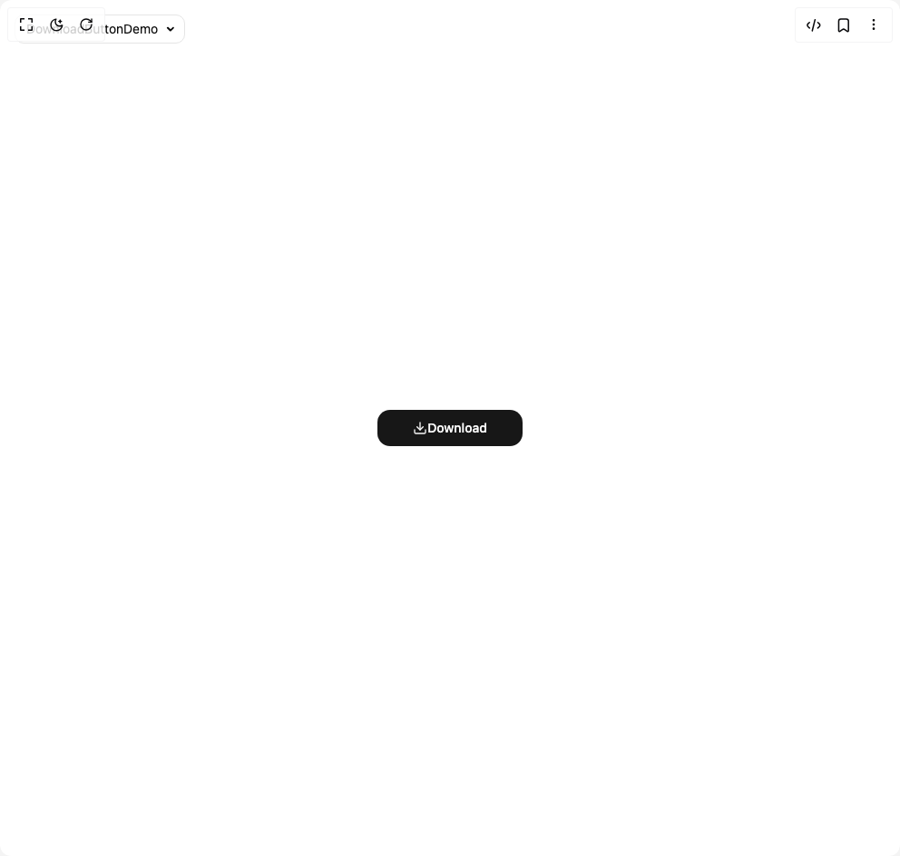
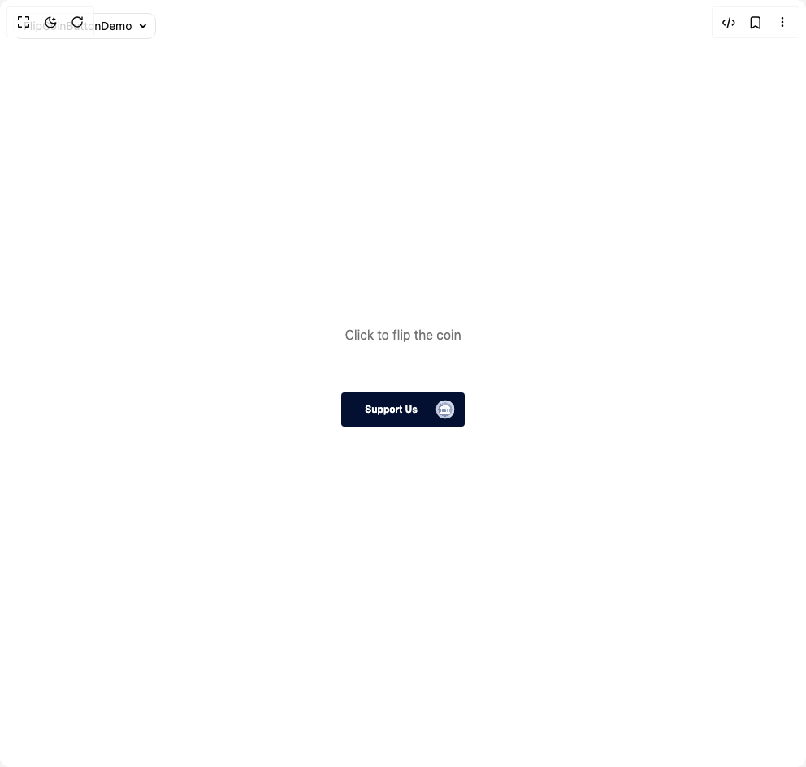
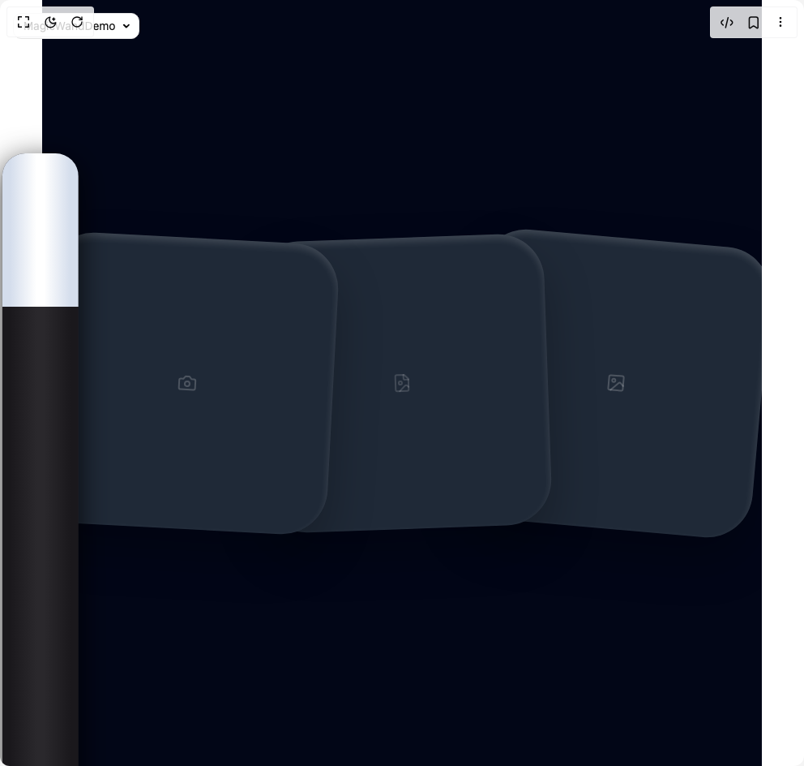
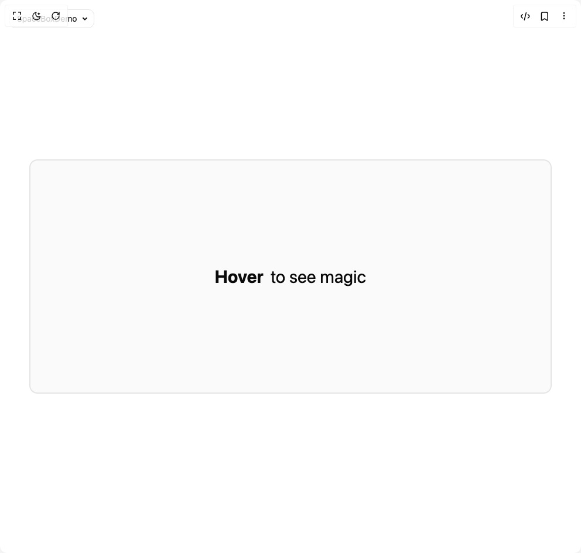

# Voxlet Ui Components

5 components are available in this author group.

> Build any component in [BuilderStudio](https://builderstudio.dev), then share improvements with the community on [Discord](https://discord.gg/QdWeSGCqfe) or [Reddit](https://reddit.com/r/builderstudio).

| Preview | Component | Variant |
| --- | --- | --- |
|  | [Button Download](button-download/default/README.md) | `default` |
|  | [Flip Coin Button](flip-coin-button/default/README.md) | `default` |
|  | [Magic Wand](magic-wand/default/README.md) | `default` |
|  | [Space Box](space-box/default/README.md) | `default` |
|  | [Tube Light Navbar](tube-light-navbar/default/README.md) | `default` |
