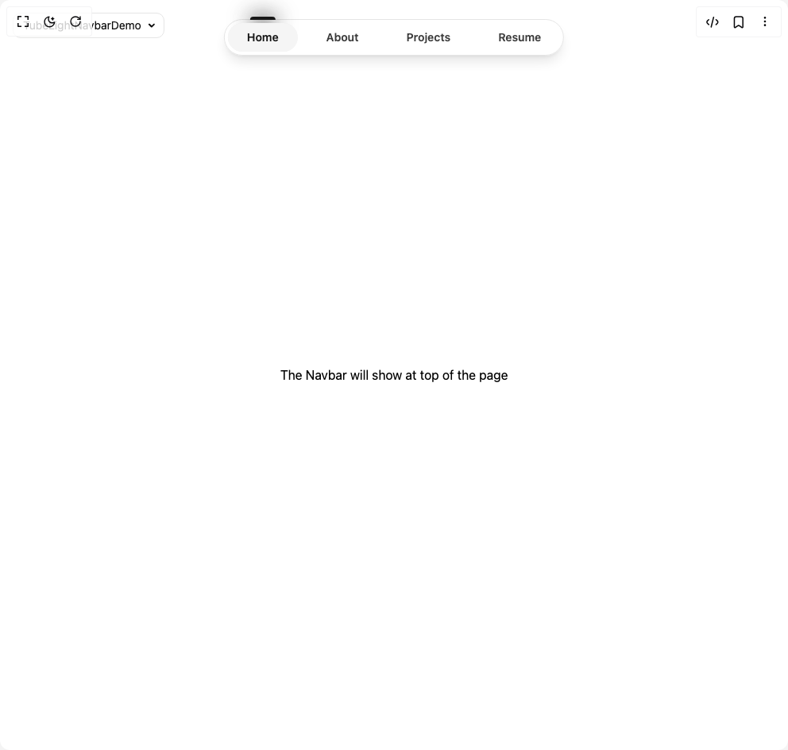

# Build Tube Light Navbar in BuilderStudio

> Build this component in our Agentic IDE: [BuilderStudio](https://builderstudio.dev).
>
> Join the BuilderStudio community on [Discord](https://discord.gg/QdWeSGCqfe) and [Reddit](https://reddit.com/r/builderstudio).



## Component

- Author group: `voxlet-ui`
- Component: `tube-light-navbar`
- Variant: `default`
- Rendered HTML snapshot: [`rendered.html`](rendered.html)

## BuilderStudio prompt

You are implementing a React component based on a component reference.

## Component identity

- Author: voxlet-ui
- Component slug: tube-light-navbar
- Demo slug: default
- Title: tube-light-navbar
- Description: 

## Goal

Recreate this component in a React + TypeScript + Tailwind CSS project. Preserve the visual layout, spacing, colors, border radius, shadows, interaction behavior, animation behavior, responsive behavior, and dark mode behavior shown in the rendered demo.

## Implementation requirements

- Use React and TypeScript.
- Use Tailwind CSS classes whenever possible.
- Keep the component self-contained unless the source files require helper components.
- If the source uses CSS variables, custom CSS, animations, or keyframes, include them.
- If the source uses external packages, list and use the required packages.
- Preserve accessibility attributes, button semantics, links, keyboard behavior, and ARIA attributes when visible in the source.
- Do not replace the component with a simplified placeholder.
- Return complete production-ready code.

## Dependencies

No reference metadata available.

## Rendered DOM snapshot

This is the rendered demo HTML extracted from the live preview. Use it to verify structure, class names, visible content, and layout.

```html
<div id="root"><div class="fixed top-4 left-4 z-10"><select class="appearance-none h-8 max-w-[200px] text-sm leading-tight rounded-lg pl-3 pr-7 py-0 border bg-background focus:outline-none focus:ring-0"><option value="default_TubeLightNavbarDemo">TubeLightNavbarDemo</option></select><div class="absolute top-1/2 transform -translate-y-1/2 right-2 pointer-events-none"><svg class="w-4 h-4 fill-current" viewBox="0 0 20 20"><path d="M5.516 7.548c.436-.446 1.043-.48 1.576 0L10 10.405l2.908-2.857c.533-.48 1.14-.446 1.576 0 .436.445.408 1.197 0 1.615l-3.734 3.705c-.533.534-1.39.534-1.923 0l-3.734-3.705c-.408-.418-.436-1.17 0-1.615z"></path></svg></div></div><div class="w-screen min-h-screen flex justify-center items-center"><div class="fixed bottom-0 sm:top-0 left-1/2 -translate-x-1/2 z-[200] mb-6 sm:pt-6 h-max"><div class="flex items-center gap-3 bg-background/5 border border-border backdrop-blur-lg py-1 px-1 rounded-full shadow-lg"><a href="#" class="relative cursor-pointer text-sm font-semibold px-6 py-2 rounded-full transition-colors hover:text-primary bg-muted text-primary"><span class="hidden md:inline">Home</span><span class="md:hidden"><svg xmlns="http://www.w3.org/2000/svg" width="18" height="18" viewBox="0 0 24 24" fill="none" stroke="currentColor" stroke-width="2.5" stroke-linecap="round" stroke-linejoin="round" class="lucide lucide-house" aria-hidden="true"><path d="M15 21v-8a1 1 0 0 0-1-1h-4a1 1 0 0 0-1 1v8"></path><path d="M3 10a2 2 0 0 1 .709-1.528l7-5.999a2 2 0 0 1 2.582 0l7 5.999A2 2 0 0 1 21 10v9a2 2 0 0 1-2 2H5a2 2 0 0 1-2-2z"></path></svg></span><div class="absolute inset-0 w-full bg-primary/5 rounded-full -z-10" style="opacity: 1;"><div class="absolute -top-2 left-1/2 -translate-x-1/2 w-8 h-1 bg-primary rounded-t-full"><div class="absolute w-12 h-6 bg-primary/20 rounded-full blur-md -top-2 -left-2"></div><div class="absolute w-8 h-6 bg-primary/20 rounded-full blur-md -top-1"></div><div class="absolute w-4 h-4 bg-primary/20 rounded-full blur-sm top-0 left-2"></div></div></div></a><a href="#" class="relative cursor-pointer text-sm font-semibold px-6 py-2 rounded-full transition-colors text-foreground/80 hover:text-primary"><span class="hidden md:inline">About</span><span class="md:hidden"><svg xmlns="http://www.w3.org/2000/svg" width="18" height="18" viewBox="0 0 24 24" fill="none" stroke="currentColor" stroke-width="2.5" stroke-linecap="round" stroke-linejoin="round" class="lucide lucide-user" aria-hidden="true"><path d="M19 21v-2a4 4 0 0 0-4-4H9a4 4 0 0 0-4 4v2"></path><circle cx="12" cy="7" r="4"></circle></svg></span></a><a href="#" class="relative cursor-pointer text-sm font-semibold px-6 py-2 rounded-full transition-colors text-foreground/80 hover:text-primary"><span class="hidden md:inline">Projects</span><span class="md:hidden"><svg xmlns="http://www.w3.org/2000/svg" width="18" height="18" viewBox="0 0 24 24" fill="none" stroke="currentColor" stroke-width="2.5" stroke-linecap="round" stroke-linejoin="round" class="lucide lucide-briefcase" aria-hidden="true"><path d="M16 20V4a2 2 0 0 0-2-2h-4a2 2 0 0 0-2 2v16"></path><rect width="20" height="14" x="2" y="6" rx="2"></rect></svg></span></a><a href="#" class="relative cursor-pointer text-sm font-semibold px-6 py-2 rounded-full transition-colors text-foreground/80 hover:text-primary"><span class="hidden md:inline">Resume</span><span class="md:hidden"><svg xmlns="http://www.w3.org/2000/svg" width="18" height="18" viewBox="0 0 24 24" fill="none" stroke="currentColor" stroke-width="2.5" stroke-linecap="round" stroke-linejoin="round" class="lucide lucide-file-text" aria-hidden="true"><path d="M15 2H6a2 2 0 0 0-2 2v16a2 2 0 0 0 2 2h12a2 2 0 0 0 2-2V7Z"></path><path d="M14 2v4a2 2 0 0 0 2 2h4"></path><path d="M10 9H8"></path><path d="M16 13H8"></path><path d="M16 17H8"></path></svg></span></a></div></div><div class="preview flex min-h-[100px] w-full justify-center p-2 sm:p-10 items-center"><div class="relative w-full flex items-center justify-center"><p class="text-black dark:text-white">The Navbar will show at top of the page</p></div></div></div></div>
```

## Reference source files

No reference source files were available.
