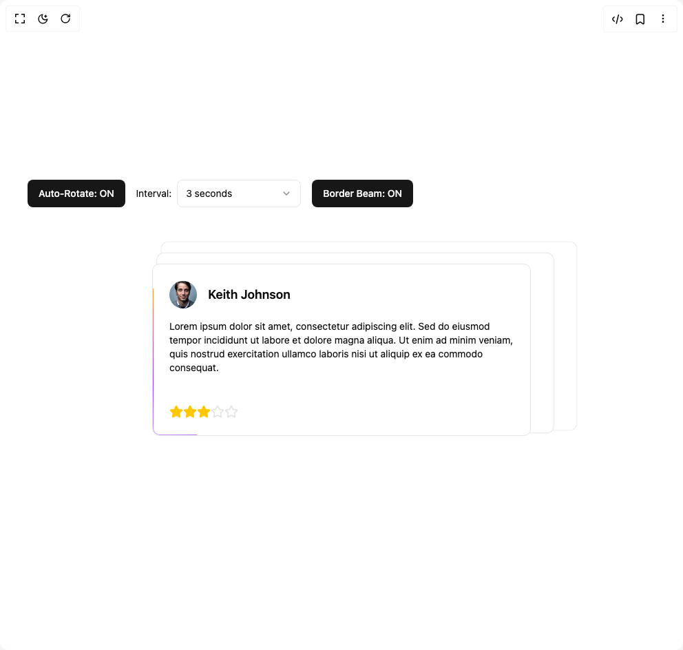
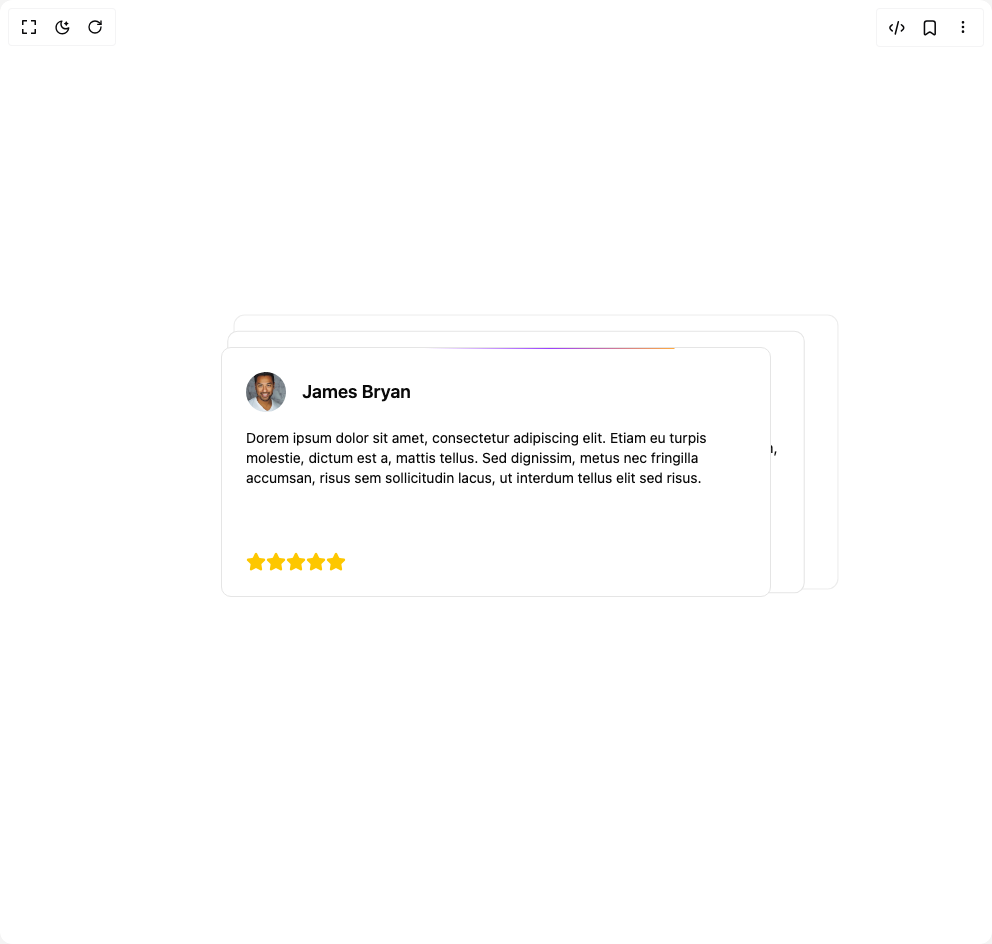
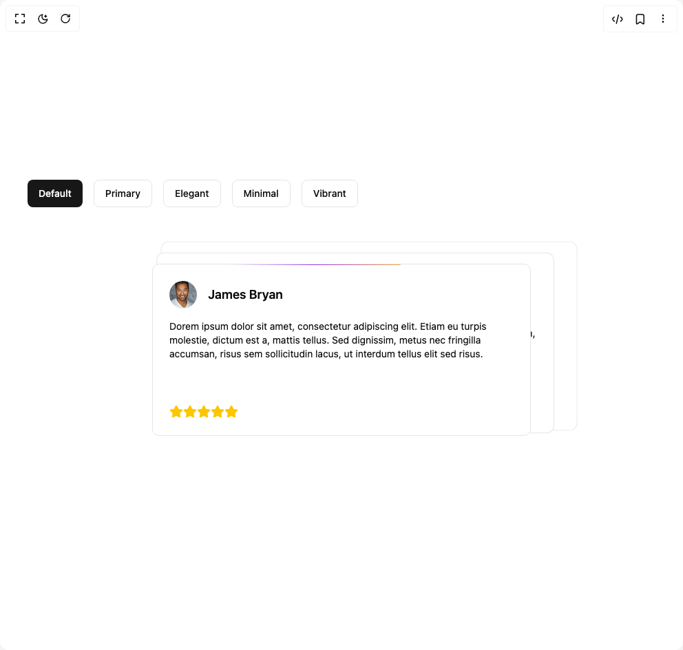
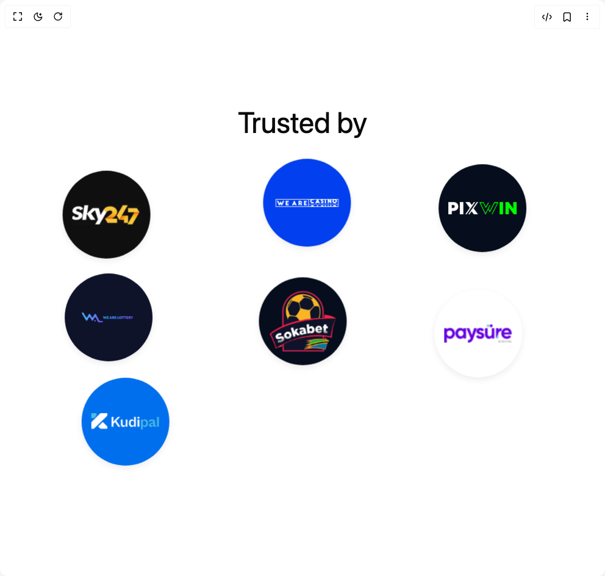

# Whyte25 Components

5 components are available in this author group.

> Build any component in [BuilderStudio](https://builderstudio.dev), then share improvements with the community on [Discord](https://discord.gg/QdWeSGCqfe) or [Reddit](https://reddit.com/r/builderstudio).

| Preview | Component | Variant |
| --- | --- | --- |
|  | [Animated Review Card](animated-review-card/auto-rotation-review-card/README.md) | `auto-rotation-review-card` |
|  | [Animated Review Card](animated-review-card/click-iterations-review-card/README.md) | `click-iterations-review-card` |
|  | [Animated Review Card](animated-review-card/default/README.md) | `default` |
|  | [Animated Review Card](animated-review-card/review-cards-with-themes/README.md) | `review-cards-with-themes` |
|  | [Floating Elements](floating-elements/default/README.md) | `default` |
