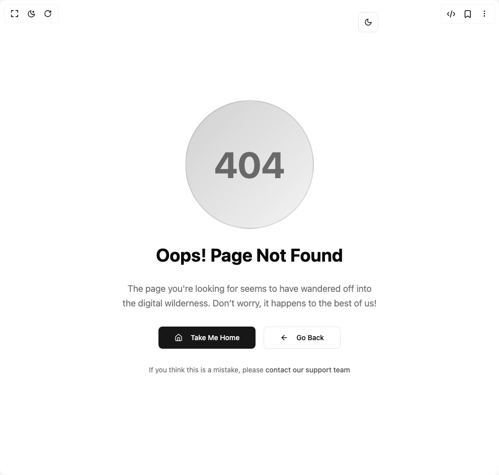
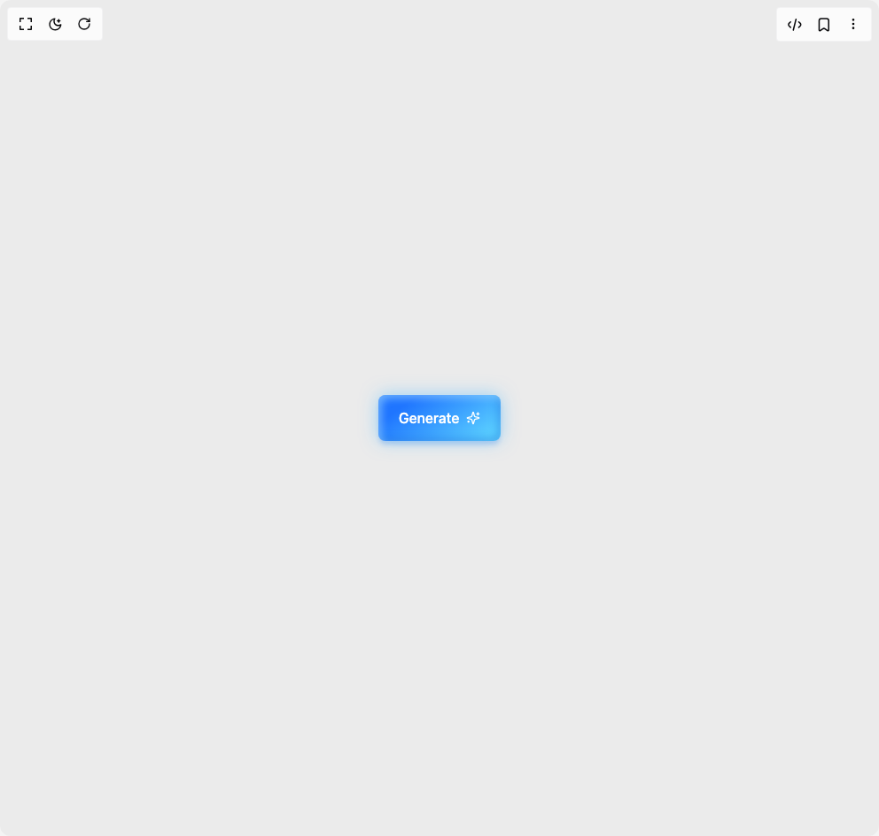
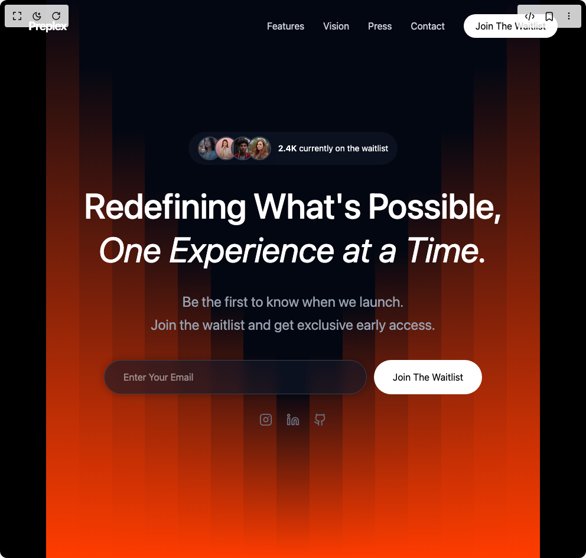
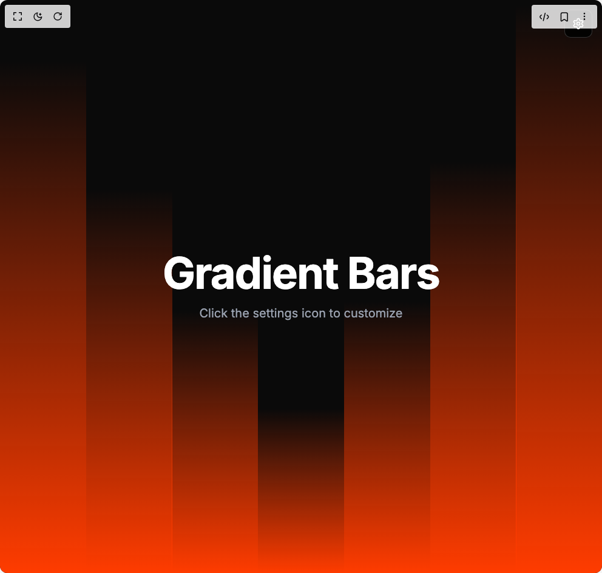
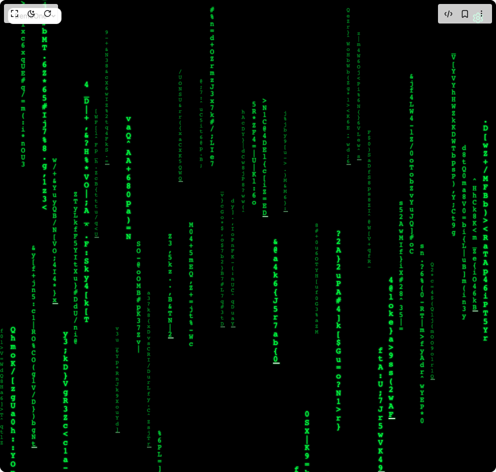
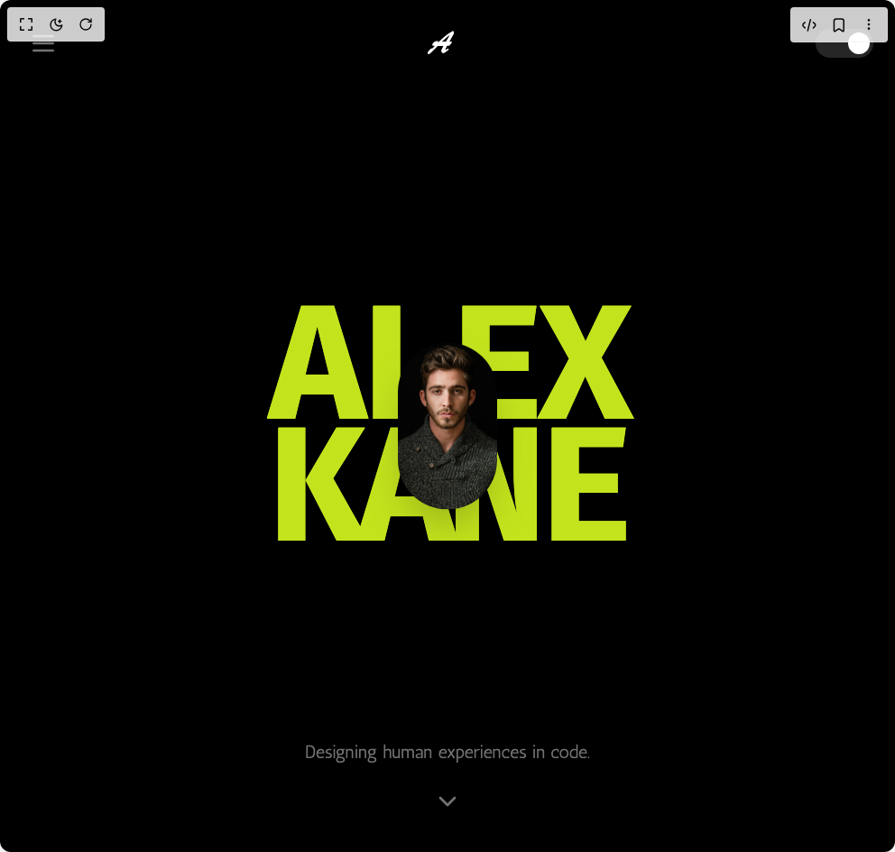
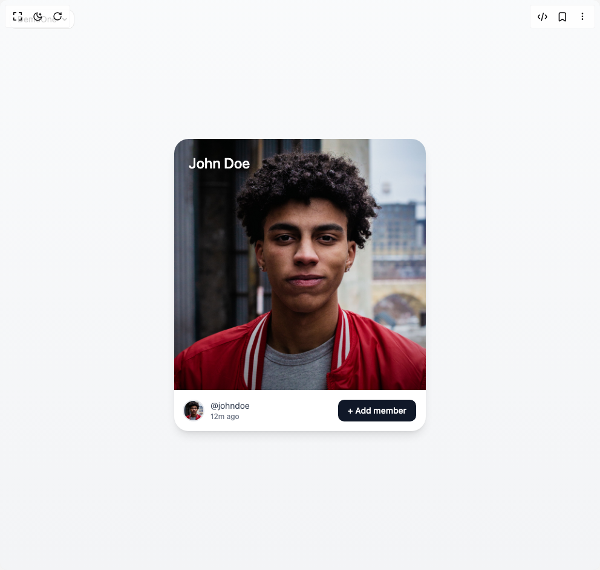
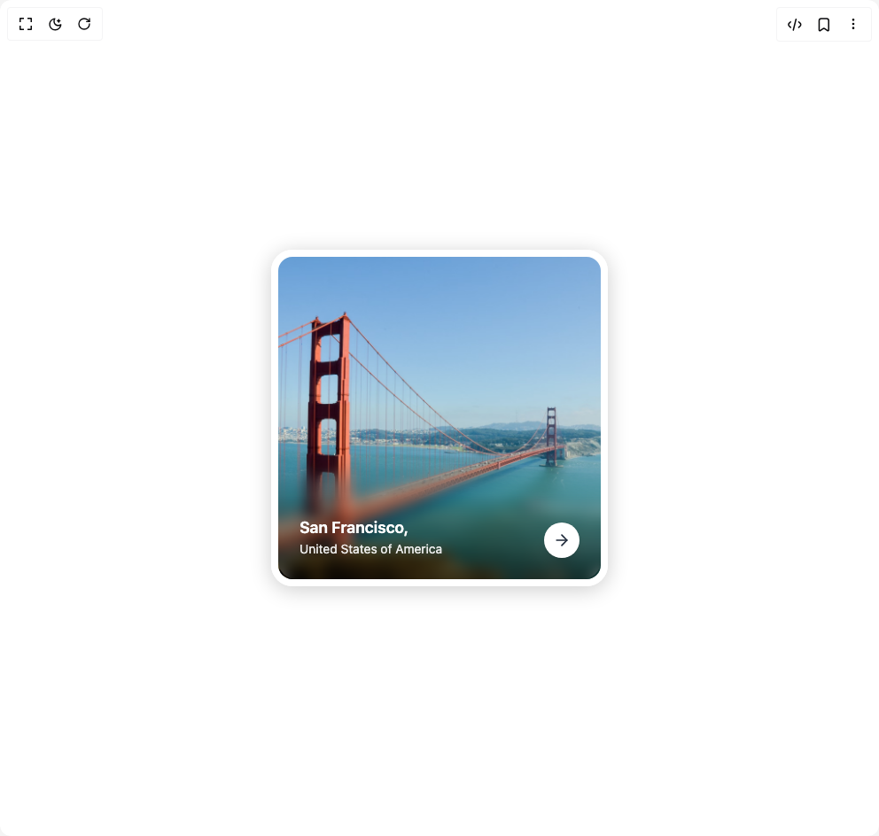
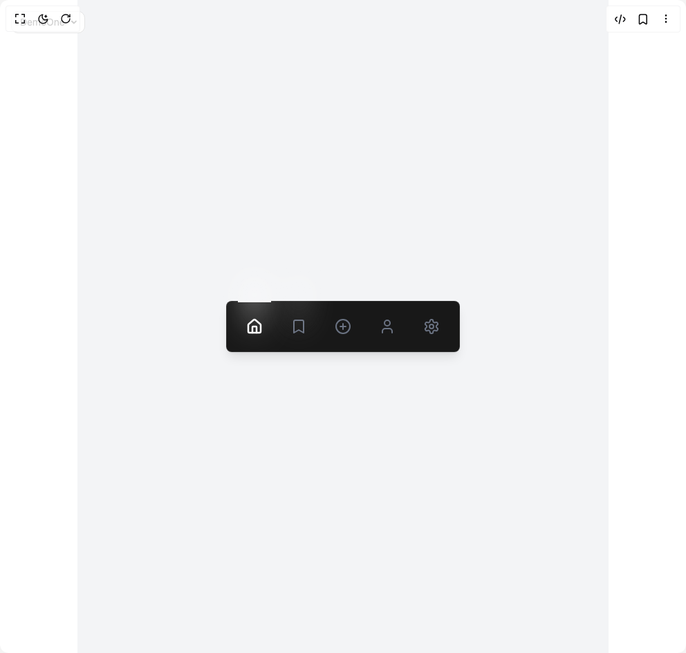
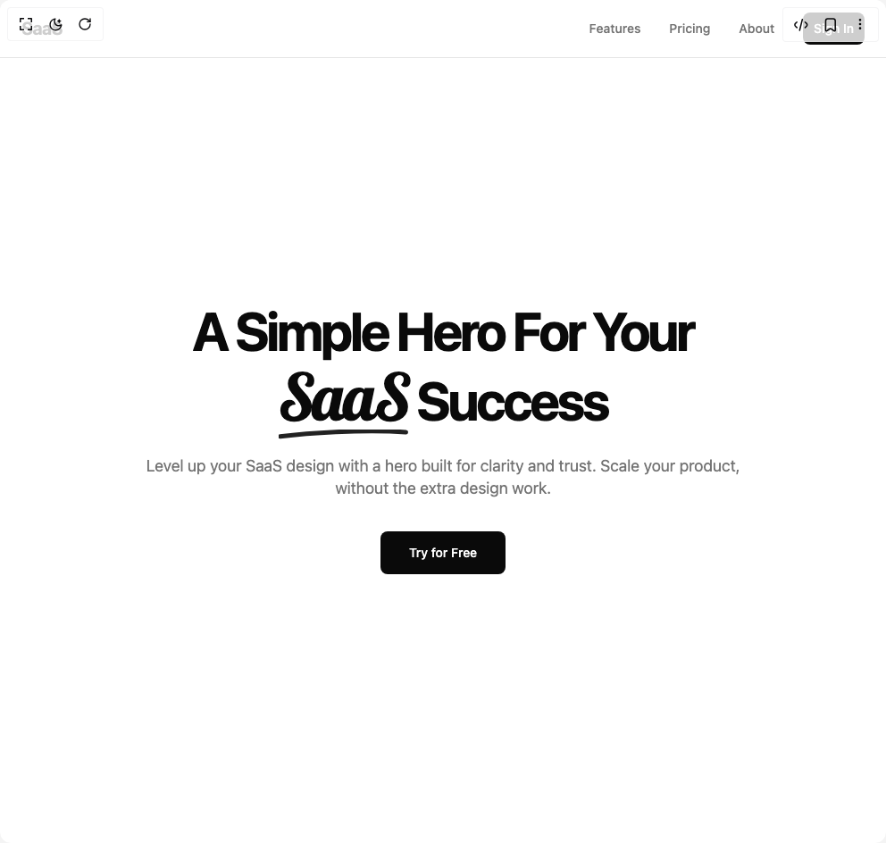

# Wisedev Components

14 components are available in this author group.

> Build any component in [BuilderStudio](https://builderstudio.dev), then share improvements with the community on [Discord](https://discord.gg/QdWeSGCqfe) or [Reddit](https://reddit.com/r/builderstudio).

| Preview | Component | Variant |
| --- | --- | --- |
|  | [404 Page Error](404-page-error/default/README.md) | `default` |
|  | [Glow Button](glow-button/default/README.md) | `default` |
|  | [Gradient Bar Hero Section](gradient-bar-hero-section/default/README.md) | `default` |
|  | [Gradient Bars Background](gradient-bars-background/default/README.md) | `default` |
|  | [Image Auto Slider](image-auto-slider/default/README.md) | `default` |
|  | [Matrix Code Rain](matrix-code-rain/default/README.md) | `default` |
|  | [Portfolio Hero](portfolio-hero/default/README.md) | `default` |
|  | [Profile Card](profile-card/default/README.md) | `default` |
|  | [Progressive Blur Card](progressive-blur-card/default/README.md) | `default` |
|  | [Retro Grid](retro-grid/default/README.md) | `default` |
|  | [Saa S Template](saa-s-template/default/README.md) | `default` |
|  | [Silk Background Animation](silk-background-animation/default/README.md) | `default` |
|  | [Spotlight Button](spotlight-button/default/README.md) | `default` |
|  | [Underline Hero Section](underline-hero-section/default/README.md) | `default` |
