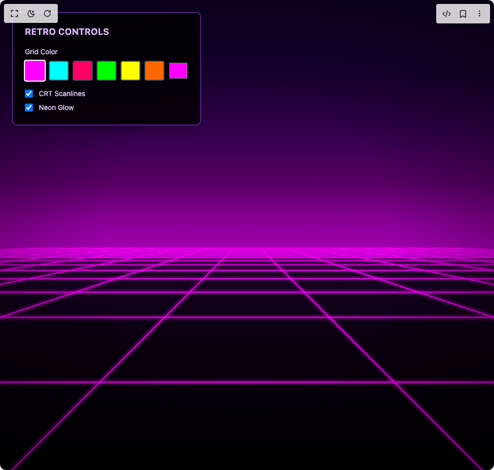

# Build Retro Grid in BuilderStudio

> Build this component in our Agentic IDE: [BuilderStudio](https://builderstudio.dev).
>
> Join the BuilderStudio community on [Discord](https://discord.gg/QdWeSGCqfe) and [Reddit](https://reddit.com/r/builderstudio).



## Component

- Author group: `wisedev`
- Component: `retro-grid`
- Variant: `default`
- Rendered HTML snapshot: [`rendered.html`](rendered.html)

## BuilderStudio prompt

You are implementing a React component based on a component reference.

## Component identity

- Author: wisedev
- Component slug: retro-grid
- Demo slug: default
- Title: retro-grid
- Description: 

## Goal

Recreate this component in a React + TypeScript + Tailwind CSS project. Preserve the visual layout, spacing, colors, border radius, shadows, interaction behavior, animation behavior, responsive behavior, and dark mode behavior shown in the rendered demo.

## Implementation requirements

- Use React and TypeScript.
- Use Tailwind CSS classes whenever possible.
- Keep the component self-contained unless the source files require helper components.
- If the source uses CSS variables, custom CSS, animations, or keyframes, include them.
- If the source uses external packages, list and use the required packages.
- Preserve accessibility attributes, button semantics, links, keyboard behavior, and ARIA attributes when visible in the source.
- Do not replace the component with a simplified placeholder.
- Return complete production-ready code.

## Dependencies

No reference metadata available.

## Rendered DOM snapshot

This is the rendered demo HTML extracted from the live preview. Use it to verify structure, class names, visible content, and layout.

```html
<div id="root"><div class="w-screen min-h-screen flex justify-center items-center"><div class="w-screen min-h-screen flex justify-center items-center"><div class="relative w-full h-screen"><canvas class="fixed inset-0 w-full h-full" width="992" height="944" style="background: rgb(0, 0, 0); width: 100%; height: 100%;"></canvas><div class="absolute bg-black/80 backdrop-blur-sm p-6 rounded-lg border-2 border-purple-500/50 shadow-xl cursor-move select-none" style="left: 24px; top: 24px;"><h2 class="text-purple-300 font-bold text-lg mb-4 tracking-wide">RETRO CONTROLS</h2><div class="space-y-4"><div><label class="text-purple-200 text-sm block mb-2">Grid Color</label><div class="flex gap-2 flex-wrap"><button class="w-10 h-10 rounded border-2 transition-all border-white scale-110" style="background-color: rgb(255, 0, 255);"></button><button class="w-10 h-10 rounded border-2 transition-all border-gray-600" style="background-color: rgb(0, 255, 255);"></button><button class="w-10 h-10 rounded border-2 transition-all border-gray-600" style="background-color: rgb(255, 0, 102);"></button><button class="w-10 h-10 rounded border-2 transition-all border-gray-600" style="background-color: rgb(0, 255, 0);"></button><button class="w-10 h-10 rounded border-2 transition-all border-gray-600" style="background-color: rgb(255, 255, 0);"></button><button class="w-10 h-10 rounded border-2 transition-all border-gray-600" style="background-color: rgb(255, 102, 0);"></button><input class="w-10 h-10 rounded cursor-pointer" type="color" value="#ff00ff"></div></div><div class="space-y-2"><label class="flex items-center gap-3 text-purple-200 text-sm cursor-pointer"><input class="w-4 h-4" type="checkbox" checked=""><span>CRT Scanlines</span></label><label class="flex items-center gap-3 text-purple-200 text-sm cursor-pointer"><input class="w-4 h-4" type="checkbox" checked=""><span>Neon Glow</span></label></div></div></div></div></div></div></div>
```

## Reference source files

No reference source files were available.
