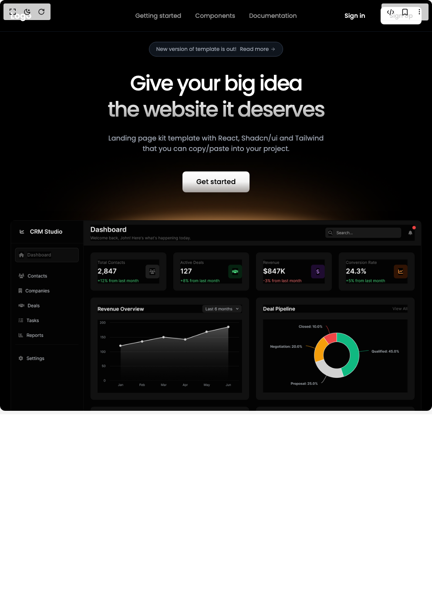

# Build Saa S Template in BuilderStudio

> Build this component in our Agentic IDE: [BuilderStudio](https://builderstudio.dev).
>
> Join the BuilderStudio community on [Discord](https://discord.gg/QdWeSGCqfe) and [Reddit](https://reddit.com/r/builderstudio).



## Component

- Author group: `wisedev`
- Component: `saa-s-template`
- Variant: `default`
- Rendered HTML snapshot: [`rendered.html`](rendered.html)

## BuilderStudio prompt

You are implementing a React component based on a component reference.

## Component identity

- Author: wisedev
- Component slug: saa-s-template
- Demo slug: default
- Title: saa-s-template
- Description: 

## Goal

Recreate this component in a React + TypeScript + Tailwind CSS project. Preserve the visual layout, spacing, colors, border radius, shadows, interaction behavior, animation behavior, responsive behavior, and dark mode behavior shown in the rendered demo.

## Implementation requirements

- Use React and TypeScript.
- Use Tailwind CSS classes whenever possible.
- Keep the component self-contained unless the source files require helper components.
- If the source uses CSS variables, custom CSS, animations, or keyframes, include them.
- If the source uses external packages, list and use the required packages.
- Preserve accessibility attributes, button semantics, links, keyboard behavior, and ARIA attributes when visible in the source.
- Do not replace the component with a simplified placeholder.
- Return complete production-ready code.

## Dependencies

No reference metadata available.

## Rendered DOM snapshot

This is the rendered demo HTML extracted from the live preview. Use it to verify structure, class names, visible content, and layout.

```html
<div id="root"><div class="w-screen min-h-screen flex justify-center items-center"><div class="w-screen min-h-screen flex justify-center items-center"><main class="min-h-screen bg-black text-white"><header class="fixed top-0 w-full z-50 border-b border-gray-800/50 bg-black/80 backdrop-blur-md"><nav class="max-w-7xl mx-auto px-6 py-4"><div class="flex items-center justify-between"><div class="text-xl font-semibold text-white">Logo</div><div class="hidden md:flex items-center justify-center gap-8 absolute left-1/2 top-1/2 -translate-x-1/2 -translate-y-1/2"><a href="#getting-started" class="text-sm text-white/60 hover:text-white transition-colors">Getting started</a><a href="#components" class="text-sm text-white/60 hover:text-white transition-colors">Components</a><a href="#documentation" class="text-sm text-white/60 hover:text-white transition-colors">Documentation</a></div><div class="hidden md:flex items-center gap-4"><button class="inline-flex items-center justify-center gap-2 whitespace-nowrap rounded-md font-medium transition-all focus-visible:outline-none focus-visible:ring-2 focus-visible:ring-offset-2 disabled:pointer-events-none disabled:opacity-50 hover:bg-gray-800/50 text-white h-10 px-5 text-sm " type="button">Sign in</button><button class="inline-flex items-center justify-center gap-2 whitespace-nowrap rounded-md font-medium transition-all focus-visible:outline-none focus-visible:ring-2 focus-visible:ring-offset-2 disabled:pointer-events-none disabled:opacity-50 bg-white text-black hover:bg-gray-100 h-10 px-5 text-sm " type="button">Sign Up</button></div><button type="button" class="md:hidden text-white" aria-label="Toggle menu"><svg xmlns="http://www.w3.org/2000/svg" width="24" height="24" viewBox="0 0 24 24" fill="none" stroke="currentColor" stroke-width="2" stroke-linecap="round" stroke-linejoin="round" class=""><line x1="4" x2="20" y1="12" y2="12"></line><line x1="4" x2="20" y1="6" y2="6"></line><line x1="4" x2="20" y1="18" y2="18"></line></svg></button></div></nav></header><section class="relative min-h-screen flex flex-col items-center justify-start px-6 py-20 md:py-24" style="animation: 0.6s ease-out 0s 1 normal none running fadeIn;"><style>
        @import url('https://fonts.googleapis.com/css2?family=Poppins:wght@400;500;600;700&display=swap');
        
        * {
          font-family: 'Poppins', sans-serif;
        }
        
        @keyframes fadeIn {
          from {
            opacity: 0;
            transform: translateY(10px);
          }
          to {
            opacity: 1;
            transform: translateY(0);
          }
        }
        
        @keyframes slideDown {
          from {
            opacity: 0;
            transform: translateY(-10px);
          }
          to {
            opacity: 1;
            transform: translateY(0);
          }
        }
      </style><aside class="mb-8 inline-flex flex-wrap items-center justify-center gap-2 px-4 py-2 rounded-full border border-gray-700 bg-gray-800/50 backdrop-blur-sm max-w-full"><span class="text-xs text-center whitespace-nowrap" style="color: rgb(156, 163, 175);">New version of template is out!</span><a href="#new-version" class="flex items-center gap-1 text-xs hover:text-white transition-all active:scale-95 whitespace-nowrap" aria-label="Read more about the new version" style="color: rgb(156, 163, 175);">Read more<svg xmlns="http://www.w3.org/2000/svg" width="12" height="12" viewBox="0 0 24 24" fill="none" stroke="currentColor" stroke-width="2" stroke-linecap="round" stroke-linejoin="round" class=""><path d="M5 12h14"></path><path d="m12 5 7 7-7 7"></path></svg></a></aside><h1 class="text-4xl md:text-5xl lg:text-6xl font-medium text-center max-w-3xl px-6 leading-tight mb-6" style="background: linear-gradient(rgb(255, 255, 255), rgb(255, 255, 255), rgba(255, 255, 255, 0.6)) text; -webkit-text-fill-color: transparent; letter-spacing: -0.05em;">Give your big idea <br>the website it deserves</h1><p class="text-sm md:text-base text-center max-w-2xl px-6 mb-10" style="color: rgb(156, 163, 175);">Landing page kit template with React, Shadcn/ui and Tailwind <br>that you can copy/paste into your project.</p><div class="flex items-center gap-4 relative z-10 mb-16"><button class="inline-flex items-center justify-center gap-2 whitespace-nowrap rounded-md font-medium transition-all focus-visible:outline-none focus-visible:ring-2 focus-visible:ring-offset-2 disabled:pointer-events-none disabled:opacity-50 bg-gradient-to-b from-white via-white/95 to-white/60 text-black hover:scale-105 active:scale-95 h-12 px-8 text-base rounded-lg flex items-center justify-center" type="button" aria-label="Get started with the template">Get started</button></div><div class="w-full max-w-5xl relative pb-20"><div class="absolute left-1/2 w-[90%] pointer-events-none z-0" aria-hidden="true" style="top: -23%; transform: translateX(-50%);"></div><div class="relative z-10"></div></div></section></main></div></div></div>
```

## Reference source files

No reference source files were available.
