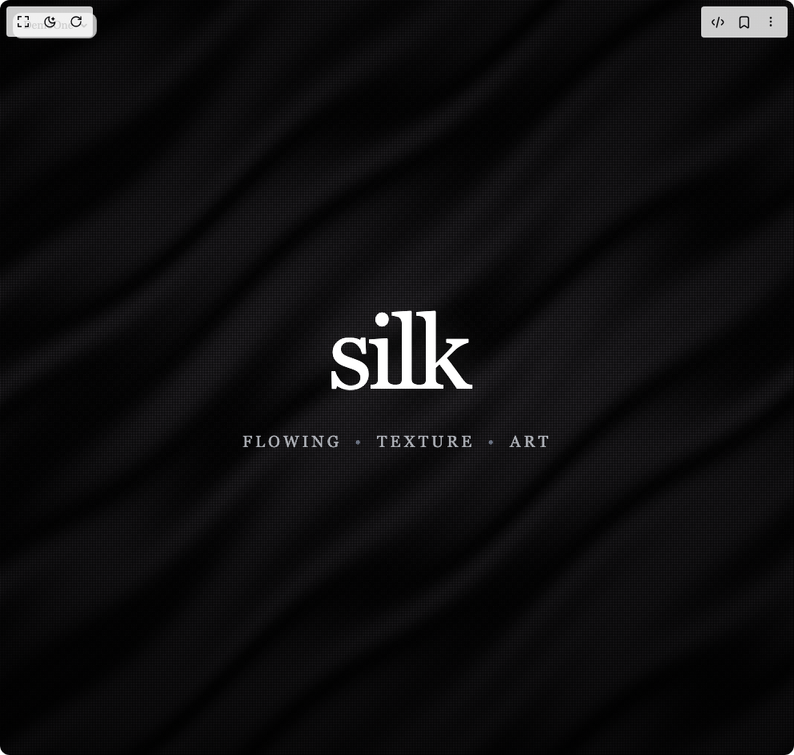

# Build Silk Background Animation in BuilderStudio

> Build this component in our Agentic IDE: [BuilderStudio](https://builderstudio.dev).
>
> Join the BuilderStudio community on [Discord](https://discord.gg/QdWeSGCqfe) and [Reddit](https://reddit.com/r/builderstudio).



## Component

- Author group: `wisedev`
- Component: `silk-background-animation`
- Variant: `default`
- Rendered HTML snapshot: [`rendered.html`](rendered.html)

## BuilderStudio prompt

You are implementing a React component based on a component reference.

## Component identity

- Author: wisedev
- Component slug: silk-background-animation
- Demo slug: default
- Title: silk-background-animation
- Description: 

## Goal

Recreate this component in a React + TypeScript + Tailwind CSS project. Preserve the visual layout, spacing, colors, border radius, shadows, interaction behavior, animation behavior, responsive behavior, and dark mode behavior shown in the rendered demo.

## Implementation requirements

- Use React and TypeScript.
- Use Tailwind CSS classes whenever possible.
- Keep the component self-contained unless the source files require helper components.
- If the source uses CSS variables, custom CSS, animations, or keyframes, include them.
- If the source uses external packages, list and use the required packages.
- Preserve accessibility attributes, button semantics, links, keyboard behavior, and ARIA attributes when visible in the source.
- Do not replace the component with a simplified placeholder.
- Return complete production-ready code.

## Dependencies

No reference metadata available.

## Rendered DOM snapshot

This is the rendered demo HTML extracted from the live preview. Use it to verify structure, class names, visible content, and layout.

```html
<div id="root"><div class="fixed top-4 left-4 z-10"><select class="appearance-none h-8 max-w-[200px] text-sm leading-tight rounded-lg pl-3 pr-7 py-0 border bg-background focus:outline-none focus:ring-0"><option value="named_DemoOne_DemoOne">DemoOne</option></select><div class="absolute top-1/2 transform -translate-y-1/2 right-2 pointer-events-none"><svg class="w-4 h-4 fill-current" viewBox="0 0 20 20"><path d="M5.516 7.548c.436-.446 1.043-.48 1.576 0L10 10.405l2.908-2.857c.533-.48 1.14-.446 1.576 0 .436.445.408 1.197 0 1.615l-3.734 3.705c-.533.534-1.39.534-1.923 0l-3.734-3.705c-.408-.418-.436-1.17 0-1.615z"></path></svg></div></div><div class="w-screen min-h-screen flex justify-center items-center"><style>
        html, body {
          margin: 0;
          padding: 0;
          overflow-x: hidden;
          font-family: ui-serif, Georgia, Cambria, "Times New Roman", Times, serif;
        }
        
        @keyframes fadeInUp {
          from {
            opacity: 0;
            transform: translateY(2rem);
          }
          to {
            opacity: 1;
            transform: translateY(0);
          }
        }
        
        @keyframes fadeInUpDelay {
          from {
            opacity: 0;
            transform: translateY(1rem);
          }
          to {
            opacity: 1;
            transform: translateY(0);
          }
        }
        
        @keyframes fadeInCorner {
          from {
            opacity: 0;
            transform: translateY(-1rem);
          }
          to {
            opacity: 1;
            transform: translateY(0);
          }
        }
        
        .animate-fade-in-up {
          animation: fadeInUp 1s ease-out forwards;
        }
        
        .animate-fade-in-up-delay {
          animation: fadeInUpDelay 1s ease-out 0.3s forwards;
        }
        
        .animate-fade-in-corner {
          animation: fadeInCorner 1s ease-out 0.9s forwards;
        }
        
        .silk-canvas {
          position: absolute;
          top: 0;
          left: 0;
          width: 100%;
          height: 100%;
          z-index: 0;
        }
      </style><div class="relative h-screen w-full overflow-hidden bg-black"><canvas class="silk-canvas" width="992" height="944"></canvas><div class="absolute inset-0 z-10 bg-gradient-to-b from-black/30 via-transparent to-black/50"></div><div class="relative z-20 flex h-full items-center justify-center"><div class="text-center px-8"><h1 class="
                text-6xl sm:text-8xl md:text-9xl lg:text-[12rem] xl:text-[14rem] 
                font-light tracking-[-0.05em] leading-none
                text-white mix-blend-difference
                opacity-0
                animate-fade-in-up
              " style="text-shadow: rgba(255, 255, 255, 0.1) 0px 0px 40px;">silk</h1><div class="
                mt-8 text-lg md:text-xl lg:text-2xl 
                font-extralight tracking-[0.2em] uppercase
                text-gray-300/80 mix-blend-overlay
                opacity-0
                animate-fade-in-up-delay
              "><span class="inline-block">flowing</span><span class="mx-4 text-gray-500">•</span><span class="inline-block">texture</span><span class="mx-4 text-gray-500">•</span><span class="inline-block">art</span></div></div></div><div class="
            absolute top-8 left-8 z-30
            text-xs font-light tracking-widest uppercase
            text-gray-500/40 mix-blend-overlay
            opacity-0
            animate-fade-in-corner
          ">2025</div></div></div></div>
```

## Reference source files

No reference source files were available.
