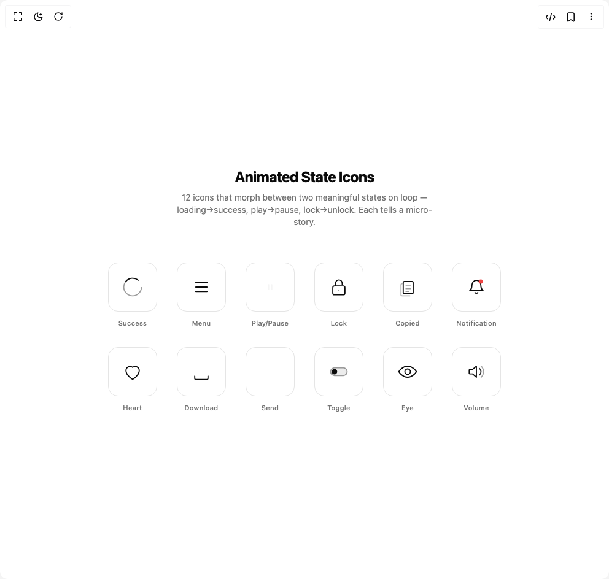
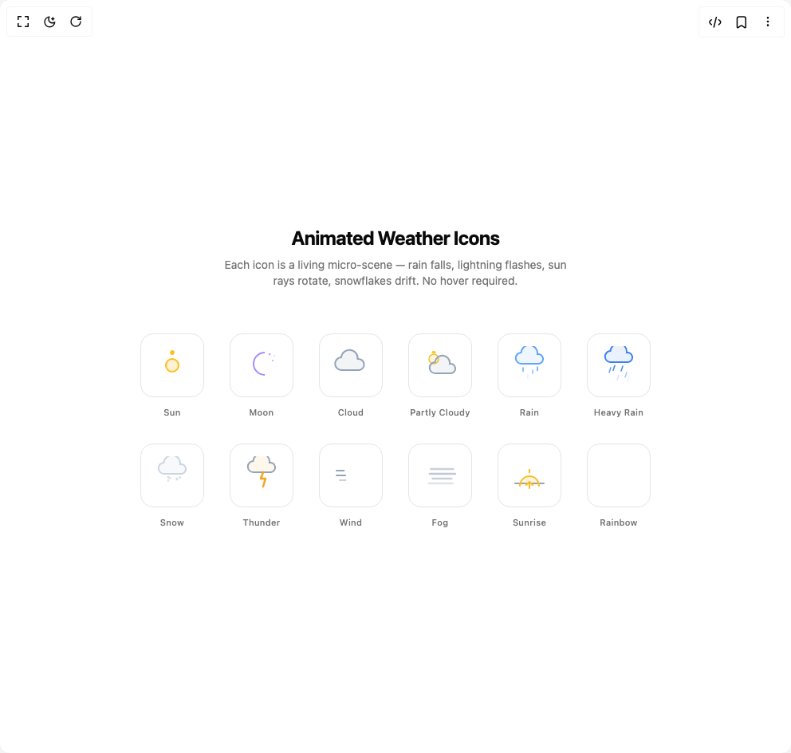
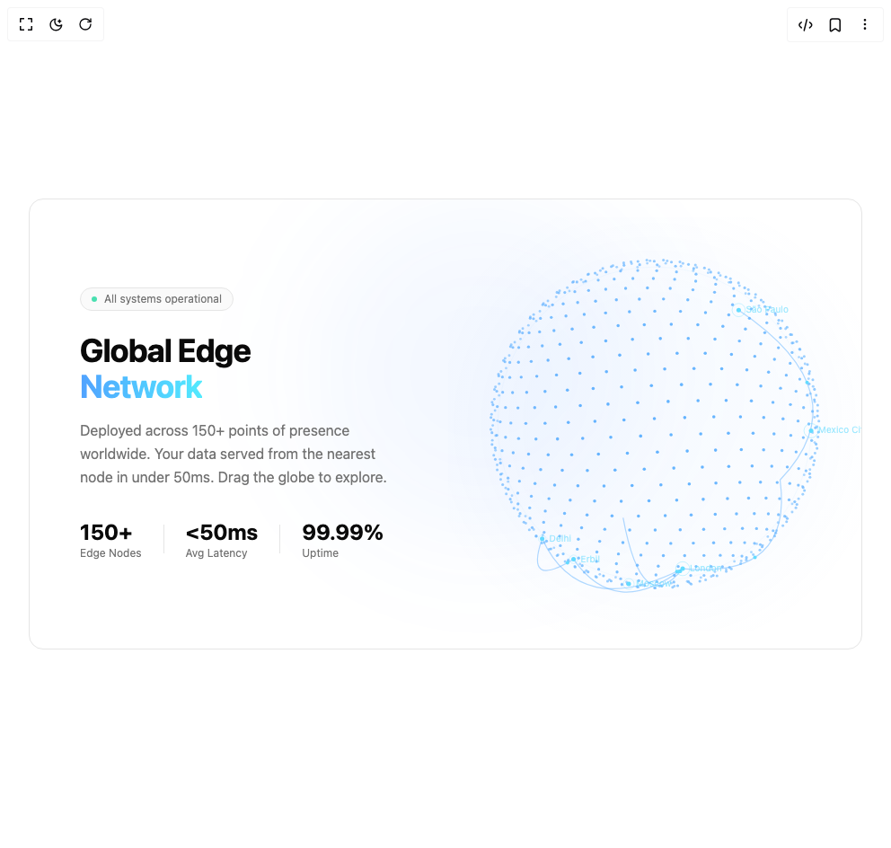

# Yadhakim Components

5 components are available in this author group.

> Build any component in [BuilderStudio](https://builderstudio.dev), then share improvements with the community on [Discord](https://discord.gg/QdWeSGCqfe) or [Reddit](https://reddit.com/r/builderstudio).

| Preview | Component | Variant |
| --- | --- | --- |
|  | [Animated State Icons](animated-state-icons/default/README.md) | `default` |
|  | [Animated Weather Icons](animated-weather-icons/default/README.md) | `default` |
|  | [Elegant Carousel](elegant-carousel/default/README.md) | `default` |
|  | [Interactive Globe](interactive-globe/default/README.md) | `default` |
|  | [Rotating Text](rotating-text/default/README.md) | `default` |
