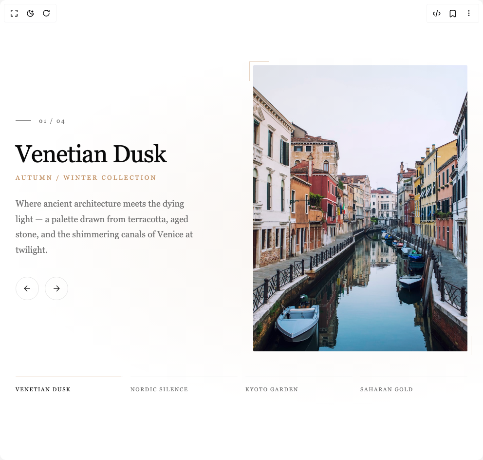

# Build Elegant Carousel in BuilderStudio

> Build this component in our Agentic IDE: [BuilderStudio](https://builderstudio.dev).
>
> Join the BuilderStudio community on [Discord](https://discord.gg/QdWeSGCqfe) and [Reddit](https://reddit.com/r/builderstudio).



## Component

- Author group: `yadhakim`
- Component: `elegant-carousel`
- Variant: `default`
- Rendered HTML snapshot: [`rendered.html`](rendered.html)

## BuilderStudio prompt

You are implementing a React component based on a component reference.

## Component identity

- Author: YadHakim
- Component slug: elegant-carousel
- Demo slug: default
- Title: elegant-carousel
- Description: 

## Goal

Recreate this component in a React + TypeScript + Tailwind CSS project. Preserve the visual layout, spacing, colors, border radius, shadows, interaction behavior, animation behavior, responsive behavior, and dark mode behavior shown in the rendered demo.

## Implementation requirements

- Use React and TypeScript.
- Use Tailwind CSS classes whenever possible.
- Keep the component self-contained unless the source files require helper components.
- If the source uses CSS variables, custom CSS, animations, or keyframes, include them.
- If the source uses external packages, list and use the required packages.
- Preserve accessibility attributes, button semantics, links, keyboard behavior, and ARIA attributes when visible in the source.
- Do not replace the component with a simplified placeholder.
- Return complete production-ready code.

## Dependencies

No reference metadata available.

## Rendered DOM snapshot

This is the rendered demo HTML extracted from the live preview. Use it to verify structure, class names, visible content, and layout.

```html
<div id="root"><div class="w-screen min-h-screen flex justify-center items-center"><div class="w-screen min-h-screen flex justify-center items-center"><div class="carousel-wrapper"><div class="carousel-bg-wash" style="background: radial-gradient(at 70% 50%, rgba(196, 149, 106, 0.094) 0%, transparent 70%);"></div><div class="carousel-inner"><div class="carousel-content"><div class="carousel-content-inner"><div class="carousel-collection-num visible"><span class="carousel-num-line"></span><span class="carousel-num-text">01 / 04</span></div><h2 class="carousel-title visible">Venetian Dusk</h2><p class="carousel-subtitle visible" style="color: rgb(196, 149, 106);">Autumn / Winter Collection</p><p class="carousel-description visible">Where ancient architecture meets the dying light — a palette drawn from terracotta, aged stone, and the shimmering canals of Venice at twilight.</p><div class="carousel-nav-arrows"><button class="carousel-arrow-btn" aria-label="Previous slide"><svg width="20" height="20" viewBox="0 0 24 24" fill="none" stroke="currentColor" stroke-width="1.5"><path d="M19 12H5M12 19l-7-7 7-7"></path></svg></button><button class="carousel-arrow-btn" aria-label="Next slide"><svg width="20" height="20" viewBox="0 0 24 24" fill="none" stroke="currentColor" stroke-width="1.5"><path d="M5 12h14M12 5l7 7-7 7"></path></svg></button></div></div></div><div class="carousel-image-container"><div class="carousel-image-frame visible"><div class="carousel-image-overlay" style="background: linear-gradient(135deg, rgba(196, 149, 106, 0.133) 0%, transparent 50%);"></div></div><div class="carousel-frame-corner carousel-frame-corner--tl" style="border-color: rgb(196, 149, 106);"></div><div class="carousel-frame-corner carousel-frame-corner--br" style="border-color: rgb(196, 149, 106);"></div></div></div><div class="carousel-progress-bar"><button class="carousel-progress-item active" aria-label="Go to slide 1"><div class="carousel-progress-track"><div class="carousel-progress-fill" style="width: 98.3333%; background-color: rgb(196, 149, 106);"></div></div><span class="carousel-progress-label">Venetian Dusk</span></button><button class="carousel-progress-item " aria-label="Go to slide 2"><div class="carousel-progress-track"><div class="carousel-progress-fill" style="width: 0%;"></div></div><span class="carousel-progress-label">Nordic Silence</span></button><button class="carousel-progress-item " aria-label="Go to slide 3"><div class="carousel-progress-track"><div class="carousel-progress-fill" style="width: 0%;"></div></div><span class="carousel-progress-label">Kyoto Garden</span></button><button class="carousel-progress-item " aria-label="Go to slide 4"><div class="carousel-progress-track"><div class="carousel-progress-fill" style="width: 0%;"></div></div><span class="carousel-progress-label">Saharan Gold</span></button></div></div></div></div></div>
```

## Reference source files

No reference source files were available.
