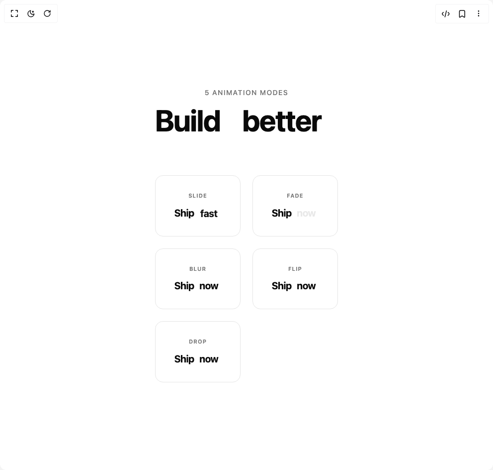

# Build Rotating Text in BuilderStudio

> Build this component in our Agentic IDE: [BuilderStudio](https://builderstudio.dev).
>
> Join the BuilderStudio community on [Discord](https://discord.gg/QdWeSGCqfe) and [Reddit](https://reddit.com/r/builderstudio).



## Component

- Author group: `yadhakim`
- Component: `rotating-text`
- Variant: `default`
- Rendered HTML snapshot: [`rendered.html`](rendered.html)

## BuilderStudio prompt

You are implementing a React component based on a component reference.

## Component identity

- Author: YadHakim
- Component slug: rotating-text
- Demo slug: default
- Title: rotating-text
- Description: 

## Goal

Recreate this component in a React + TypeScript + Tailwind CSS project. Preserve the visual layout, spacing, colors, border radius, shadows, interaction behavior, animation behavior, responsive behavior, and dark mode behavior shown in the rendered demo.

## Implementation requirements

- Use React and TypeScript.
- Use Tailwind CSS classes whenever possible.
- Keep the component self-contained unless the source files require helper components.
- If the source uses CSS variables, custom CSS, animations, or keyframes, include them.
- If the source uses external packages, list and use the required packages.
- Preserve accessibility attributes, button semantics, links, keyboard behavior, and ARIA attributes when visible in the source.
- Do not replace the component with a simplified placeholder.
- Return complete production-ready code.

## Dependencies

No reference metadata available.

## Rendered DOM snapshot

This is the rendered demo HTML extracted from the live preview. Use it to verify structure, class names, visible content, and layout.

```html
<div id="root"><div class="w-screen min-h-screen flex justify-center items-center"><div class="w-screen min-h-screen flex justify-center items-center"><div class="flex min-h-screen flex-col items-center justify-center gap-20 bg-background px-6 py-20"><div class="text-center space-y-4"><p class="text-sm font-medium tracking-widest uppercase text-muted-foreground">5 animation modes</p><h1 class="text-4xl md:text-6xl font-bold tracking-tight text-foreground">Build <span class="relative inline-flex overflow-hidden text-foreground"><span class="invisible">together</span><span class="absolute inset-0 flex items-center justify-center" style="opacity: 1; transform: none;">better</span></span></h1></div><div class="grid grid-cols-1 sm:grid-cols-2 lg:grid-cols-3 gap-6 w-full max-w-3xl"><div class="flex flex-col items-center gap-3 rounded-2xl border border-border bg-card p-8"><span class="text-[11px] font-semibold tracking-widest uppercase text-muted-foreground">slide</span><p class="text-xl font-bold tracking-tight text-foreground">Ship <span class="relative inline-flex overflow-hidden text-foreground"><span class="invisible">today</span><span class="absolute inset-0 flex items-center justify-center" style="opacity: 0; transform: translateY(5.20754%);">fast</span></span></p></div><div class="flex flex-col items-center gap-3 rounded-2xl border border-border bg-card p-8"><span class="text-[11px] font-semibold tracking-widest uppercase text-muted-foreground">fade</span><p class="text-xl font-bold tracking-tight text-foreground">Ship <span class="relative inline-flex overflow-hidden text-foreground"><span class="invisible">today</span><span class="absolute inset-0 flex items-center justify-center" style="opacity: 1;">now</span></span></p></div><div class="flex flex-col items-center gap-3 rounded-2xl border border-border bg-card p-8"><span class="text-[11px] font-semibold tracking-widest uppercase text-muted-foreground">blur</span><p class="text-xl font-bold tracking-tight text-foreground">Ship <span class="relative inline-flex overflow-hidden text-foreground"><span class="invisible">today</span><span class="absolute inset-0 flex items-center justify-center" style="opacity: 1; filter: blur(0px);">now</span></span></p></div><div class="flex flex-col items-center gap-3 rounded-2xl border border-border bg-card p-8"><span class="text-[11px] font-semibold tracking-widest uppercase text-muted-foreground">flip</span><p class="text-xl font-bold tracking-tight text-foreground">Ship <span class="relative inline-flex overflow-hidden text-foreground" style="perspective: 600px;"><span class="invisible">today</span><span class="absolute inset-0 flex items-center justify-center" style="opacity: 1; transform: none;">now</span></span></p></div><div class="flex flex-col items-center gap-3 rounded-2xl border border-border bg-card p-8"><span class="text-[11px] font-semibold tracking-widest uppercase text-muted-foreground">drop</span><p class="text-xl font-bold tracking-tight text-foreground">Ship <span class="relative inline-flex overflow-hidden text-foreground"><span class="invisible">today</span><span class="absolute inset-0 flex items-center justify-center" style="opacity: 1; transform: none;">now</span></span></p></div></div></div></div></div></div>
```

## Reference source files

No reference source files were available.
