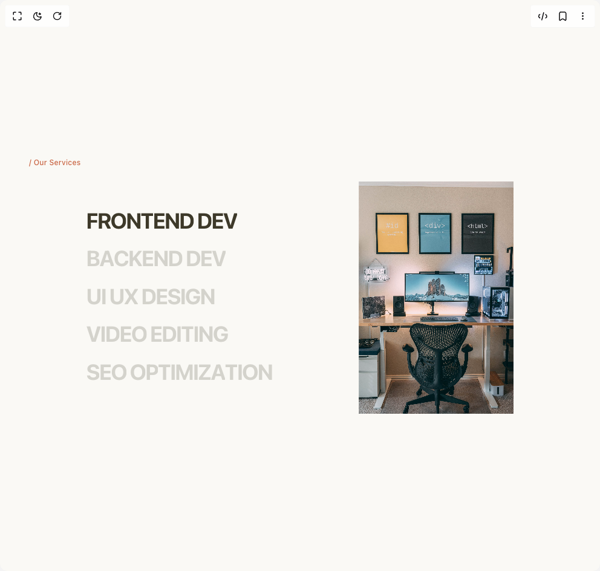

# Build Animated Slideshow in BuilderStudio

> Build this component in our Agentic IDE: [BuilderStudio](https://builderstudio.dev).
>
> Join the BuilderStudio community on [Discord](https://discord.gg/QdWeSGCqfe) and [Reddit](https://reddit.com/r/builderstudio).



## Component

- Author group: `youcefbnm`
- Component: `animated-slideshow`
- Variant: `default`
- Rendered HTML snapshot: [`rendered.html`](rendered.html)

## BuilderStudio prompt

You are implementing a React component based on a component reference.

## Component identity

- Author: YoucefBnm
- Component slug: animated-slideshow
- Demo slug: default
- Title: animated-slideshow
- Description: 

## Goal

Recreate this component in a React + TypeScript + Tailwind CSS project. Preserve the visual layout, spacing, colors, border radius, shadows, interaction behavior, animation behavior, responsive behavior, and dark mode behavior shown in the rendered demo.

## Implementation requirements

- Use React and TypeScript.
- Use Tailwind CSS classes whenever possible.
- Keep the component self-contained unless the source files require helper components.
- If the source uses CSS variables, custom CSS, animations, or keyframes, include them.
- If the source uses external packages, list and use the required packages.
- Preserve accessibility attributes, button semantics, links, keyboard behavior, and ARIA attributes when visible in the source.
- Do not replace the component with a simplified placeholder.
- Return complete production-ready code.

## Dependencies

No reference metadata available.

## Rendered DOM snapshot

This is the rendered demo HTML extracted from the live preview. Use it to verify structure, class names, visible content, and layout.

```html
<div id="root"><div class="bg-background text-foreground"><div class="w-full"><div class="min-h-svh place-content-center p-6 md:px-12 bg-[#faf9f5] text-[#3d3929]"><h3 class="mb-6 text-[rgb(201, 100, 66)] text-xs font-medium capitalize tracking-wide text-[#c96442]">/ our services</h3><div class="flex flex-wrap items-center justify-evenly gap-6 md:gap-12"><div class="flex  flex-col space-y-2 md:space-y-4   "><span class="relative inline-block origin-bottom overflow-hidden cursor-pointer text-4xl font-bold uppercase tracking-tighter"><span class="relative inline-block overflow-hidden"><span class="inline-block opacity-20" style="transform: translateY(-110%);">f</span><span class="absolute left-0 top-0 inline-block opacity-100" style="transform: none;">f</span></span><span class="relative inline-block overflow-hidden"><span class="inline-block opacity-20" style="transform: translateY(-110%);">r</span><span class="absolute left-0 top-0 inline-block opacity-100" style="transform: none;">r</span></span><span class="relative inline-block overflow-hidden"><span class="inline-block opacity-20" style="transform: translateY(-110%);">o</span><span class="absolute left-0 top-0 inline-block opacity-100" style="transform: none;">o</span></span><span class="relative inline-block overflow-hidden"><span class="inline-block opacity-20" style="transform: translateY(-110%);">n</span><span class="absolute left-0 top-0 inline-block opacity-100" style="transform: none;">n</span></span><span class="relative inline-block overflow-hidden"><span class="inline-block opacity-20" style="transform: translateY(-110%);">t</span><span class="absolute left-0 top-0 inline-block opacity-100" style="transform: none;">t</span></span><span class="relative inline-block overflow-hidden"><span class="inline-block opacity-20" style="transform: translateY(-110%);">e</span><span class="absolute left-0 top-0 inline-block opacity-100" style="transform: none;">e</span></span><span class="relative inline-block overflow-hidden"><span class="inline-block opacity-20" style="transform: translateY(-110%);">n</span><span class="absolute left-0 top-0 inline-block opacity-100" style="transform: none;">n</span></span><span class="relative inline-block overflow-hidden"><span class="inline-block opacity-20" style="transform: translateY(-110%);">d</span><span class="absolute left-0 top-0 inline-block opacity-100" style="transform: none;">d</span></span><span class="relative inline-block overflow-hidden"><span class="inline-block opacity-20" style="transform: translateY(-110%);"> &nbsp;</span><span class="absolute left-0 top-0 inline-block opacity-100" style="transform: none;"> </span></span><span class="relative inline-block overflow-hidden"><span class="inline-block opacity-20" style="transform: translateY(-110%);">d</span><span class="absolute left-0 top-0 inline-block opacity-100" style="transform: none;">d</span></span><span class="relative inline-block overflow-hidden"><span class="inline-block opacity-20" style="transform: translateY(-110%);">e</span><span class="absolute left-0 top-0 inline-block opacity-100" style="transform: none;">e</span></span><span class="relative inline-block overflow-hidden"><span class="inline-block opacity-20" style="transform: translateY(-110%);">v</span><span class="absolute left-0 top-0 inline-block opacity-100" style="transform: none;">v</span></span><span class="relative inline-block overflow-hidden"><span class="inline-block opacity-20" style="transform: translateY(-110%);"> </span><span class="absolute left-0 top-0 inline-block opacity-100" style="transform: none;"> </span></span></span><span class="relative inline-block origin-bottom overflow-hidden cursor-pointer text-4xl font-bold uppercase tracking-tighter"><span class="relative inline-block overflow-hidden"><span class="inline-block opacity-20" style="transform: none;">b</span><span class="absolute left-0 top-0 inline-block opacity-100" style="transform: translateY(110%);">b</span></span><span class="relative inline-block overflow-hidden"><span class="inline-block opacity-20" style="transform: none;">a</span><span class="absolute left-0 top-0 inline-block opacity-100" style="transform: translateY(110%);">a</span></span><span class="relative inline-block overflow-hidden"><span class="inline-block opacity-20" style="transform: none;">c</span><span class="absolute left-0 top-0 inline-block opacity-100" style="transform: translateY(110%);">c</span></span><span class="relative inline-block overflow-hidden"><span class="inline-block opacity-20" style="transform: none;">k</span><span class="absolute left-0 top-0 inline-block opacity-100" style="transform: translateY(110%);">k</span></span><span class="relative inline-block overflow-hidden"><span class="inline-block opacity-20" style="transform: none;">e</span><span class="absolute left-0 top-0 inline-block opacity-100" style="transform: translateY(110%);">e</span></span><span class="relative inline-block overflow-hidden"><span class="inline-block opacity-20" style="transform: none;">n</span><span class="absolute left-0 top-0 inline-block opacity-100" style="transform: translateY(110%);">n</span></span><span class="relative inline-block overflow-hidden"><span class="inline-block opacity-20" style="transform: none;">d</span><span class="absolute left-0 top-0 inline-block opacity-100" style="transform: translateY(110%);">d</span></span><span class="relative inline-block overflow-hidden"><span class="inline-block opacity-20" style="transform: none;"> &nbsp;</span><span class="absolute left-0 top-0 inline-block opacity-100" style="transform: translateY(110%);"> </span></span><span class="relative inline-block overflow-hidden"><span class="inline-block opacity-20" style="transform: none;">d</span><span class="absolute left-0 top-0 inline-block opacity-100" style="transform: translateY(110%);">d</span></span><span class="relative inline-block overflow-hidden"><span class="inline-block opacity-20" style="transform: none;">e</span><span class="absolute left-0 top-0 inline-block opacity-100" style="transform: translateY(110%);">e</span></span><span class="relative inline-block overflow-hidden"><span class="inline-block opacity-20" style="transform: none;">v</span><span class="absolute left-0 top-0 inline-block opacity-100" style="transform: translateY(110%);">v</span></span><span class="relative inline-block overflow-hidden"><span class="inline-block opacity-20" style="transform: none;"> </span><span class="absolute left-0 top-0 inline-block opacity-100" style="transform: translateY(110%);"> </span></span></span><span class="relative inline-block origin-bottom overflow-hidden cursor-pointer text-4xl font-bold uppercase tracking-tighter"><span class="relative inline-block overflow-hidden"><span class="inline-block opacity-20" style="transform: none;">U</span><span class="absolute left-0 top-0 inline-block opacity-100" style="transform: translateY(110%);">U</span></span><span class="relative inline-block overflow-hidden"><span class="inline-block opacity-20" style="transform: none;">I</span><span class="absolute left-0 top-0 inline-block opacity-100" style="transform: translateY(110%);">I</span></span><span class="relative inline-block overflow-hidden"><span class="inline-block opacity-20" style="transform: none;"> &nbsp;</span><span class="absolute left-0 top-0 inline-block opacity-100" style="transform: translateY(110%);"> </span></span><span class="relative inline-block overflow-hidden"><span class="inline-block opacity-20" style="transform: none;">U</span><span class="absolute left-0 top-0 inline-block opacity-100" style="transform: translateY(110%);">U</span></span><span class="relative inline-block overflow-hidden"><span class="inline-block opacity-20" style="transform: none;">X</span><span class="absolute left-0 top-0 inline-block opacity-100" style="transform: translateY(110%);">X</span></span><span class="relative inline-block overflow-hidden"><span class="inline-block opacity-20" style="transform: none;"> &nbsp;</span><span class="absolute left-0 top-0 inline-block opacity-100" style="transform: translateY(110%);"> </span></span><span class="relative inline-block overflow-hidden"><span class="inline-block opacity-20" style="transform: none;">d</span><span class="absolute left-0 top-0 inline-block opacity-100" style="transform: translateY(110%);">d</span></span><span class="relative inline-block overflow-hidden"><span class="inline-block opacity-20" style="transform: none;">e</span><span class="absolute left-0 top-0 inline-block opacity-100" style="transform: translateY(110%);">e</span></span><span class="relative inline-block overflow-hidden"><span class="inline-block opacity-20" style="transform: none;">s</span><span class="absolute left-0 top-0 inline-block opacity-100" style="transform: translateY(110%);">s</span></span><span class="relative inline-block overflow-hidden"><span class="inline-block opacity-20" style="transform: none;">i</span><span class="absolute left-0 top-0 inline-block opacity-100" style="transform: translateY(110%);">i</span></span><span class="relative inline-block overflow-hidden"><span class="inline-block opacity-20" style="transform: none;">g</span><span class="absolute left-0 top-0 inline-block opacity-100" style="transform: translateY(110%);">g</span></span><span class="relative inline-block overflow-hidden"><span class="inline-block opacity-20" style="transform: none;">n</span><span class="absolute left-0 top-0 inline-block opacity-100" style="transform: translateY(110%);">n</span></span><span class="relative inline-block overflow-hidden"><span class="inline-block opacity-20" style="transform: none;"> </span><span class="absolute left-0 top-0 inline-block opacity-100" style="transform: translateY(110%);"> </span></span></span><span class="relative inline-block origin-bottom overflow-hidden cursor-pointer text-4xl font-bold uppercase tracking-tighter"><span class="relative inline-block overflow-hidden"><span class="inline-block opacity-20" style="transform: none;">v</span><span class="absolute left-0 top-0 inline-block opacity-100" style="transform: translateY(110%);">v</span></span><span class="relative inline-block overflow-hidden"><span class="inline-block opacity-20" style="transform: none;">i</span><span class="absolute left-0 top-0 inline-block opacity-100" style="transform: translateY(110%);">i</span></span><span class="relative inline-block overflow-hidden"><span class="inline-block opacity-20" style="transform: none;">d</span><span class="absolute left-0 top-0 inline-block opacity-100" style="transform: translateY(110%);">d</span></span><span class="relative inline-block overflow-hidden"><span class="inline-block opacity-20" style="transform: none;">e</span><span class="absolute left-0 top-0 inline-block opacity-100" style="transform: translateY(110%);">e</span></span><span class="relative inline-block overflow-hidden"><span class="inline-block opacity-20" style="transform: none;">o</span><span class="absolute left-0 top-0 inline-block opacity-100" style="transform: translateY(110%);">o</span></span><span class="relative inline-block overflow-hidden"><span class="inline-block opacity-20" style="transform: none;"> &nbsp;</span><span class="absolute left-0 top-0 inline-block opacity-100" style="transform: translateY(110%);"> </span></span><span class="relative inline-block overflow-hidden"><span class="inline-block opacity-20" style="transform: none;">e</span><span class="absolute left-0 top-0 inline-block opacity-100" style="transform: translateY(110%);">e</span></span><span class="relative inline-block overflow-hidden"><span class="inline-block opacity-20" style="transform: none;">d</span><span class="absolute left-0 top-0 inline-block opacity-100" style="transform: translateY(110%);">d</span></span><span class="relative inline-block overflow-hidden"><span class="inline-block opacity-20" style="transform: none;">i</span><span class="absolute left-0 top-0 inline-block opacity-100" style="transform: translateY(110%);">i</span></span><span class="relative inline-block overflow-hidden"><span class="inline-block opacity-20" style="transform: none;">t</span><span class="absolute left-0 top-0 inline-block opacity-100" style="transform: translateY(110%);">t</span></span><span class="relative inline-block overflow-hidden"><span class="inline-block opacity-20" style="transform: none;">i</span><span class="absolute left-0 top-0 inline-block opacity-100" style="transform: translateY(110%);">i</span></span><span class="relative inline-block overflow-hidden"><span class="inline-block opacity-20" style="transform: none;">n</span><span class="absolute left-0 top-0 inline-block opacity-100" style="transform: translateY(110%);">n</span></span><span class="relative inline-block overflow-hidden"><span class="inline-block opacity-20" style="transform: none;">g</span><span class="absolute left-0 top-0 inline-block opacity-100" style="transform: translateY(110%);">g</span></span><span class="relative inline-block overflow-hidden"><span class="inline-block opacity-20" style="transform: none;"> </span><span class="absolute left-0 top-0 inline-block opacity-100" style="transform: translateY(110%);"> </span></span></span><span class="relative inline-block origin-bottom overflow-hidden cursor-pointer text-4xl font-bold uppercase tracking-tighter"><span class="relative inline-block overflow-hidden"><span class="inline-block opacity-20" style="transform: none;">S</span><span class="absolute left-0 top-0 inline-block opacity-100" style="transform: translateY(110%);">S</span></span><span class="relative inline-block overflow-hidden"><span class="inline-block opacity-20" style="transform: none;">E</span><span class="absolute left-0 top-0 inline-block opacity-100" style="transform: translateY(110%);">E</span></span><span class="relative inline-block overflow-hidden"><span class="inline-block opacity-20" style="transform: none;">O</span><span class="absolute left-0 top-0 inline-block opacity-100" style="transform: translateY(110%);">O</span></span><span class="relative inline-block overflow-hidden"><span class="inline-block opacity-20" style="transform: none;"> &nbsp;</span><span class="absolute left-0 top-0 inline-block opacity-100" style="transform: translateY(110%);"> </span></span><span class="relative inline-block overflow-hidden"><span class="inline-block opacity-20" style="transform: none;">o</span><span class="absolute left-0 top-0 inline-block opacity-100" style="transform: translateY(110%);">o</span></span><span class="relative inline-block overflow-hidden"><span class="inline-block opacity-20" style="transform: none;">p</span><span class="absolute left-0 top-0 inline-block opacity-100" style="transform: translateY(110%);">p</span></span><span class="relative inline-block overflow-hidden"><span class="inline-block opacity-20" style="transform: none;">t</span><span class="absolute left-0 top-0 inline-block opacity-100" style="transform: translateY(110%);">t</span></span><span class="relative inline-block overflow-hidden"><span class="inline-block opacity-20" style="transform: none;">i</span><span class="absolute left-0 top-0 inline-block opacity-100" style="transform: translateY(110%);">i</span></span><span class="relative inline-block overflow-hidden"><span class="inline-block opacity-20" style="transform: none;">m</span><span class="absolute left-0 top-0 inline-block opacity-100" style="transform: translateY(110%);">m</span></span><span class="relative inline-block overflow-hidden"><span class="inline-block opacity-20" style="transform: none;">i</span><span class="absolute left-0 top-0 inline-block opacity-100" style="transform: translateY(110%);">i</span></span><span class="relative inline-block overflow-hidden"><span class="inline-block opacity-20" style="transform: none;">z</span><span class="absolute left-0 top-0 inline-block opacity-100" style="transform: translateY(110%);">z</span></span><span class="relative inline-block overflow-hidden"><span class="inline-block opacity-20" style="transform: none;">a</span><span class="absolute left-0 top-0 inline-block opacity-100" style="transform: translateY(110%);">a</span></span><span class="relative inline-block overflow-hidden"><span class="inline-block opacity-20" style="transform: none;">t</span><span class="absolute left-0 top-0 inline-block opacity-100" style="transform: translateY(110%);">t</span></span><span class="relative inline-block overflow-hidden"><span class="inline-block opacity-20" style="transform: none;">i</span><span class="absolute left-0 top-0 inline-block opacity-100" style="transform: translateY(110%);">i</span></span><span class="relative inline-block overflow-hidden"><span class="inline-block opacity-20" style="transform: none;">o</span><span class="absolute left-0 top-0 inline-block opacity-100" style="transform: translateY(110%);">o</span></span><span class="relative inline-block overflow-hidden"><span class="inline-block opacity-20" style="transform: none;">n</span><span class="absolute left-0 top-0 inline-block opacity-100" style="transform: translateY(110%);">n</span></span><span class="relative inline-block overflow-hidden"><span class="inline-block opacity-20" style="transform: none;"> </span><span class="absolute left-0 top-0 inline-block opacity-100" style="transform: translateY(110%);"> </span></span></span></div><div class="grid overflow-hidden [&amp;&gt;*]:col-start-1 [&amp;&gt;*]:col-end-1 [&amp;&gt;*]:row-start-1 [&amp;&gt;*]:row-end-1 [&amp;&gt;*]:size-full"><div class="  "></div><div class="  "></div><div class="  "></div><div class="  "></div><div class="  "></div></div></div></div></div></div></div>
```

## Reference source files

No reference source files were available.
