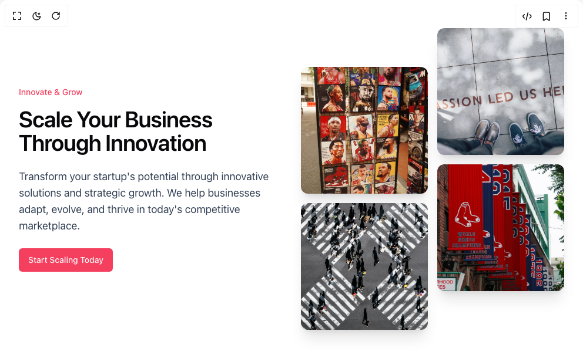

# Build Cta Section With Gallery in BuilderStudio

> Build this component in our Agentic IDE: [BuilderStudio](https://builderstudio.dev).
>
> Join the BuilderStudio community on [Discord](https://discord.gg/QdWeSGCqfe) and [Reddit](https://reddit.com/r/builderstudio).



## Component

- Author group: `youcefbnm`
- Component: `cta-section-with-gallery`
- Variant: `default`
- Rendered HTML snapshot: [`rendered.html`](rendered.html)

## BuilderStudio prompt

You are implementing a React component based on a component reference.

## Component identity

- Author: YoucefBnm
- Component slug: cta-section-with-gallery
- Demo slug: default
- Title: cta-section-with-gallery
- Description: 

## Goal

Recreate this component in a React + TypeScript + Tailwind CSS project. Preserve the visual layout, spacing, colors, border radius, shadows, interaction behavior, animation behavior, responsive behavior, and dark mode behavior shown in the rendered demo.

## Implementation requirements

- Use React and TypeScript.
- Use Tailwind CSS classes whenever possible.
- Keep the component self-contained unless the source files require helper components.
- If the source uses CSS variables, custom CSS, animations, or keyframes, include them.
- If the source uses external packages, list and use the required packages.
- Preserve accessibility attributes, button semantics, links, keyboard behavior, and ARIA attributes when visible in the source.
- Do not replace the component with a simplified placeholder.
- Return complete production-ready code.

## Dependencies

No reference metadata available.

## Rendered DOM snapshot

This is the rendered demo HTML extracted from the live preview. Use it to verify structure, class names, visible content, and layout.

```html
<div id="root"><div class="bg-background text-foreground"><div class="w-full"><section><div class="mx-auto grid w-full max-w-6xl grid-cols-1 items-center gap-8 px-8 py-12 md:grid-cols-2"><div><div class="mb-4 block text-xs font-medium text-rose-500 md:text-sm" style="opacity: 1; filter: blur(0px);">Innovate &amp; Grow</div><div class="text-4xl font-semibold md:text-[2.4rem] tracking-tight" style="opacity: 1; filter: blur(0px);">Scale Your Business Through Innovation</div><div class="my-4 text-base text-slate-700 md:my-6 md:text-lg" style="opacity: 1; filter: blur(0px);">Transform your startup's potential through innovative solutions and strategic growth. We help businesses adapt, evolve, and thrive in today's competitive marketplace.</div><div style="opacity: 1; filter: blur(0px);"><button class="inline-flex items-center justify-center whitespace-nowrap rounded-md text-sm font-medium ring-offset-background transition-colors focus-visible:outline-none focus-visible:ring-2 focus-visible:ring-ring focus-visible:ring-offset-2 disabled:pointer-events-none disabled:opacity-50 text-primary-foreground hover:bg-primary/90 h-10 px-4 py-2 bg-rose-500">Start Scaling Today</button></div></div><div class="grid grid-cols-2 grid-rows-[50px_150px_50px_150px_50px] gap-4"><div class="relative overflow-hidden rounded-xl shadow-xl col-start-2 col-end-3 row-start-1 row-end-3" style="opacity: 1;"></div><div class="relative overflow-hidden rounded-xl shadow-xl col-start-1 col-end-2 row-start-2 row-end-4" style="opacity: 1;"></div><div class="relative overflow-hidden rounded-xl shadow-xl col-start-1 col-end-2 row-start-4 row-end-6" style="opacity: 1;"></div><div class="relative overflow-hidden rounded-xl shadow-xl col-start-2 col-end-3 row-start-3 row-end-5" style="opacity: 1;"></div></div></div></section></div></div></div>
```

## Reference source files

No reference source files were available.
