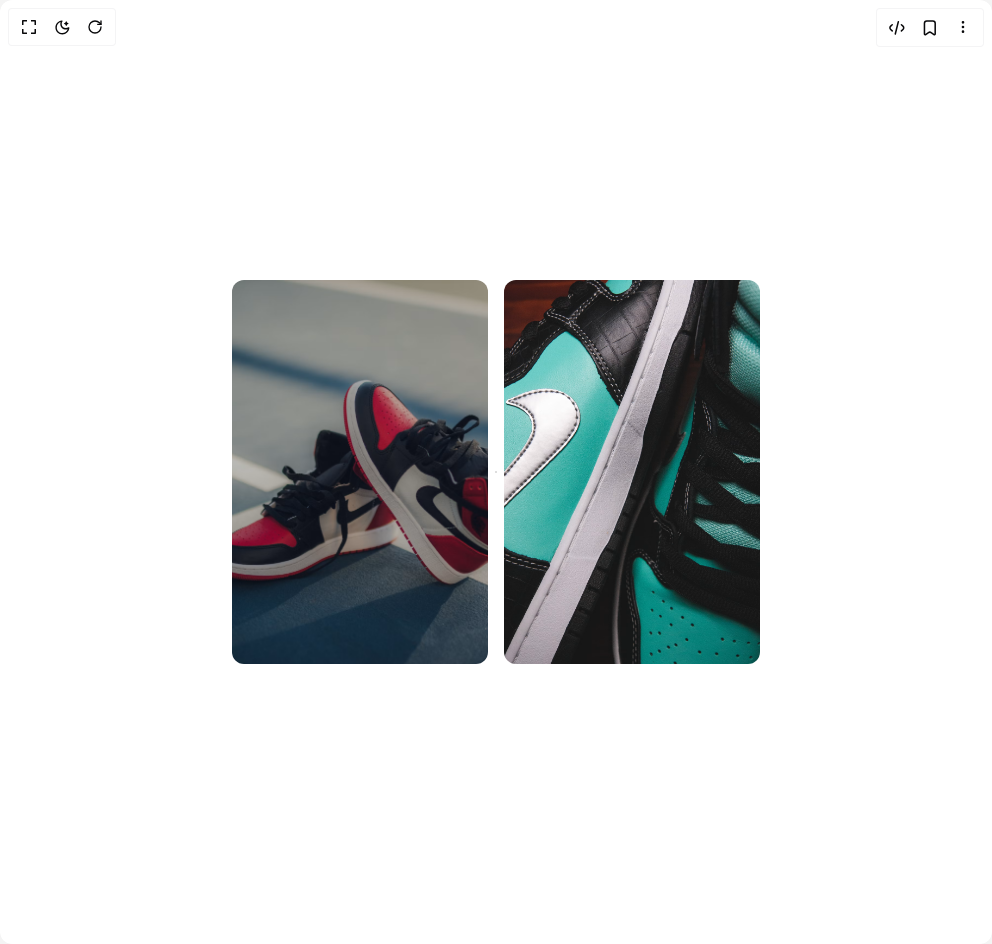

# Build Flip Card in BuilderStudio

> Build this component in our Agentic IDE: [BuilderStudio](https://builderstudio.dev).
>
> Join the BuilderStudio community on [Discord](https://discord.gg/QdWeSGCqfe) and [Reddit](https://reddit.com/r/builderstudio).



## Component

- Author group: `youcefbnm`
- Component: `flip-card`
- Variant: `flip-card`
- Rendered HTML snapshot: [`rendered.html`](rendered.html)

## BuilderStudio prompt

You are implementing a React component based on a component reference.

## Component identity

- Author: YoucefBnm
- Component slug: flip-card
- Demo slug: flip-card
- Title: flip-card
- Description: 

## Goal

Recreate this component in a React + TypeScript + Tailwind CSS project. Preserve the visual layout, spacing, colors, border radius, shadows, interaction behavior, animation behavior, responsive behavior, and dark mode behavior shown in the rendered demo.

## Implementation requirements

- Use React and TypeScript.
- Use Tailwind CSS classes whenever possible.
- Keep the component self-contained unless the source files require helper components.
- If the source uses CSS variables, custom CSS, animations, or keyframes, include them.
- If the source uses external packages, list and use the required packages.
- Preserve accessibility attributes, button semantics, links, keyboard behavior, and ARIA attributes when visible in the source.
- Do not replace the component with a simplified placeholder.
- Return complete production-ready code.

## Dependencies

No reference metadata available.

## Rendered DOM snapshot

This is the rendered demo HTML extracted from the live preview. Use it to verify structure, class names, visible content, and layout.

```html
<div id="root"><div class="relative flex items-center justify-center h-screen w-full m-auto p-16 bg-background text-foreground"><div class="absolute lab-bg inset-0 size-full"><div class="absolute inset-0 bg-[radial-gradient(#00000021_1px,transparent_1px)] dark:bg-[radial-gradient(#ffffff22_1px,transparent_1px)]"></div></div><div class="flex w-full justify-center relative"><div class="container py-12"><div class="flex flex-wrap justify-center gap-4"><div class="relative border-none bg-none shadow-none h-96 w-2/6" role="button" tabindex="0" aria-pressed="false" style="transform-style: preserve-3d; perspective: 1000px; backface-visibility: hidden;"><div class="absolute inset-0 z-20 size-full overflow-hidden rounded-xl" style="transform-style: preserve-3d; perspective: 1000px; backface-visibility: hidden; transform: none;"></div><div class="absolute inset-0 z-10 size-full flex flex-col items-center justify-center rounded-xl bg-rose-600 px-4 py-6 text-center text-white" style="transform-style: preserve-3d; perspective: 1000px; backface-visibility: hidden; transform: rotateY(180deg);"><h2 class="text-xl font-bold">Nike Air Jordan</h2><h4 class="mb-4">€ 1,299.00</h4><button class="inline-flex items-center justify-center whitespace-nowrap text-sm font-medium ring-offset-background transition-colors focus-visible:outline-none focus-visible:ring-2 focus-visible:ring-ring focus-visible:ring-offset-2 disabled:pointer-events-none disabled:opacity-50 bg-primary text-primary-foreground hover:bg-primary/90 h-10 px-4 py-2 rounded-full">Add to cart</button></div></div><div class="relative border-none bg-none shadow-none h-96 w-2/6" role="button" tabindex="0" aria-pressed="false" style="transform-style: preserve-3d; perspective: 1000px; backface-visibility: hidden;"><div class="absolute inset-0 z-20 size-full overflow-hidden rounded-xl" style="transform-style: preserve-3d; perspective: 1000px; backface-visibility: hidden; transform: none;"></div><div class="absolute inset-0 z-10 size-full flex flex-col items-center justify-center rounded-xl bg-emerald-500 px-4 py-6 text-center text-white" style="transform-style: preserve-3d; perspective: 1000px; backface-visibility: hidden; transform: rotateX(180deg);"><h2 class="text-xl font-bold">Nike Air Jordan</h2><h4 class="mb-4">€ 1,299.00</h4><button class="inline-flex items-center justify-center whitespace-nowrap text-sm font-medium ring-offset-background transition-colors focus-visible:outline-none focus-visible:ring-2 focus-visible:ring-ring focus-visible:ring-offset-2 disabled:pointer-events-none disabled:opacity-50 bg-primary text-primary-foreground hover:bg-primary/90 h-10 px-4 py-2 rounded-full">Add to cart</button></div></div></div></div></div></div></div>
```

## Reference source files

No reference source files were available.
