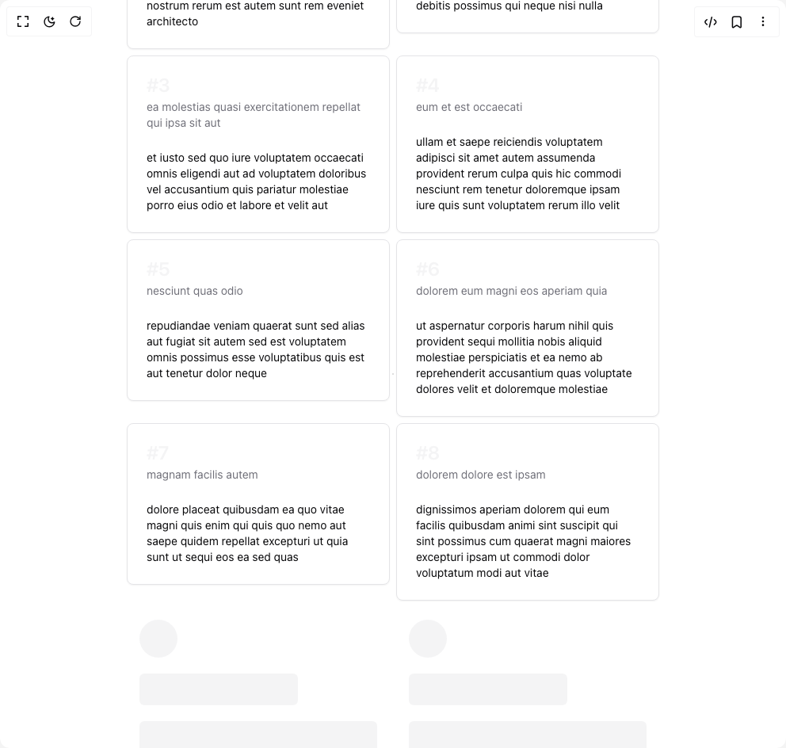

# Build Infinite Scroll Container in BuilderStudio

> Build this component in our Agentic IDE: [BuilderStudio](https://builderstudio.dev).
>
> Join the BuilderStudio community on [Discord](https://discord.gg/QdWeSGCqfe) and [Reddit](https://reddit.com/r/builderstudio).



## Component

- Author group: `youcefbnm`
- Component: `infinite-scroll-container`
- Variant: `infinite-scroll-container-demo`
- Rendered HTML snapshot: [`rendered.html`](rendered.html)

## BuilderStudio prompt

You are implementing a React component based on a component reference.

## Component identity

- Author: YoucefBnm
- Component slug: infinite-scroll-container
- Demo slug: infinite-scroll-container-demo
- Title: infinite-scroll-container
- Description: 

## Goal

Recreate this component in a React + TypeScript + Tailwind CSS project. Preserve the visual layout, spacing, colors, border radius, shadows, interaction behavior, animation behavior, responsive behavior, and dark mode behavior shown in the rendered demo.

## Implementation requirements

- Use React and TypeScript.
- Use Tailwind CSS classes whenever possible.
- Keep the component self-contained unless the source files require helper components.
- If the source uses CSS variables, custom CSS, animations, or keyframes, include them.
- If the source uses external packages, list and use the required packages.
- Preserve accessibility attributes, button semantics, links, keyboard behavior, and ARIA attributes when visible in the source.
- Do not replace the component with a simplified placeholder.
- Return complete production-ready code.

## Dependencies

No reference metadata available.

## Rendered DOM snapshot

This is the rendered demo HTML extracted from the live preview. Use it to verify structure, class names, visible content, and layout.

```html
<div id="root"><div class="relative flex items-center justify-center h-screen w-full m-auto p-16 bg-background text-foreground"><div class="absolute lab-bg inset-0 size-full"><div class="absolute inset-0 bg-[radial-gradient(#00000021_1px,transparent_1px)] dark:bg-[radial-gradient(#ffffff22_1px,transparent_1px)]"></div></div><div class="flex w-full justify-center relative"><div class="container mx-auto grid grid-cols-[repeat(auto-fill,minmax(220px,1fr))] gap-2 p-12"><div class="relative"><div style="opacity: 1; display: block;"><div class="rounded-lg border bg-card text-card-foreground shadow-sm"><div class="flex flex-col space-y-1.5 p-6"><h3 class="text-2xl font-semibold leading-none tracking-tight text-muted">#1</h3><p class="text-sm text-muted-foreground">sunt aut facere repellat provident occaecati excepturi optio reprehenderit</p></div><div class="p-6 pt-0 text-sm text-foreground"><p>quia et suscipit
suscipit recusandae consequuntur expedita et cum
reprehenderit molestiae ut ut quas totam
nostrum rerum est autem sunt rem eveniet architecto</p></div></div></div><div></div></div><div class="relative"><div style="opacity: 1; display: block;"><div class="rounded-lg border bg-card text-card-foreground shadow-sm"><div class="flex flex-col space-y-1.5 p-6"><h3 class="text-2xl font-semibold leading-none tracking-tight text-muted">#2</h3><p class="text-sm text-muted-foreground">qui est esse</p></div><div class="p-6 pt-0 text-sm text-foreground"><p>est rerum tempore vitae
sequi sint nihil reprehenderit dolor beatae ea dolores neque
fugiat blanditiis voluptate porro vel nihil molestiae ut reiciendis
qui aperiam non debitis possimus qui neque nisi nulla</p></div></div></div><div></div></div><div class="relative"><div style="opacity: 1; display: block;"><div class="rounded-lg border bg-card text-card-foreground shadow-sm"><div class="flex flex-col space-y-1.5 p-6"><h3 class="text-2xl font-semibold leading-none tracking-tight text-muted">#3</h3><p class="text-sm text-muted-foreground">ea molestias quasi exercitationem repellat qui ipsa sit aut</p></div><div class="p-6 pt-0 text-sm text-foreground"><p>et iusto sed quo iure
voluptatem occaecati omnis eligendi aut ad
voluptatem doloribus vel accusantium quis pariatur
molestiae porro eius odio et labore et velit aut</p></div></div></div><div></div></div><div class="relative"><div style="opacity: 1; display: block;"><div class="rounded-lg border bg-card text-card-foreground shadow-sm"><div class="flex flex-col space-y-1.5 p-6"><h3 class="text-2xl font-semibold leading-none tracking-tight text-muted">#4</h3><p class="text-sm text-muted-foreground">eum et est occaecati</p></div><div class="p-6 pt-0 text-sm text-foreground"><p>ullam et saepe reiciendis voluptatem adipisci
sit amet autem assumenda provident rerum culpa
quis hic commodi nesciunt rem tenetur doloremque ipsam iure
quis sunt voluptatem rerum illo velit</p></div></div></div><div></div></div><div class="relative"><div style="opacity: 1; display: block;"><div class="rounded-lg border bg-card text-card-foreground shadow-sm"><div class="flex flex-col space-y-1.5 p-6"><h3 class="text-2xl font-semibold leading-none tracking-tight text-muted">#5</h3><p class="text-sm text-muted-foreground">nesciunt quas odio</p></div><div class="p-6 pt-0 text-sm text-foreground"><p>repudiandae veniam quaerat sunt sed
alias aut fugiat sit autem sed est
voluptatem omnis possimus esse voluptatibus quis
est aut tenetur dolor neque</p></div></div></div><div></div></div><div class="relative"><div style="opacity: 1; display: block;"><div class="rounded-lg border bg-card text-card-foreground shadow-sm"><div class="flex flex-col space-y-1.5 p-6"><h3 class="text-2xl font-semibold leading-none tracking-tight text-muted">#6</h3><p class="text-sm text-muted-foreground">dolorem eum magni eos aperiam quia</p></div><div class="p-6 pt-0 text-sm text-foreground"><p>ut aspernatur corporis harum nihil quis provident sequi
mollitia nobis aliquid molestiae
perspiciatis et ea nemo ab reprehenderit accusantium quas
voluptate dolores velit et doloremque molestiae</p></div></div></div><div></div></div><div class="relative"><div style="opacity: 1; display: block;"><div class="rounded-lg border bg-card text-card-foreground shadow-sm"><div class="flex flex-col space-y-1.5 p-6"><h3 class="text-2xl font-semibold leading-none tracking-tight text-muted">#7</h3><p class="text-sm text-muted-foreground">magnam facilis autem</p></div><div class="p-6 pt-0 text-sm text-foreground"><p>dolore placeat quibusdam ea quo vitae
magni quis enim qui quis quo nemo aut saepe
quidem repellat excepturi ut quia
sunt ut sequi eos ea sed quas</p></div></div></div><div></div></div><div class="relative"><div style="opacity: 1; display: block;"><div class="rounded-lg border bg-card text-card-foreground shadow-sm"><div class="flex flex-col space-y-1.5 p-6"><h3 class="text-2xl font-semibold leading-none tracking-tight text-muted">#8</h3><p class="text-sm text-muted-foreground">dolorem dolore est ipsam</p></div><div class="p-6 pt-0 text-sm text-foreground"><p>dignissimos aperiam dolorem qui eum
facilis quibusdam animi sint suscipit qui sint possimus cum
quaerat magni maiores excepturi
ipsam ut commodi dolor voluptatum modi aut vitae</p></div></div></div><div></div></div><div class="relative"><div style="opacity: 1; display: block;"><div class=" space-y-5 p-4"><div class="animate-pulse bg-muted size-12 rounded-full"></div><div class="animate-pulse rounded-md bg-muted h-10 w-2/3"></div><div class="animate-pulse rounded-md bg-muted h-48 w-full"></div></div></div><div></div></div><div class="relative"><div style="opacity: 1; display: block;"><div class=" space-y-5 p-4"><div class="animate-pulse bg-muted size-12 rounded-full"></div><div class="animate-pulse rounded-md bg-muted h-10 w-2/3"></div><div class="animate-pulse rounded-md bg-muted h-48 w-full"></div></div></div><div></div></div><div></div></div></div></div></div>
```

## Reference source files

No reference source files were available.
