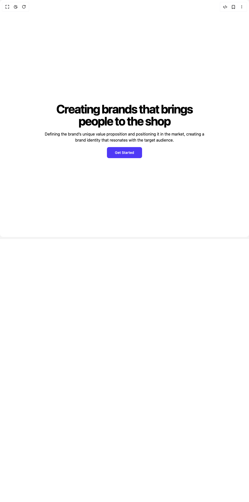

# Build Parallax in BuilderStudio

> Build this component in our Agentic IDE: [BuilderStudio](https://builderstudio.dev).
>
> Join the BuilderStudio community on [Discord](https://discord.gg/QdWeSGCqfe) and [Reddit](https://reddit.com/r/builderstudio).



## Component

- Author group: `youcefbnm`
- Component: `parallax`
- Variant: `default`
- Rendered HTML snapshot: [`rendered.html`](rendered.html)

## BuilderStudio prompt

You are implementing a React component based on a component reference.

## Component identity

- Author: YoucefBnm
- Component slug: parallax
- Demo slug: default
- Title: parallax
- Description: 

## Goal

Recreate this component in a React + TypeScript + Tailwind CSS project. Preserve the visual layout, spacing, colors, border radius, shadows, interaction behavior, animation behavior, responsive behavior, and dark mode behavior shown in the rendered demo.

## Implementation requirements

- Use React and TypeScript.
- Use Tailwind CSS classes whenever possible.
- Keep the component self-contained unless the source files require helper components.
- If the source uses CSS variables, custom CSS, animations, or keyframes, include them.
- If the source uses external packages, list and use the required packages.
- Preserve accessibility attributes, button semantics, links, keyboard behavior, and ARIA attributes when visible in the source.
- Do not replace the component with a simplified placeholder.
- Return complete production-ready code.

## Dependencies

No reference metadata available.

## Rendered DOM snapshot

This is the rendered demo HTML extracted from the live preview. Use it to verify structure, class names, visible content, and layout.

```html
<div id="root"><div class="w-screen min-h-screen flex justify-center items-center"><div class="w-screen min-h-screen flex justify-center items-center"><div class="relative min-h-dvh w-full h-[3200px] md:h-[2000px] p-12 text-black bg-white"><div class="sticky top-0 h-screen space-y-4 w-full flex flex-col justify-center items-center text-center"><div class="relative text-5xl font-bold tracking-tighter md:w-2/3 mx-auto"><span class="inline-block text-nowrap align-top"><span class="inline-block"><span class="inline-block" style="opacity: 1; transform: none;">C</span></span><span class="inline-block"><span class="inline-block" style="opacity: 1; transform: none;">r</span></span><span class="inline-block"><span class="inline-block" style="opacity: 1; transform: none;">e</span></span><span class="inline-block"><span class="inline-block" style="opacity: 1; transform: none;">a</span></span><span class="inline-block"><span class="inline-block" style="opacity: 1; transform: none;">t</span></span><span class="inline-block"><span class="inline-block" style="opacity: 1; transform: none;">i</span></span><span class="inline-block"><span class="inline-block" style="opacity: 1; transform: none;">n</span></span><span class="inline-block"><span class="inline-block" style="opacity: 1; transform: none;">g</span></span></span> <span class="inline-block text-nowrap align-top"><span class="inline-block"><span class="inline-block" style="opacity: 1; transform: none;">b</span></span><span class="inline-block"><span class="inline-block" style="opacity: 1; transform: none;">r</span></span><span class="inline-block"><span class="inline-block" style="opacity: 1; transform: none;">a</span></span><span class="inline-block"><span class="inline-block" style="opacity: 1; transform: none;">n</span></span><span class="inline-block"><span class="inline-block" style="opacity: 1; transform: none;">d</span></span><span class="inline-block"><span class="inline-block" style="opacity: 1; transform: none;">s</span></span></span> <span class="inline-block text-nowrap align-top"><span class="inline-block"><span class="inline-block" style="opacity: 1; transform: none;">t</span></span><span class="inline-block"><span class="inline-block" style="opacity: 1; transform: none;">h</span></span><span class="inline-block"><span class="inline-block" style="opacity: 1; transform: none;">a</span></span><span class="inline-block"><span class="inline-block" style="opacity: 1; transform: none;">t</span></span></span> <span class="inline-block text-nowrap align-top"><span class="inline-block"><span class="inline-block" style="opacity: 1; transform: none;">b</span></span><span class="inline-block"><span class="inline-block" style="opacity: 1; transform: none;">r</span></span><span class="inline-block"><span class="inline-block" style="opacity: 1; transform: none;">i</span></span><span class="inline-block"><span class="inline-block" style="opacity: 1; transform: none;">n</span></span><span class="inline-block"><span class="inline-block" style="opacity: 1; transform: none;">g</span></span><span class="inline-block"><span class="inline-block" style="opacity: 1; transform: none;">s</span></span></span> <span class="inline-block text-nowrap align-top"><span class="inline-block"><span class="inline-block" style="opacity: 1; transform: none;">p</span></span><span class="inline-block"><span class="inline-block" style="opacity: 1; transform: none;">e</span></span><span class="inline-block"><span class="inline-block" style="opacity: 1; transform: none;">o</span></span><span class="inline-block"><span class="inline-block" style="opacity: 1; transform: none;">p</span></span><span class="inline-block"><span class="inline-block" style="opacity: 1; transform: none;">l</span></span><span class="inline-block"><span class="inline-block" style="opacity: 1; transform: none;">e</span></span></span> <span class="inline-block text-nowrap align-top"><span class="inline-block"><span class="inline-block" style="opacity: 1; transform: none;">t</span></span><span class="inline-block"><span class="inline-block" style="opacity: 1; transform: none;">o</span></span></span> <span class="inline-block text-nowrap align-top"><span class="inline-block"><span class="inline-block" style="opacity: 1; transform: none;">t</span></span><span class="inline-block"><span class="inline-block" style="opacity: 1; transform: none;">h</span></span><span class="inline-block"><span class="inline-block" style="opacity: 1; transform: none;">e</span></span></span> <span class="inline-block text-nowrap align-top"><span class="inline-block"><span class="inline-block" style="opacity: 1; transform: none;">s</span></span><span class="inline-block"><span class="inline-block" style="opacity: 1; transform: none;">h</span></span><span class="inline-block"><span class="inline-block" style="opacity: 1; transform: none;">o</span></span><span class="inline-block"><span class="inline-block" style="opacity: 1; transform: none;">p</span></span></span></div><p class="max-w-prose  ">Defining the brand’s unique value proposition and positioning it in the market, creating a brand identity that resonates with the target audience.</p><button class="inline-flex items-center justify-center whitespace-nowrap text-sm font-medium ring-offset-background transition-colors focus-visible:outline-none focus-visible:ring-2 focus-visible:ring-ring focus-visible:ring-offset-2 disabled:pointer-events-none disabled:opacity-50 text-primary-foreground h-11 rounded-md px-8 bg-indigo-600 hover:bg-indigo-400">Get Started</button></div><div class="px-default min-h-screen flex flex-wrap justify-between gap-4 w-full"><div class="w-11/12 md:w-1/4 max-h-96" style="transform: translateY(200px) scale(1); opacity: 1;"></div><div class="w-11/12 md:w-1/4 max-h-96" style="transform: translateY(500px) scale(1); opacity: 1;"></div><div class="w-11/12 md:w-1/4 max-h-96" style="transform: translateY(800px) scale(1); opacity: 1;"></div><div class="w-11/12 md:w-1/4 max-h-96" style="transform: translateY(500px) scale(1); opacity: 1;"></div><div class="w-11/12 md:w-1/4 max-h-96" style="transform: translateY(800px) scale(1); opacity: 1;"></div></div></div></div></div></div>
```

## Reference source files

No reference source files were available.
