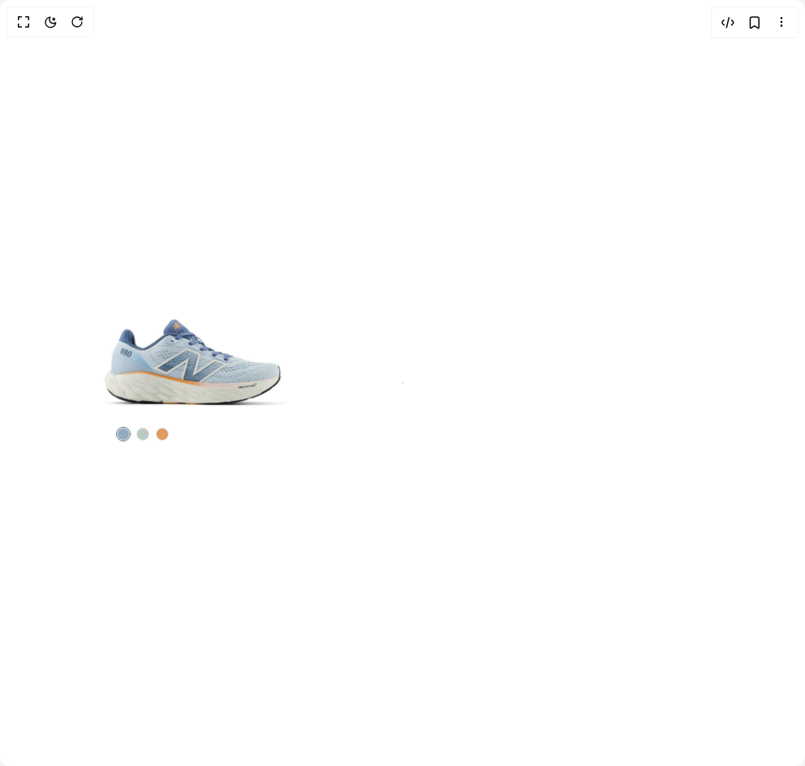

# Build Product Card in BuilderStudio

> Build this component in our Agentic IDE: [BuilderStudio](https://builderstudio.dev).
>
> Join the BuilderStudio community on [Discord](https://discord.gg/QdWeSGCqfe) and [Reddit](https://reddit.com/r/builderstudio).



## Component

- Author group: `youcefbnm`
- Component: `product-card`
- Variant: `default`
- Rendered HTML snapshot: [`rendered.html`](rendered.html)

## BuilderStudio prompt

You are implementing a React component based on a component reference.

## Component identity

- Author: YoucefBnm
- Component slug: product-card
- Demo slug: default
- Title: product-card
- Description: 

## Goal

Recreate this component in a React + TypeScript + Tailwind CSS project. Preserve the visual layout, spacing, colors, border radius, shadows, interaction behavior, animation behavior, responsive behavior, and dark mode behavior shown in the rendered demo.

## Implementation requirements

- Use React and TypeScript.
- Use Tailwind CSS classes whenever possible.
- Keep the component self-contained unless the source files require helper components.
- If the source uses CSS variables, custom CSS, animations, or keyframes, include them.
- If the source uses external packages, list and use the required packages.
- Preserve accessibility attributes, button semantics, links, keyboard behavior, and ARIA attributes when visible in the source.
- Do not replace the component with a simplified placeholder.
- Return complete production-ready code.

## Dependencies

No reference metadata available.

## Rendered DOM snapshot

This is the rendered demo HTML extracted from the live preview. Use it to verify structure, class names, visible content, and layout.

```html
<div id="root"><div class="relative flex items-center justify-center h-screen w-full m-auto p-16 bg-background text-foreground"><div class="absolute lab-bg inset-0 size-full"><div class="absolute inset-0 bg-[radial-gradient(#00000021_1px,transparent_1px)] dark:bg-[radial-gradient(#ffffff22_1px,transparent_1px)]"></div></div><div class="flex w-full justify-center relative"><div class="container min-h-svh place-content-center"><div id="product-1" class="relative px-4 py-6 w-64"><div class="relative aspect-video"><div class="absolute inset-0 cursor-pointer overflow-hidden" style="opacity: 1;"><div><div class="pointer-events-none"></div><div class="pointer-events-none absolute inset-0 size-full" style="opacity: 0;"></div></div></div><div class="absolute inset-0 cursor-pointer overflow-hidden" style="opacity: 0;"><div><div class="pointer-events-none"></div><div class="pointer-events-none absolute inset-0 size-full" style="opacity: 0;"></div></div></div><div class="absolute inset-0 cursor-pointer overflow-hidden" style="opacity: 0;"><div><div class="pointer-events-none"></div><div class="pointer-events-none absolute inset-0 size-full" style="opacity: 0;"></div></div></div></div><div class="my-2 flex gap-2 px-4"><button role="button" aria-label="show product color" class="relative size-4 appearance-none rounded-full border border-neutral-200" title="rgb(147, 171, 193)" style="background-color: rgb(147, 171, 193);"><div class="absolute -left-[2px] -top-[2px] size-[18px] rounded-full border border-gray-500" style="opacity: 1;"></div></button><button role="button" aria-label="show product color" class="relative size-4 appearance-none rounded-full border border-neutral-200" title="rgb(187, 203, 195)" style="background-color: rgb(187, 203, 195);"></button><button role="button" aria-label="show product color" class="relative size-4 appearance-none rounded-full border border-neutral-200" title="rgb(222, 156, 94)" style="background-color: rgb(222, 156, 94);"></button></div></div></div></div></div></div>
```

## Reference source files

No reference source files were available.
