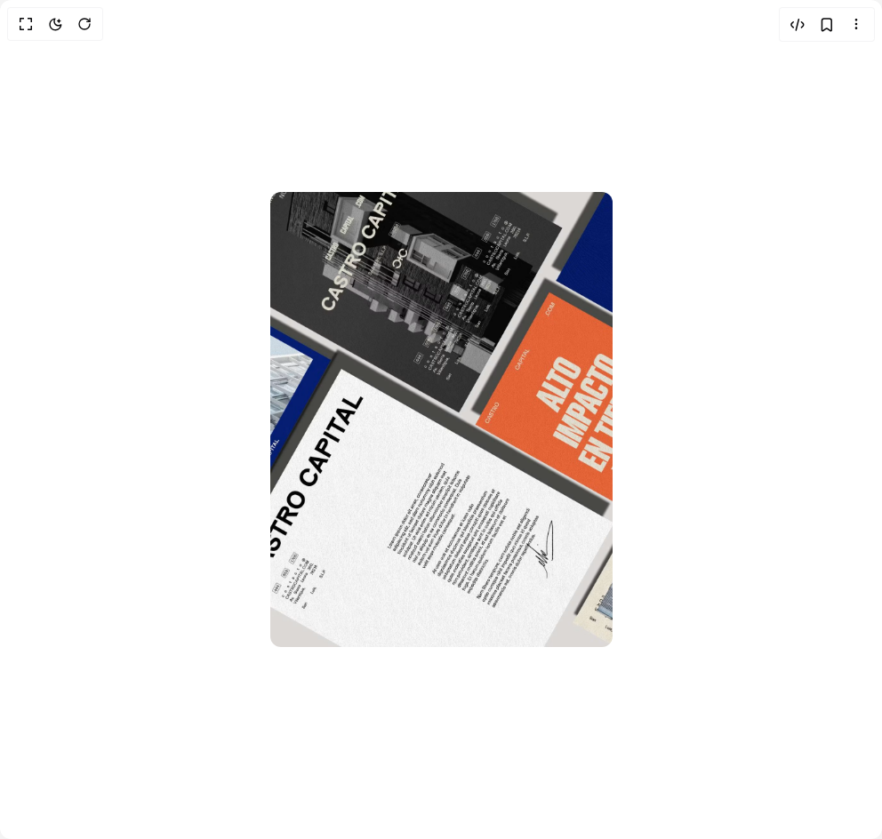

# Build Reveal On Hover in BuilderStudio

> Build this component in our Agentic IDE: [BuilderStudio](https://builderstudio.dev).
>
> Join the BuilderStudio community on [Discord](https://discord.gg/QdWeSGCqfe) and [Reddit](https://reddit.com/r/builderstudio).



## Component

- Author group: `youcefbnm`
- Component: `reveal-on-hover`
- Variant: `default`
- Rendered HTML snapshot: [`rendered.html`](rendered.html)

## BuilderStudio prompt

You are implementing a React component based on a component reference.

## Component identity

- Author: YoucefBnm
- Component slug: reveal-on-hover
- Demo slug: default
- Title: reveal-on-hover
- Description: 

## Goal

Recreate this component in a React + TypeScript + Tailwind CSS project. Preserve the visual layout, spacing, colors, border radius, shadows, interaction behavior, animation behavior, responsive behavior, and dark mode behavior shown in the rendered demo.

## Implementation requirements

- Use React and TypeScript.
- Use Tailwind CSS classes whenever possible.
- Keep the component self-contained unless the source files require helper components.
- If the source uses CSS variables, custom CSS, animations, or keyframes, include them.
- If the source uses external packages, list and use the required packages.
- Preserve accessibility attributes, button semantics, links, keyboard behavior, and ARIA attributes when visible in the source.
- Do not replace the component with a simplified placeholder.
- Return complete production-ready code.

## Dependencies

No reference metadata available.

## Rendered DOM snapshot

This is the rendered demo HTML extracted from the live preview. Use it to verify structure, class names, visible content, and layout.

```html
<div id="root"><div class="relative flex items-center justify-center h-screen w-full m-auto p-16 bg-background text-foreground"><div class="absolute lab-bg inset-0 size-full"><div class="absolute inset-0 bg-[radial-gradient(#00000021_1px,transparent_1px)] dark:bg-[radial-gradient(#ffffff22_1px,transparent_1px)]"></div></div><div class="flex w-full justify-center relative"><div class="relative overflow-hidden h-[512px] w-[385px] rounded-xl"><div class="size-full transition-transform duration-300" style="transform: scale(1);"></div><div class="absolute inset-[auto_1.5rem_1.5rem] p-6 backdrop-blur-lg transition-all duration-500 ease-in-out space-y-4 rounded-2xl bg-zinc-900/75 text-zinc-50" style="translate: 0% 120%; opacity: 0;"><div class="space-y-2"><h3 class="text-sm text-opacity-60">Services</h3><div class="flex flex-wrap gap-2 "><div class=" rounded-full bg-zinc-800 px-2 py-1"><p class=" text-xs leading-normal">Branding</p></div><div class=" rounded-full bg-zinc-800 px-2 py-1"><p class=" text-xs leading-normal">UI UX</p></div></div></div><div class="space-y-2"><h3 class=" text-sm text-opacity-60">Stack</h3><div class="flex flex-wrap gap-2 "><div class=" rounded-full bg-[hsl(18,56%,32%)] px-2 py-1"><p class=" text-xs leading-normal">Figma</p></div><div class=" rounded-full bg-[hsl(18,56%,32%)] px-2 py-1"><p class=" text-xs leading-normal">Webflow</p></div></div></div><div class="space-y-2"><h3 class=" text-sm text-opacity-60">Profile</h3><div class="flex flex-wrap gap-2 "><p class="text-sm text-card">Comprehensive platform designed for an agency, Creating professional and business-oriented brand.</p></div></div></div></div></div></div></div>
```

## Reference source files

No reference source files were available.
