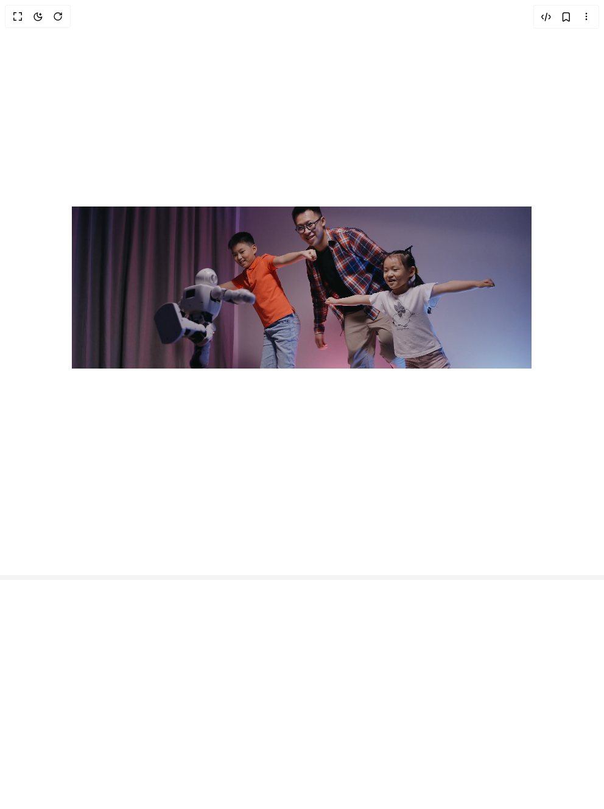

# Build Scroll Trigger Animations in BuilderStudio

> Build this component in our Agentic IDE: [BuilderStudio](https://builderstudio.dev).
>
> Join the BuilderStudio community on [Discord](https://discord.gg/QdWeSGCqfe) and [Reddit](https://reddit.com/r/builderstudio).



## Component

- Author group: `youcefbnm`
- Component: `scroll-trigger-animations`
- Variant: `scroll-trigger-inset-y-demo`
- Rendered HTML snapshot: [`rendered.html`](rendered.html)

## BuilderStudio prompt

You are implementing a React component based on a component reference.

## Component identity

- Author: YoucefBnm
- Component slug: scroll-trigger-animations
- Demo slug: scroll-trigger-inset-y-demo
- Title: scroll-trigger-animations
- Description: 

## Goal

Recreate this component in a React + TypeScript + Tailwind CSS project. Preserve the visual layout, spacing, colors, border radius, shadows, interaction behavior, animation behavior, responsive behavior, and dark mode behavior shown in the rendered demo.

## Implementation requirements

- Use React and TypeScript.
- Use Tailwind CSS classes whenever possible.
- Keep the component self-contained unless the source files require helper components.
- If the source uses CSS variables, custom CSS, animations, or keyframes, include them.
- If the source uses external packages, list and use the required packages.
- Preserve accessibility attributes, button semantics, links, keyboard behavior, and ARIA attributes when visible in the source.
- Do not replace the component with a simplified placeholder.
- Return complete production-ready code.

## Dependencies

No reference metadata available.

## Rendered DOM snapshot

This is the rendered demo HTML extracted from the live preview. Use it to verify structure, class names, visible content, and layout.

```html
<div id="root"><div class="w-screen min-h-screen flex justify-center items-center"><div class="w-screen min-h-screen flex justify-center items-center"><div class="relative"><div class="relative h-dvh py-8 px-6 flex justify-center items-center" style="transform: none;"><div class="overflow-hidden w-4/5 mx-auto  rounded-md flex justify-center items-center" style="clip-path: inset(80px 0px);"><video class="relative z-10  max-h-full max-w-full " src="https://videos.pexels.com/video-files/8086711/8086711-uhd_2560_1440_25fps.mp4" autoplay="" loop="" playsinline=""></video></div></div><div class="w-full h-96"></div></div></div></div></div>
```

## Reference source files

No reference source files were available.
