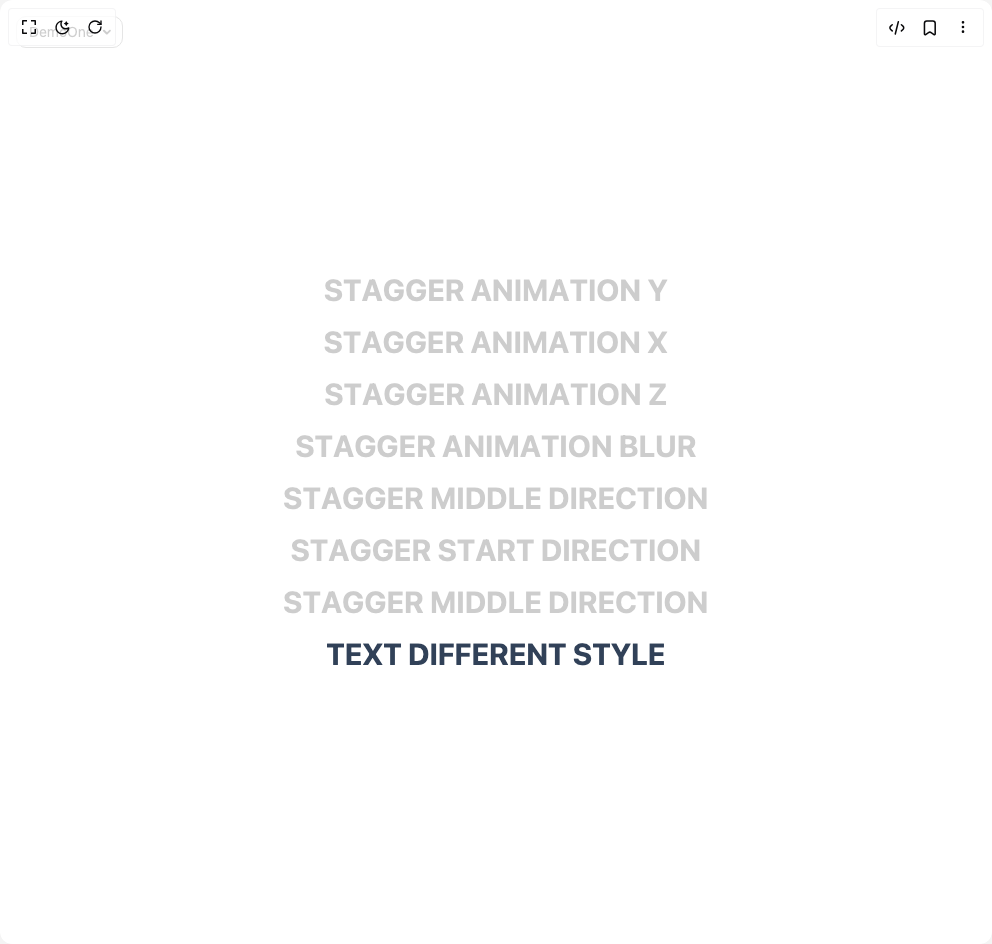

# Build Text Stagger Hover in BuilderStudio

> Build this component in our Agentic IDE: [BuilderStudio](https://builderstudio.dev).
>
> Join the BuilderStudio community on [Discord](https://discord.gg/QdWeSGCqfe) and [Reddit](https://reddit.com/r/builderstudio).



## Component

- Author group: `youcefbnm`
- Component: `text-stagger-hover`
- Variant: `default`
- Rendered HTML snapshot: [`rendered.html`](rendered.html)

## BuilderStudio prompt

You are implementing a React component based on a component reference.

## Component identity

- Author: YoucefBnm
- Component slug: text-stagger-hover
- Demo slug: default
- Title: text-stagger-hover
- Description: 

## Goal

Recreate this component in a React + TypeScript + Tailwind CSS project. Preserve the visual layout, spacing, colors, border radius, shadows, interaction behavior, animation behavior, responsive behavior, and dark mode behavior shown in the rendered demo.

## Implementation requirements

- Use React and TypeScript.
- Use Tailwind CSS classes whenever possible.
- Keep the component self-contained unless the source files require helper components.
- If the source uses CSS variables, custom CSS, animations, or keyframes, include them.
- If the source uses external packages, list and use the required packages.
- Preserve accessibility attributes, button semantics, links, keyboard behavior, and ARIA attributes when visible in the source.
- Do not replace the component with a simplified placeholder.
- Return complete production-ready code.

## Dependencies

No reference metadata available.

## Rendered DOM snapshot

This is the rendered demo HTML extracted from the live preview. Use it to verify structure, class names, visible content, and layout.

```html
<div id="root"><div class="fixed top-4 left-4 z-10"><select class="appearance-none h-8 max-w-[200px] text-sm leading-tight rounded-lg pl-3 pr-7 py-0 border bg-background focus:outline-none focus:ring-0"><option value="named_DemoOne_DemoOne">DemoOne</option></select><div class="absolute top-1/2 transform -translate-y-1/2 right-2 pointer-events-none"><svg class="w-4 h-4 fill-current" viewBox="0 0 20 20"><path d="M5.516 7.548c.436-.446 1.043-.48 1.576 0L10 10.405l2.908-2.857c.533-.48 1.14-.446 1.576 0 .436.445.408 1.197 0 1.615l-3.734 3.705c-.533.534-1.39.534-1.923 0l-3.734-3.705c-.408-.418-.436-1.17 0-1.615z"></path></svg></div></div><div class="w-screen min-h-screen flex justify-center items-center"><div class="min-h-dvh w-full p-6 justify-center flex flex-col items-center space-y-4 text-center"><h2 class="relative inline-block overflow-hidden text-3xl font-bold uppercase"><span class="inline-block text-nowrap opacity-20 origin-top"><span class="inline-block" style="filter: blur(0px); opacity: 1; transform: none;">S</span><span class="inline-block" style="filter: blur(0px); opacity: 1; transform: none;">t</span><span class="inline-block" style="filter: blur(0px); opacity: 1; transform: none;">a</span><span class="inline-block" style="filter: blur(0px); opacity: 1; transform: none;">g</span><span class="inline-block" style="filter: blur(0px); opacity: 1; transform: none;">g</span><span class="inline-block" style="filter: blur(0px); opacity: 1; transform: none;">e</span><span class="inline-block" style="filter: blur(0px); opacity: 1; transform: none;">r</span><span class="inline-block" style="filter: blur(0px); opacity: 1; transform: none;"> &nbsp;</span><span class="inline-block" style="filter: blur(0px); opacity: 1; transform: none;">a</span><span class="inline-block" style="filter: blur(0px); opacity: 1; transform: none;">n</span><span class="inline-block" style="filter: blur(0px); opacity: 1; transform: none;">i</span><span class="inline-block" style="filter: blur(0px); opacity: 1; transform: none;">m</span><span class="inline-block" style="filter: blur(0px); opacity: 1; transform: none;">a</span><span class="inline-block" style="filter: blur(0px); opacity: 1; transform: none;">t</span><span class="inline-block" style="filter: blur(0px); opacity: 1; transform: none;">i</span><span class="inline-block" style="filter: blur(0px); opacity: 1; transform: none;">o</span><span class="inline-block" style="filter: blur(0px); opacity: 1; transform: none;">n</span><span class="inline-block" style="filter: blur(0px); opacity: 1; transform: none;"> &nbsp;</span><span class="inline-block" style="filter: blur(0px); opacity: 1; transform: none;">y</span><span class="inline-block" style="filter: blur(0px); opacity: 1; transform: none;"> </span></span><span class="inline-block absolute left-0 top-0 text-nowrap origin-bottom"><span class="inline-block" style="filter: blur(0px); opacity: 0; transform: translateY(100%);">S</span><span class="inline-block" style="filter: blur(0px); opacity: 0; transform: translateY(100%);">t</span><span class="inline-block" style="filter: blur(0px); opacity: 0; transform: translateY(100%);">a</span><span class="inline-block" style="filter: blur(0px); opacity: 0; transform: translateY(100%);">g</span><span class="inline-block" style="filter: blur(0px); opacity: 0; transform: translateY(100%);">g</span><span class="inline-block" style="filter: blur(0px); opacity: 0; transform: translateY(100%);">e</span><span class="inline-block" style="filter: blur(0px); opacity: 0; transform: translateY(100%);">r</span><span class="inline-block" style="filter: blur(0px); opacity: 0; transform: translateY(100%);"> &nbsp;</span><span class="inline-block" style="filter: blur(0px); opacity: 0; transform: translateY(100%);">A</span><span class="inline-block" style="filter: blur(0px); opacity: 0; transform: translateY(100%);">n</span><span class="inline-block" style="filter: blur(0px); opacity: 0; transform: translateY(100%);">i</span><span class="inline-block" style="filter: blur(0px); opacity: 0; transform: translateY(100%);">m</span><span class="inline-block" style="filter: blur(0px); opacity: 0; transform: translateY(100%);">a</span><span class="inline-block" style="filter: blur(0px); opacity: 0; transform: translateY(100%);">t</span><span class="inline-block" style="filter: blur(0px); opacity: 0; transform: translateY(100%);">i</span><span class="inline-block" style="filter: blur(0px); opacity: 0; transform: translateY(100%);">o</span><span class="inline-block" style="filter: blur(0px); opacity: 0; transform: translateY(100%);">n</span><span class="inline-block" style="filter: blur(0px); opacity: 0; transform: translateY(100%);"> &nbsp;</span><span class="inline-block" style="filter: blur(0px); opacity: 0; transform: translateY(100%);">y</span><span class="inline-block" style="filter: blur(0px); opacity: 0; transform: translateY(100%);"> </span></span></h2><h2 class="relative inline-block overflow-hidden text-3xl font-bold uppercase"><span class="inline-block text-nowrap opacity-20 origin-right"><span class="inline-block" style="filter: blur(0px); opacity: 1; transform: none;">S</span><span class="inline-block" style="filter: blur(0px); opacity: 1; transform: none;">t</span><span class="inline-block" style="filter: blur(0px); opacity: 1; transform: none;">a</span><span class="inline-block" style="filter: blur(0px); opacity: 1; transform: none;">g</span><span class="inline-block" style="filter: blur(0px); opacity: 1; transform: none;">g</span><span class="inline-block" style="filter: blur(0px); opacity: 1; transform: none;">e</span><span class="inline-block" style="filter: blur(0px); opacity: 1; transform: none;">r</span><span class="inline-block" style="filter: blur(0px); opacity: 1; transform: none;"> &nbsp;</span><span class="inline-block" style="filter: blur(0px); opacity: 1; transform: none;">a</span><span class="inline-block" style="filter: blur(0px); opacity: 1; transform: none;">n</span><span class="inline-block" style="filter: blur(0px); opacity: 1; transform: none;">i</span><span class="inline-block" style="filter: blur(0px); opacity: 1; transform: none;">m</span><span class="inline-block" style="filter: blur(0px); opacity: 1; transform: none;">a</span><span class="inline-block" style="filter: blur(0px); opacity: 1; transform: none;">t</span><span class="inline-block" style="filter: blur(0px); opacity: 1; transform: none;">i</span><span class="inline-block" style="filter: blur(0px); opacity: 1; transform: none;">o</span><span class="inline-block" style="filter: blur(0px); opacity: 1; transform: none;">n</span><span class="inline-block" style="filter: blur(0px); opacity: 1; transform: none;"> &nbsp;</span><span class="inline-block" style="filter: blur(0px); opacity: 1; transform: none;">x</span><span class="inline-block" style="filter: blur(0px); opacity: 1; transform: none;"> </span></span><span class="inline-block absolute left-0 top-0 text-nowrap origin-left"><span class="inline-block" style="filter: blur(0px); opacity: 0; transform: translateX(-100%);">S</span><span class="inline-block" style="filter: blur(0px); opacity: 0; transform: translateX(-100%);">t</span><span class="inline-block" style="filter: blur(0px); opacity: 0; transform: translateX(-100%);">a</span><span class="inline-block" style="filter: blur(0px); opacity: 0; transform: translateX(-100%);">g</span><span class="inline-block" style="filter: blur(0px); opacity: 0; transform: translateX(-100%);">g</span><span class="inline-block" style="filter: blur(0px); opacity: 0; transform: translateX(-100%);">e</span><span class="inline-block" style="filter: blur(0px); opacity: 0; transform: translateX(-100%);">r</span><span class="inline-block" style="filter: blur(0px); opacity: 0; transform: translateX(-100%);"> &nbsp;</span><span class="inline-block" style="filter: blur(0px); opacity: 0; transform: translateX(-100%);">A</span><span class="inline-block" style="filter: blur(0px); opacity: 0; transform: translateX(-100%);">n</span><span class="inline-block" style="filter: blur(0px); opacity: 0; transform: translateX(-100%);">i</span><span class="inline-block" style="filter: blur(0px); opacity: 0; transform: translateX(-100%);">m</span><span class="inline-block" style="filter: blur(0px); opacity: 0; transform: translateX(-100%);">a</span><span class="inline-block" style="filter: blur(0px); opacity: 0; transform: translateX(-100%);">t</span><span class="inline-block" style="filter: blur(0px); opacity: 0; transform: translateX(-100%);">i</span><span class="inline-block" style="filter: blur(0px); opacity: 0; transform: translateX(-100%);">o</span><span class="inline-block" style="filter: blur(0px); opacity: 0; transform: translateX(-100%);">n</span><span class="inline-block" style="filter: blur(0px); opacity: 0; transform: translateX(-100%);"> &nbsp;</span><span class="inline-block" style="filter: blur(0px); opacity: 0; transform: translateX(-100%);">x</span><span class="inline-block" style="filter: blur(0px); opacity: 0; transform: translateX(-100%);"> </span></span></h2><h2 class="relative inline-block overflow-hidden text-3xl font-bold uppercase"><span class="inline-block text-nowrap opacity-20"><span class="inline-block" style="filter: blur(0px); opacity: 1; transform: none;">S</span><span class="inline-block" style="filter: blur(0px); opacity: 1; transform: none;">t</span><span class="inline-block" style="filter: blur(0px); opacity: 1; transform: none;">a</span><span class="inline-block" style="filter: blur(0px); opacity: 1; transform: none;">g</span><span class="inline-block" style="filter: blur(0px); opacity: 1; transform: none;">g</span><span class="inline-block" style="filter: blur(0px); opacity: 1; transform: none;">e</span><span class="inline-block" style="filter: blur(0px); opacity: 1; transform: none;">r</span><span class="inline-block" style="filter: blur(0px); opacity: 1; transform: none;"> &nbsp;</span><span class="inline-block" style="filter: blur(0px); opacity: 1; transform: none;">a</span><span class="inline-block" style="filter: blur(0px); opacity: 1; transform: none;">n</span><span class="inline-block" style="filter: blur(0px); opacity: 1; transform: none;">i</span><span class="inline-block" style="filter: blur(0px); opacity: 1; transform: none;">m</span><span class="inline-block" style="filter: blur(0px); opacity: 1; transform: none;">a</span><span class="inline-block" style="filter: blur(0px); opacity: 1; transform: none;">t</span><span class="inline-block" style="filter: blur(0px); opacity: 1; transform: none;">i</span><span class="inline-block" style="filter: blur(0px); opacity: 1; transform: none;">o</span><span class="inline-block" style="filter: blur(0px); opacity: 1; transform: none;">n</span><span class="inline-block" style="filter: blur(0px); opacity: 1; transform: none;"> &nbsp;</span><span class="inline-block" style="filter: blur(0px); opacity: 1; transform: none;">z</span><span class="inline-block" style="filter: blur(0px); opacity: 1; transform: none;"> </span></span><span class="inline-block absolute left-0 top-0 text-nowrap"><span class="inline-block" style="filter: blur(0px); opacity: 0; transform: scale(0);">S</span><span class="inline-block" style="filter: blur(0px); opacity: 0; transform: scale(0);">t</span><span class="inline-block" style="filter: blur(0px); opacity: 0; transform: scale(0);">a</span><span class="inline-block" style="filter: blur(0px); opacity: 0; transform: scale(0);">g</span><span class="inline-block" style="filter: blur(0px); opacity: 0; transform: scale(0);">g</span><span class="inline-block" style="filter: blur(0px); opacity: 0; transform: scale(0);">e</span><span class="inline-block" style="filter: blur(0px); opacity: 0; transform: scale(0);">r</span><span class="inline-block" style="filter: blur(0px); opacity: 0; transform: scale(0);"> &nbsp;</span><span class="inline-block" style="filter: blur(0px); opacity: 0; transform: scale(0);">A</span><span class="inline-block" style="filter: blur(0px); opacity: 0; transform: scale(0);">n</span><span class="inline-block" style="filter: blur(0px); opacity: 0; transform: scale(0);">i</span><span class="inline-block" style="filter: blur(0px); opacity: 0; transform: scale(0);">m</span><span class="inline-block" style="filter: blur(0px); opacity: 0; transform: scale(0);">a</span><span class="inline-block" style="filter: blur(0px); opacity: 0; transform: scale(0);">t</span><span class="inline-block" style="filter: blur(0px); opacity: 0; transform: scale(0);">i</span><span class="inline-block" style="filter: blur(0px); opacity: 0; transform: scale(0);">o</span><span class="inline-block" style="filter: blur(0px); opacity: 0; transform: scale(0);">n</span><span class="inline-block" style="filter: blur(0px); opacity: 0; transform: scale(0);"> &nbsp;</span><span class="inline-block" style="filter: blur(0px); opacity: 0; transform: scale(0);">z</span><span class="inline-block" style="filter: blur(0px); opacity: 0; transform: scale(0);"> </span></span></h2><h2 class="relative inline-block overflow-hidden text-3xl font-bold uppercase"><span class="inline-block text-nowrap opacity-20"><span class="inline-block" style="filter: blur(0px); opacity: 1; transform: none;">S</span><span class="inline-block" style="filter: blur(0px); opacity: 1; transform: none;">t</span><span class="inline-block" style="filter: blur(0px); opacity: 1; transform: none;">a</span><span class="inline-block" style="filter: blur(0px); opacity: 1; transform: none;">g</span><span class="inline-block" style="filter: blur(0px); opacity: 1; transform: none;">g</span><span class="inline-block" style="filter: blur(0px); opacity: 1; transform: none;">e</span><span class="inline-block" style="filter: blur(0px); opacity: 1; transform: none;">r</span><span class="inline-block" style="filter: blur(0px); opacity: 1; transform: none;"> &nbsp;</span><span class="inline-block" style="filter: blur(0px); opacity: 1; transform: none;">a</span><span class="inline-block" style="filter: blur(0px); opacity: 1; transform: none;">n</span><span class="inline-block" style="filter: blur(0px); opacity: 1; transform: none;">i</span><span class="inline-block" style="filter: blur(0px); opacity: 1; transform: none;">m</span><span class="inline-block" style="filter: blur(0px); opacity: 1; transform: none;">a</span><span class="inline-block" style="filter: blur(0px); opacity: 1; transform: none;">t</span><span class="inline-block" style="filter: blur(0px); opacity: 1; transform: none;">i</span><span class="inline-block" style="filter: blur(0px); opacity: 1; transform: none;">o</span><span class="inline-block" style="filter: blur(0px); opacity: 1; transform: none;">n</span><span class="inline-block" style="filter: blur(0px); opacity: 1; transform: none;"> &nbsp;</span><span class="inline-block" style="filter: blur(0px); opacity: 1; transform: none;">b</span><span class="inline-block" style="filter: blur(0px); opacity: 1; transform: none;">l</span><span class="inline-block" style="filter: blur(0px); opacity: 1; transform: none;">u</span><span class="inline-block" style="filter: blur(0px); opacity: 1; transform: none;">r</span><span class="inline-block" style="filter: blur(0px); opacity: 1; transform: none;"> </span></span><span class="inline-block absolute left-0 top-0 text-nowrap"><span class="inline-block" style="filter: blur(10px); opacity: 0; transform: none;">S</span><span class="inline-block" style="filter: blur(10px); opacity: 0; transform: none;">t</span><span class="inline-block" style="filter: blur(10px); opacity: 0; transform: none;">a</span><span class="inline-block" style="filter: blur(10px); opacity: 0; transform: none;">g</span><span class="inline-block" style="filter: blur(10px); opacity: 0; transform: none;">g</span><span class="inline-block" style="filter: blur(10px); opacity: 0; transform: none;">e</span><span class="inline-block" style="filter: blur(10px); opacity: 0; transform: none;">r</span><span class="inline-block" style="filter: blur(10px); opacity: 0; transform: none;"> &nbsp;</span><span class="inline-block" style="filter: blur(10px); opacity: 0; transform: none;">A</span><span class="inline-block" style="filter: blur(10px); opacity: 0; transform: none;">n</span><span class="inline-block" style="filter: blur(10px); opacity: 0; transform: none;">i</span><span class="inline-block" style="filter: blur(10px); opacity: 0; transform: none;">m</span><span class="inline-block" style="filter: blur(10px); opacity: 0; transform: none;">a</span><span class="inline-block" style="filter: blur(10px); opacity: 0; transform: none;">t</span><span class="inline-block" style="filter: blur(10px); opacity: 0; transform: none;">i</span><span class="inline-block" style="filter: blur(10px); opacity: 0; transform: none;">o</span><span class="inline-block" style="filter: blur(10px); opacity: 0; transform: none;">n</span><span class="inline-block" style="filter: blur(10px); opacity: 0; transform: none;"> &nbsp;</span><span class="inline-block" style="filter: blur(10px); opacity: 0; transform: none;">b</span><span class="inline-block" style="filter: blur(10px); opacity: 0; transform: none;">l</span><span class="inline-block" style="filter: blur(10px); opacity: 0; transform: none;">u</span><span class="inline-block" style="filter: blur(10px); opacity: 0; transform: none;">r</span><span class="inline-block" style="filter: blur(10px); opacity: 0; transform: none;"> </span></span></h2><h2 class="relative inline-block overflow-hidden text-3xl font-bold uppercase"><span class="inline-block text-nowrap opacity-20"><span class="inline-block" style="filter: blur(0px); opacity: 1; transform: none;">S</span><span class="inline-block" style="filter: blur(0px); opacity: 1; transform: none;">t</span><span class="inline-block" style="filter: blur(0px); opacity: 1; transform: none;">a</span><span class="inline-block" style="filter: blur(0px); opacity: 1; transform: none;">g</span><span class="inline-block" style="filter: blur(0px); opacity: 1; transform: none;">g</span><span class="inline-block" style="filter: blur(0px); opacity: 1; transform: none;">e</span><span class="inline-block" style="filter: blur(0px); opacity: 1; transform: none;">r</span><span class="inline-block" style="filter: blur(0px); opacity: 1; transform: none;"> &nbsp;</span><span class="inline-block" style="filter: blur(0px); opacity: 1; transform: none;">m</span><span class="inline-block" style="filter: blur(0px); opacity: 1; transform: none;">i</span><span class="inline-block" style="filter: blur(0px); opacity: 1; transform: none;">d</span><span class="inline-block" style="filter: blur(0px); opacity: 1; transform: none;">d</span><span class="inline-block" style="filter: blur(0px); opacity: 1; transform: none;">l</span><span class="inline-block" style="filter: blur(0px); opacity: 1; transform: none;">e</span><span class="inline-block" style="filter: blur(0px); opacity: 1; transform: none;"> &nbsp;</span><span class="inline-block" style="filter: blur(0px); opacity: 1; transform: none;">d</span><span class="inline-block" style="filter: blur(0px); opacity: 1; transform: none;">i</span><span class="inline-block" style="filter: blur(0px); opacity: 1; transform: none;">r</span><span class="inline-block" style="filter: blur(0px); opacity: 1; transform: none;">e</span><span class="inline-block" style="filter: blur(0px); opacity: 1; transform: none;">c</span><span class="inline-block" style="filter: blur(0px); opacity: 1; transform: none;">t</span><span class="inline-block" style="filter: blur(0px); opacity: 1; transform: none;">i</span><span class="inline-block" style="filter: blur(0px); opacity: 1; transform: none;">o</span><span class="inline-block" style="filter: blur(0px); opacity: 1; transform: none;">n</span><span class="inline-block" style="filter: blur(0px); opacity: 1; transform: none;"> </span></span><span class="inline-block absolute left-0 top-0 text-nowrap origin-bottom"><span class="inline-block" style="filter: blur(0px); opacity: 0; transform: translateY(100%);">S</span><span class="inline-block" style="filter: blur(0px); opacity: 0; transform: translateY(100%);">t</span><span class="inline-block" style="filter: blur(0px); opacity: 0; transform: translateY(100%);">a</span><span class="inline-block" style="filter: blur(0px); opacity: 0; transform: translateY(100%);">g</span><span class="inline-block" style="filter: blur(0px); opacity: 0; transform: translateY(100%);">g</span><span class="inline-block" style="filter: blur(0px); opacity: 0; transform: translateY(100%);">e</span><span class="inline-block" style="filter: blur(0px); opacity: 0; transform: translateY(100%);">r</span><span class="inline-block" style="filter: blur(0px); opacity: 0; transform: translateY(100%);"> &nbsp;</span><span class="inline-block" style="filter: blur(0px); opacity: 0; transform: translateY(100%);">m</span><span class="inline-block" style="filter: blur(0px); opacity: 0; transform: translateY(100%);">i</span><span class="inline-block" style="filter: blur(0px); opacity: 0; transform: translateY(100%);">d</span><span class="inline-block" style="filter: blur(0px); opacity: 0; transform: translateY(100%);">d</span><span class="inline-block" style="filter: blur(0px); opacity: 0; transform: translateY(100%);">l</span><span class="inline-block" style="filter: blur(0px); opacity: 0; transform: translateY(100%);">e</span><span class="inline-block" style="filter: blur(0px); opacity: 0; transform: translateY(100%);"> &nbsp;</span><span class="inline-block" style="filter: blur(0px); opacity: 0; transform: translateY(100%);">d</span><span class="inline-block" style="filter: blur(0px); opacity: 0; transform: translateY(100%);">i</span><span class="inline-block" style="filter: blur(0px); opacity: 0; transform: translateY(100%);">r</span><span class="inline-block" style="filter: blur(0px); opacity: 0; transform: translateY(100%);">e</span><span class="inline-block" style="filter: blur(0px); opacity: 0; transform: translateY(100%);">c</span><span class="inline-block" style="filter: blur(0px); opacity: 0; transform: translateY(100%);">t</span><span class="inline-block" style="filter: blur(0px); opacity: 0; transform: translateY(100%);">i</span><span class="inline-block" style="filter: blur(0px); opacity: 0; transform: translateY(100%);">o</span><span class="inline-block" style="filter: blur(0px); opacity: 0; transform: translateY(100%);">n</span><span class="inline-block" style="filter: blur(0px); opacity: 0; transform: translateY(100%);"> </span></span></h2><h2 class="relative inline-block overflow-hidden text-3xl font-bold uppercase"><span class="inline-block text-nowrap opacity-20"><span class="inline-block" style="filter: blur(0px); opacity: 1; transform: none;">S</span><span class="inline-block" style="filter: blur(0px); opacity: 1; transform: none;">t</span><span class="inline-block" style="filter: blur(0px); opacity: 1; transform: none;">a</span><span class="inline-block" style="filter: blur(0px); opacity: 1; transform: none;">g</span><span class="inline-block" style="filter: blur(0px); opacity: 1; transform: none;">g</span><span class="inline-block" style="filter: blur(0px); opacity: 1; transform: none;">e</span><span class="inline-block" style="filter: blur(0px); opacity: 1; transform: none;">r</span><span class="inline-block" style="filter: blur(0px); opacity: 1; transform: none;"> &nbsp;</span><span class="inline-block" style="filter: blur(0px); opacity: 1; transform: none;">s</span><span class="inline-block" style="filter: blur(0px); opacity: 1; transform: none;">t</span><span class="inline-block" style="filter: blur(0px); opacity: 1; transform: none;">a</span><span class="inline-block" style="filter: blur(0px); opacity: 1; transform: none;">r</span><span class="inline-block" style="filter: blur(0px); opacity: 1; transform: none;">t</span><span class="inline-block" style="filter: blur(0px); opacity: 1; transform: none;"> &nbsp;</span><span class="inline-block" style="filter: blur(0px); opacity: 1; transform: none;">d</span><span class="inline-block" style="filter: blur(0px); opacity: 1; transform: none;">i</span><span class="inline-block" style="filter: blur(0px); opacity: 1; transform: none;">r</span><span class="inline-block" style="filter: blur(0px); opacity: 1; transform: none;">e</span><span class="inline-block" style="filter: blur(0px); opacity: 1; transform: none;">c</span><span class="inline-block" style="filter: blur(0px); opacity: 1; transform: none;">t</span><span class="inline-block" style="filter: blur(0px); opacity: 1; transform: none;">i</span><span class="inline-block" style="filter: blur(0px); opacity: 1; transform: none;">o</span><span class="inline-block" style="filter: blur(0px); opacity: 1; transform: none;">n</span><span class="inline-block" style="filter: blur(0px); opacity: 1; transform: none;"> </span></span><span class="inline-block absolute left-0 top-0 text-nowrap"><span class="inline-block" style="filter: blur(0px); opacity: 0; transform: translateX(-100%);">S</span><span class="inline-block" style="filter: blur(0px); opacity: 0; transform: translateX(-100%);">t</span><span class="inline-block" style="filter: blur(0px); opacity: 0; transform: translateX(-100%);">a</span><span class="inline-block" style="filter: blur(0px); opacity: 0; transform: translateX(-100%);">g</span><span class="inline-block" style="filter: blur(0px); opacity: 0; transform: translateX(-100%);">g</span><span class="inline-block" style="filter: blur(0px); opacity: 0; transform: translateX(-100%);">e</span><span class="inline-block" style="filter: blur(0px); opacity: 0; transform: translateX(-100%);">r</span><span class="inline-block" style="filter: blur(0px); opacity: 0; transform: translateX(-100%);"> &nbsp;</span><span class="inline-block" style="filter: blur(0px); opacity: 0; transform: translateX(-100%);">f</span><span class="inline-block" style="filter: blur(0px); opacity: 0; transform: translateX(-100%);">i</span><span class="inline-block" style="filter: blur(0px); opacity: 0; transform: translateX(-100%);">n</span><span class="inline-block" style="filter: blur(0px); opacity: 0; transform: translateX(-100%);">a</span><span class="inline-block" style="filter: blur(0px); opacity: 0; transform: translateX(-100%);">l</span><span class="inline-block" style="filter: blur(0px); opacity: 0; transform: translateX(-100%);"> &nbsp;</span><span class="inline-block" style="filter: blur(0px); opacity: 0; transform: translateX(-100%);">d</span><span class="inline-block" style="filter: blur(0px); opacity: 0; transform: translateX(-100%);">i</span><span class="inline-block" style="filter: blur(0px); opacity: 0; transform: translateX(-100%);">r</span><span class="inline-block" style="filter: blur(0px); opacity: 0; transform: translateX(-100%);">e</span><span class="inline-block" style="filter: blur(0px); opacity: 0; transform: translateX(-100%);">c</span><span class="inline-block" style="filter: blur(0px); opacity: 0; transform: translateX(-100%);">t</span><span class="inline-block" style="filter: blur(0px); opacity: 0; transform: translateX(-100%);">i</span><span class="inline-block" style="filter: blur(0px); opacity: 0; transform: translateX(-100%);">o</span><span class="inline-block" style="filter: blur(0px); opacity: 0; transform: translateX(-100%);">n</span><span class="inline-block" style="filter: blur(0px); opacity: 0; transform: translateX(-100%);"> </span></span></h2><h2 class="relative inline-block overflow-hidden text-3xl font-bold uppercase"><span class="inline-block text-nowrap opacity-20"><span class="inline-block" style="filter: blur(0px); opacity: 1; transform: none;">S</span><span class="inline-block" style="filter: blur(0px); opacity: 1; transform: none;">t</span><span class="inline-block" style="filter: blur(0px); opacity: 1; transform: none;">a</span><span class="inline-block" style="filter: blur(0px); opacity: 1; transform: none;">g</span><span class="inline-block" style="filter: blur(0px); opacity: 1; transform: none;">g</span><span class="inline-block" style="filter: blur(0px); opacity: 1; transform: none;">e</span><span class="inline-block" style="filter: blur(0px); opacity: 1; transform: none;">r</span><span class="inline-block" style="filter: blur(0px); opacity: 1; transform: none;"> &nbsp;</span><span class="inline-block" style="filter: blur(0px); opacity: 1; transform: none;">m</span><span class="inline-block" style="filter: blur(0px); opacity: 1; transform: none;">i</span><span class="inline-block" style="filter: blur(0px); opacity: 1; transform: none;">d</span><span class="inline-block" style="filter: blur(0px); opacity: 1; transform: none;">d</span><span class="inline-block" style="filter: blur(0px); opacity: 1; transform: none;">l</span><span class="inline-block" style="filter: blur(0px); opacity: 1; transform: none;">e</span><span class="inline-block" style="filter: blur(0px); opacity: 1; transform: none;"> &nbsp;</span><span class="inline-block" style="filter: blur(0px); opacity: 1; transform: none;">d</span><span class="inline-block" style="filter: blur(0px); opacity: 1; transform: none;">i</span><span class="inline-block" style="filter: blur(0px); opacity: 1; transform: none;">r</span><span class="inline-block" style="filter: blur(0px); opacity: 1; transform: none;">e</span><span class="inline-block" style="filter: blur(0px); opacity: 1; transform: none;">c</span><span class="inline-block" style="filter: blur(0px); opacity: 1; transform: none;">t</span><span class="inline-block" style="filter: blur(0px); opacity: 1; transform: none;">i</span><span class="inline-block" style="filter: blur(0px); opacity: 1; transform: none;">o</span><span class="inline-block" style="filter: blur(0px); opacity: 1; transform: none;">n</span><span class="inline-block" style="filter: blur(0px); opacity: 1; transform: none;"> </span></span><span class="inline-block absolute left-0 top-0 text-nowrap origin-bottom"><span class="inline-block" style="filter: blur(0px); opacity: 0; transform: translateY(100%);">S</span><span class="inline-block" style="filter: blur(0px); opacity: 0; transform: translateY(100%);">t</span><span class="inline-block" style="filter: blur(0px); opacity: 0; transform: translateY(100%);">a</span><span class="inline-block" style="filter: blur(0px); opacity: 0; transform: translateY(100%);">g</span><span class="inline-block" style="filter: blur(0px); opacity: 0; transform: translateY(100%);">g</span><span class="inline-block" style="filter: blur(0px); opacity: 0; transform: translateY(100%);">e</span><span class="inline-block" style="filter: blur(0px); opacity: 0; transform: translateY(100%);">r</span><span class="inline-block" style="filter: blur(0px); opacity: 0; transform: translateY(100%);"> &nbsp;</span><span class="inline-block" style="filter: blur(0px); opacity: 0; transform: translateY(100%);">m</span><span class="inline-block" style="filter: blur(0px); opacity: 0; transform: translateY(100%);">i</span><span class="inline-block" style="filter: blur(0px); opacity: 0; transform: translateY(100%);">d</span><span class="inline-block" style="filter: blur(0px); opacity: 0; transform: translateY(100%);">d</span><span class="inline-block" style="filter: blur(0px); opacity: 0; transform: translateY(100%);">l</span><span class="inline-block" style="filter: blur(0px); opacity: 0; transform: translateY(100%);">e</span><span class="inline-block" style="filter: blur(0px); opacity: 0; transform: translateY(100%);"> &nbsp;</span><span class="inline-block" style="filter: blur(0px); opacity: 0; transform: translateY(100%);">d</span><span class="inline-block" style="filter: blur(0px); opacity: 0; transform: translateY(100%);">i</span><span class="inline-block" style="filter: blur(0px); opacity: 0; transform: translateY(100%);">r</span><span class="inline-block" style="filter: blur(0px); opacity: 0; transform: translateY(100%);">e</span><span class="inline-block" style="filter: blur(0px); opacity: 0; transform: translateY(100%);">c</span><span class="inline-block" style="filter: blur(0px); opacity: 0; transform: translateY(100%);">t</span><span class="inline-block" style="filter: blur(0px); opacity: 0; transform: translateY(100%);">i</span><span class="inline-block" style="filter: blur(0px); opacity: 0; transform: translateY(100%);">o</span><span class="inline-block" style="filter: blur(0px); opacity: 0; transform: translateY(100%);">n</span><span class="inline-block" style="filter: blur(0px); opacity: 0; transform: translateY(100%);"> </span></span></h2><h2 class="relative inline-block overflow-hidden text-3xl font-bold uppercase"><span class="inline-block text-nowrap text-slate-700"><span class="inline-block" style="filter: blur(0px); opacity: 1; transform: none;">T</span><span class="inline-block" style="filter: blur(0px); opacity: 1; transform: none;">e</span><span class="inline-block" style="filter: blur(0px); opacity: 1; transform: none;">x</span><span class="inline-block" style="filter: blur(0px); opacity: 1; transform: none;">t</span><span class="inline-block" style="filter: blur(0px); opacity: 1; transform: none;"> &nbsp;</span><span class="inline-block" style="filter: blur(0px); opacity: 1; transform: none;">D</span><span class="inline-block" style="filter: blur(0px); opacity: 1; transform: none;">i</span><span class="inline-block" style="filter: blur(0px); opacity: 1; transform: none;">f</span><span class="inline-block" style="filter: blur(0px); opacity: 1; transform: none;">f</span><span class="inline-block" style="filter: blur(0px); opacity: 1; transform: none;">e</span><span class="inline-block" style="filter: blur(0px); opacity: 1; transform: none;">r</span><span class="inline-block" style="filter: blur(0px); opacity: 1; transform: none;">e</span><span class="inline-block" style="filter: blur(0px); opacity: 1; transform: none;">n</span><span class="inline-block" style="filter: blur(0px); opacity: 1; transform: none;">t</span><span class="inline-block" style="filter: blur(0px); opacity: 1; transform: none;"> &nbsp;</span><span class="inline-block" style="filter: blur(0px); opacity: 1; transform: none;">S</span><span class="inline-block" style="filter: blur(0px); opacity: 1; transform: none;">t</span><span class="inline-block" style="filter: blur(0px); opacity: 1; transform: none;">y</span><span class="inline-block" style="filter: blur(0px); opacity: 1; transform: none;">l</span><span class="inline-block" style="filter: blur(0px); opacity: 1; transform: none;">e</span><span class="inline-block" style="filter: blur(0px); opacity: 1; transform: none;"> </span></span><span class="inline-block absolute left-0 top-0 text-nowrap text-indigo-500"><span class="inline-block" style="filter: blur(0px); opacity: 0; transform: translateY(100%);">T</span><span class="inline-block" style="filter: blur(0px); opacity: 0; transform: translateY(100%);">e</span><span class="inline-block" style="filter: blur(0px); opacity: 0; transform: translateY(100%);">x</span><span class="inline-block" style="filter: blur(0px); opacity: 0; transform: translateY(100%);">t</span><span class="inline-block" style="filter: blur(0px); opacity: 0; transform: translateY(100%);"> &nbsp;</span><span class="inline-block" style="filter: blur(0px); opacity: 0; transform: translateY(100%);">D</span><span class="inline-block" style="filter: blur(0px); opacity: 0; transform: translateY(100%);">i</span><span class="inline-block" style="filter: blur(0px); opacity: 0; transform: translateY(100%);">f</span><span class="inline-block" style="filter: blur(0px); opacity: 0; transform: translateY(100%);">f</span><span class="inline-block" style="filter: blur(0px); opacity: 0; transform: translateY(100%);">e</span><span class="inline-block" style="filter: blur(0px); opacity: 0; transform: translateY(100%);">r</span><span class="inline-block" style="filter: blur(0px); opacity: 0; transform: translateY(100%);">e</span><span class="inline-block" style="filter: blur(0px); opacity: 0; transform: translateY(100%);">n</span><span class="inline-block" style="filter: blur(0px); opacity: 0; transform: translateY(100%);">t</span><span class="inline-block" style="filter: blur(0px); opacity: 0; transform: translateY(100%);"> &nbsp;</span><span class="inline-block" style="filter: blur(0px); opacity: 0; transform: translateY(100%);">S</span><span class="inline-block" style="filter: blur(0px); opacity: 0; transform: translateY(100%);">t</span><span class="inline-block" style="filter: blur(0px); opacity: 0; transform: translateY(100%);">y</span><span class="inline-block" style="filter: blur(0px); opacity: 0; transform: translateY(100%);">l</span><span class="inline-block" style="filter: blur(0px); opacity: 0; transform: translateY(100%);">e</span><span class="inline-block" style="filter: blur(0px); opacity: 0; transform: translateY(100%);"> </span></span></h2></div></div></div>
```

## Reference source files

No reference source files were available.
